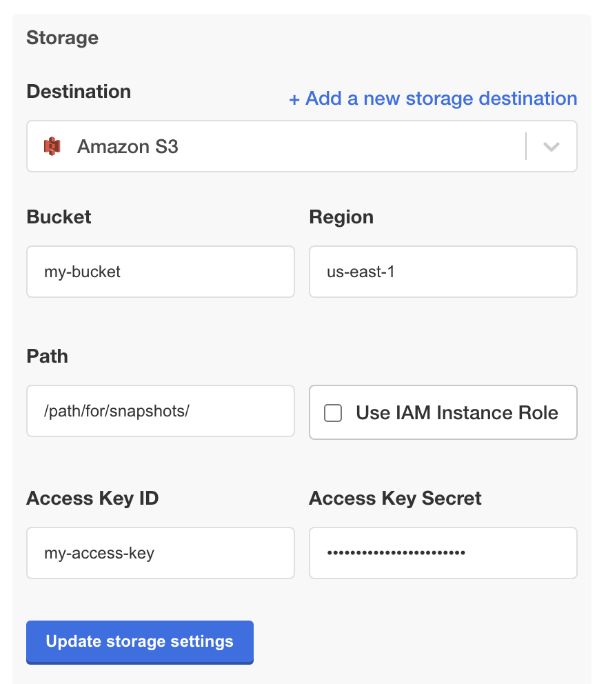
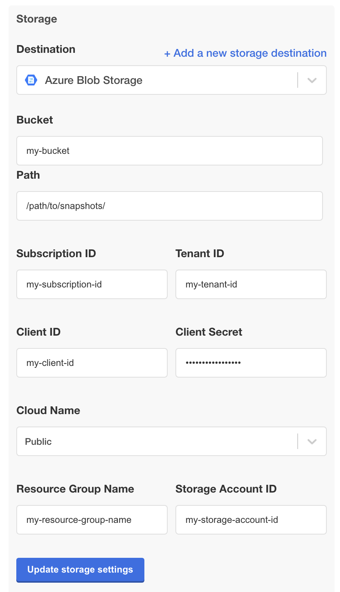
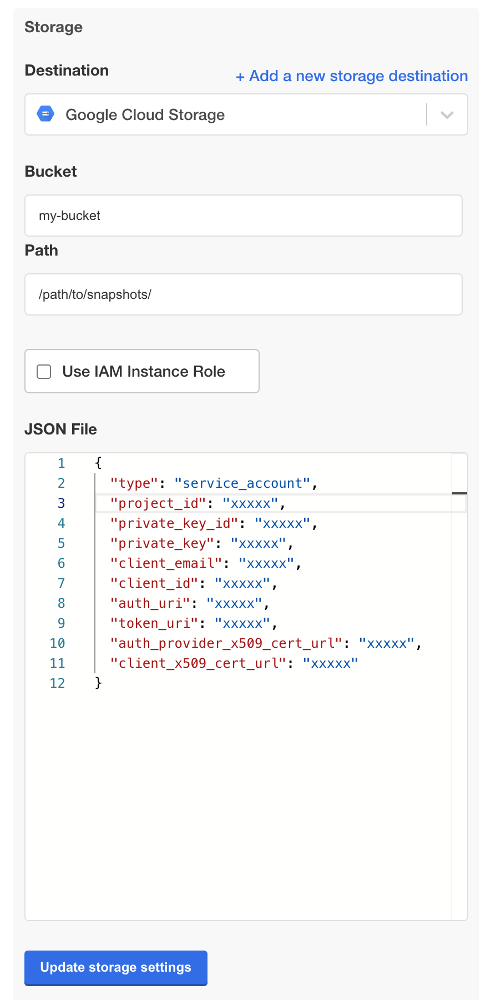
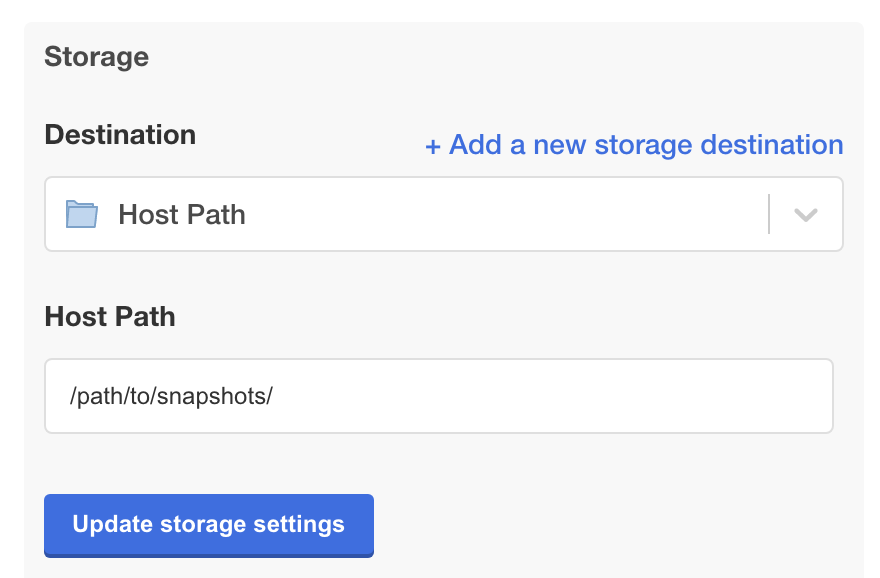
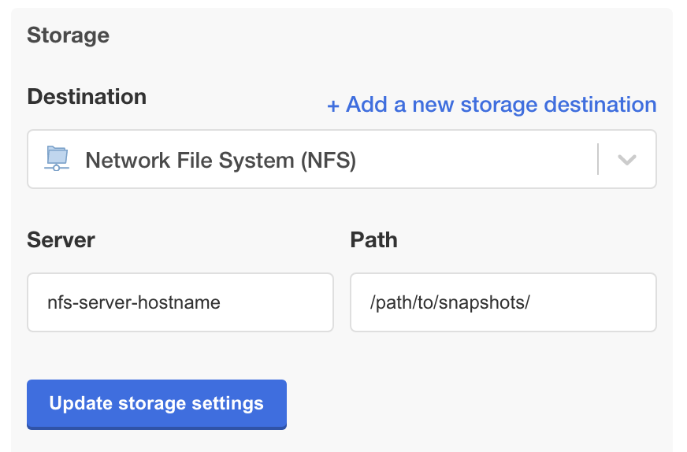
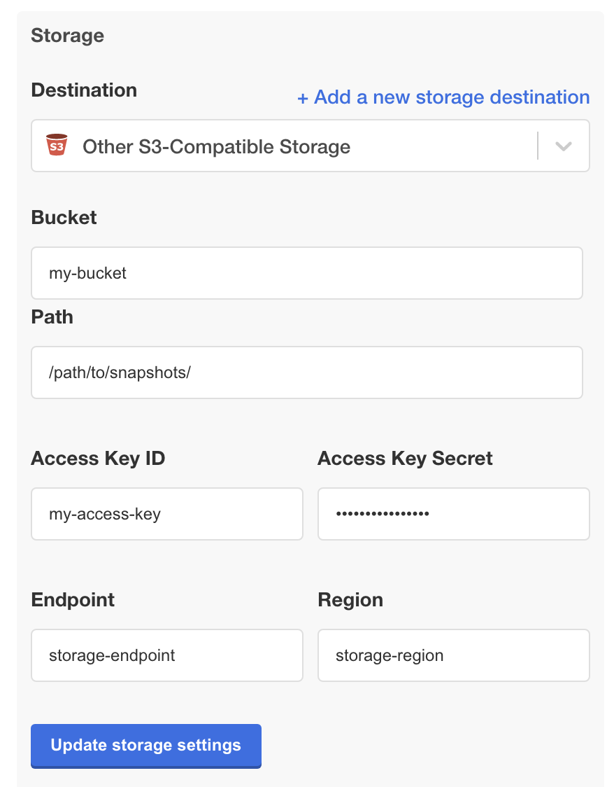
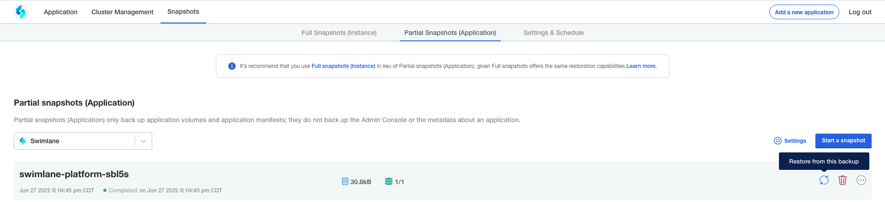
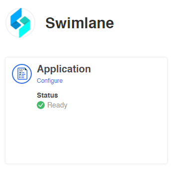
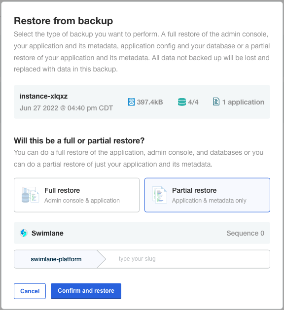

Backup and Restore on an Existing Cluster with Snapshots
========================================================

| The Turbine Installer uses Velero and Restic as the underlying
  technology for snapshots and restores.

| **Important!** Note the following items that list limitations with
  snapshots:
| Taking a snapshot requires enough free disk space for a compressed
  archive of the Swimlane database to be saved in ephemeral storage
  before it is uploaded to the snapshot destination. Free disk space on
  the cluster at ``/var/lib/kubelet`` should be greater than or equal to
  the size of the uncompressed database to ensure there is no disk
  pressure during the snapshot process.
| Instance snapshots are considered complete and are usable in disaster
  recovery scenarios. Application snapshots are the legacy snapshot
  method and are not usable for disaster recovery. Instance snapshots
  can be used in place of the legacy application snapshots.
| Snapshots cannot be restored to a different namespace than when the
  snapshot was taken.
| Snapshots cannot be restored to different installation methods. For
  example, online cluster snapshots cannot be restored to offline
  clusters.
| AWS S3 buckets with a bucket policy that requires the server-side
  encryption header are not supported. If you need to require
  server-side encryption for objects, Swimlane recommends that you
  enable default encryption on the bucket itself instead.
| Cleanup and removal of snapshots can only be done through the Turbine
  Installer admin console snapshots tab. Removing data from the snapshot
  storage itself will result in data corruption and loss of snapshots.

Install Velero
--------------

See Velero's `Customize Resource Requests and
Limits <https://velero.io/docs/v1.9/customize-installation/#customize-resource-requests-and-limits>`__
if you need to set the resource requests and limits for the Velero and
Restic pods.

Install Velero (Online)
~~~~~~~~~~~~~~~~~~~~~~~

Velero install instructions if your cluster has access to the internet:

#. Download Velero 1.11.0 for the OS version from which you run kubectl
   commands:
   ``https://github.com/vmware-tanzu/velero/releases/tag/v1.11.0``

#. Untar the file and then change directory into the uncompressed
   directory:

``tar zxf <FILENAME>.tar.gz``

``cd <DIRECTORY>``

#. Install Velero with the necessary plugins and placeholder
   information:

Create an empty credentials file to pass to the install command with
``touch placeholder-credentials``.

The Velero binary must be executable by your user. Install Velero into
the ``velero`` namespace with the following command:

./velero install \\ --node-agent \\ --use-volume-snapshots=false \\
--plugins
velero/velero-plugin-for-aws:v1.5.0,velero/velero-plugin-for-gcp:v1.5.0,velero/velero-plugin-for-microsoft-azure:v1.5.0
\\ --provider aws \\ --bucket placeholder \\ --prefix /placeholder/ \\
--secret-file placeholder-credentials \\ --backup-location-config
region=us-east-1

The bucket, prefix, credentials, and bucket region settings are set as
placeholders in this command just to get Velero installed. You will
update the snapshot storage destination later through the Turbine
Installer UI.

If the KUBECONFIG environment variable is not set you will need to add
``--kubeconfig /path/to/kube/config`` to the Velero install command
above so that it can authenticate to your cluster.

Install Velero (Offline/Airgapped)
~~~~~~~~~~~~~~~~~~~~~~~~~~~~~~~~~~

Use these Velero install instructions if your cluster has *no* access to
the internet:

#. Download Velero 1.11.0 to the jumpbox for the jumpbox's OS version:
   ``https://github.com/vmware-tanzu/velero/releases/tag/v1.11.0``

#. Untar the file and then change directory into the uncompressed
   directory:

``tar zxf <FILENAME>.tar.gz``

``cd <DIRECTORY>``

#. Download the Velero images and push them to your private registry
   from your jumpbox:

docker pull velero/velero:v1.11.0 docker tag velero/velero:v1.11.0
<my-registry>/<my-namespace>/velero/velero:v1.11.0 docker push
<my-registry>/<my-namespace>/velero/velero:v1.11.0 docker pull
velero/velero-restic-restore-helper:v1.9.0 docker tag
velero/velero-restic-restore-helper:v1.9.0
<my-registry>/<my-namespace>/velero/velero-restic-restore-helper:v1.9.0
docker push
<my-registry>/<my-namespace>/velero/velero-restic-restore-helper:v1.9.0
docker pull velero/velero-plugin-for-aws:v1.5.0 docker tag
velero/velero-plugin-for-aws:v1.5.0
<my-registry>/<my-namespace>/velero/velero-plugin-for-aws:v1.5.0 docker
push <my-registry>/<my-namespace>/velero/velero-plugin-for-aws:v1.5.0
docker pull velero/velero-plugin-for-gcp:v1.5.0 docker tag
velero/velero-plugin-for-gcp:v1.5.0
<my-registry>/<my-namespace>/velero/velero-plugin-for-gcp:v1.5.0 docker
push <my-registry>/<my-namespace>/velero/velero-plugin-for-gcp:v1.5.0
docker pull velero/velero-plugin-for-microsoft-azure:v1.5.0 docker tag
velero/velero-plugin-for-microsoft-azure:v1.5.0
<my-registry>/<my-namespace>/velero/velero-plugin-for-microsoft-azure:v1.5.0
docker push
<my-registry>/<my-namespace>/velero/velero-plugin-for-microsoft-azure:v1.5.0

#. Create the Velero restore helper, ConfigMap, to ensure that the
   Velero helper init containers pull from the private registry. Create
   the file ``velero-restore-helper-configmap.yaml`` with the following
   contents:

apiVersion: v1 kind: ConfigMap metadata: name:
restic-restore-action-config namespace: velero labels:
velero.io/plugin-config: "" velero.io/restic: RestoreItemAction data:
image: <my-registry>/<my-namespace>/velero/velero-restic-restore-helper

Create the config map by running
``kubectl apply -f velero-restore-helper-configmap.yaml``.

See Velero's `Customize Restore Helper
Container <https://velero.io/docs/v1.9/restic/#customize-restore-helper-container>`__
if you need to set the resource requests and limits for the Velero
restore helper container.

#. Install Velero with the necessary plugins and placeholder
   information:

Create an empty credentials file to pass to the install command with
``touch placeholder-credentials``.

The Velero binary must be executable by your user. Install Velero into
the ``velero`` namespace with the following command:

./velero install \\ --image
<my-registry>/<my-namespace>/velero/velero:v1.9.0 \\ --use-restic \\
--use-volume-snapshots=false \\ --plugins
<my-registry>/<my-namespace>/velero/velero-plugin-for-aws:v1.5.0,<my-registry>/<my-namespace>/velero/velero-plugin-for-gcp:v1.5.0,<my-registry>/<my-namespace>/velero/velero-plugin-for-microsoft-azure:v1.5.0
\\ --provider aws \\ --bucket placeholder \\ --prefix /placeholder/ \\
--secret-file placeholder-credentials \\ --backup-location-config
region=us-east-1

The bucket, prefix, credentials, and bucket region settings are set as
placeholders in this command just to get Velero installed. You will
update the snapshot storage destination later through the Turbine
Installer UI.

The Velero install uses the KUBECONFIG environment variable to
authenticate to the cluster. If that environment variable is not set you
must add the argument ``--kubeconfig /path/to/kube/config`` to the
install command above.

Install Velero (OpenShift)
~~~~~~~~~~~~~~~~~~~~~~~~~~

#. Install Velero using the Install Velero (Online) instructions above.

#. Set the required OpenShift policy for the Velero service account to
   let the Velero pods run:

``oc adm policy add-scc-to-user privileged -z velero -n velero``

#. Update the Velero Restic daemonset to run the pods with the required
   security context:

oc patch ds/restic \\ --namespace velero \\ --type json \\ -p
'[{"op":"add","path":"/spec/template/spec/containers/0/securityContext","value":
{ "privileged": true}}]'

Configure Snapshot Storage
--------------------------

From the top-level Turbine Installer UI, click the **Snapshots** section
and then the **Settings & Schedule** link on the right side.

**Note**: When the snapshot settings are updated the Velero and Restic
pods are restarted to apply the new settings. This can take several
seconds and can temporarily make the snapshot pages show that Velero
isn't running. Once the pods are restarted, the snapshot pages correctly
display.

Storing Snapshots on Amazon S3
------------------------------

|image1|

Requirements
~~~~~~~~~~~~

Storing snapshots on Amazon S3 requires:

-  An IAM user or IAM role to authenticate.

-  The bucket cannot have a bucket policy that requires the server-side
   encryption header. The recommended method to require server side
   encryption for objects is to enable default encryption on the bucket
   itself instead.

-  The following sample policy can be used after replacing ``${BUCKET}``
   with the AWS ARN of your bucket:

   Sample IAM Policy

   { "Version": "2012-10-17", "Statement": [ { "Effect": "Allow",
   "Action": [ "s3:GetObject", "s3:DeleteObject", "s3:PutObject",
   "s3:AbortMultipartUpload", "s3:ListMultipartUploadParts" ],
   "Resource": [ "arn:aws:s3:::${BUCKET}/\*" ] }, { "Effect": "Allow",
   "Action": [ "s3:ListBucket" ], "Resource": [ "arn:aws:s3:::${BUCKET}"
   ] } ] }

Instructions
~~~~~~~~~~~~

#. Change the **Destination** drop down to **Amazon S3**.

#. Set **Bucket** to the name of the Amazon S3 bucket to store snapshots
   in.

#. Set **Region** to the name of the AWS region that the S3 bucket is
   in.

#. Set **Path** to the path in the S3 bucket that the snapshots should
   be stored under.

#. If your cluster nodes are AWS EC2 instances and you want the AWS
   permissions to access the S3 bucket managed by an IAM instance role,
   check the **Use IAM Instance Role** checkbox and leave the **Access
   Key ID** and **Access Key Secret** fields blank.

#. If you need to use IAM credentials to access the S3 bucket then set
   **Access Key ID** and **Access Key Secret** to the IAM user's API
   credentials.

#. If you need to upload a third-party issued CA certificate used for
   trusting the authenticity of the snapshot storage endpoint you may
   upload them using **Add a CA Certificate**. Only one file can be
   uploaded. However, it is possible to concatenate multiple
   certificates into one file. Supported formats are PEM, CER, CRT, CA,
   and KEY.

Storing Snapshots on Azure Blob Storage
---------------------------------------

|image2|

.. _requirements-1:

Requirements
~~~~~~~~~~~~

Storing snapshots on Azure Blog Storage requires:

-  An Azure service principal and client secret to authenticate.
-  The storage account and service principal must be in the same
   subscription, tenant, and resource group.
-  Required service principal permissions:

   -  The service principal must have the
      ``Storage Account Key Operator Service Role`` role on the storage
      account.
   -  The service principal must have the
      ``Storage Blob Data Contributor`` role on the storage container.

-  If you need to upload a third-party issued CA certificate used for
   trusting the authenticity of the snapshot storage endpoint you may
   upload them using **Add a CA Certificate**. Only one file can be
   uploaded. However, it is possible to concatenate multiple
   certificates into one file. Supported formats are PEM, CER, CRT, CA,
   and KEY.

.. _instructions-1:

Instructions
~~~~~~~~~~~~

#. Change the **Destination** drop down to **Azure Blob Storage**.

#. Configure your Azure settings:

+---------------------+-----------------------------------------------+
| Field               | Details                                       |
+=====================+===============================================+
| Bucket              | Set to the name of the Azure storage          |
|                     | container where you will store snapshots.     |
+---------------------+-----------------------------------------------+
| Path                | Set to the path in the Azure storage          |
|                     | container where the snapshots should be       |
|                     | stored.                                       |
+---------------------+-----------------------------------------------+
| Subscription ID     | Set to the Azure subscription ID where your   |
|                     | resources are.                                |
+---------------------+-----------------------------------------------+
| Tenant ID           | Set to the Azure tenant ID where your         |
|                     | resources are.                                |
+---------------------+-----------------------------------------------+
| Client ID           | Set to the client ID of the Azure application |
|                     | that the service principal is a part of.      |
+---------------------+-----------------------------------------------+
| Client Secret       | Set to the value of the client secret         |
|                     | generated under the Azure service principal.  |
+---------------------+-----------------------------------------------+
| Cloud Name          | Set to the Azure cloud where your resources   |
|                     | are.                                          |
+---------------------+-----------------------------------------------+
| Resource Group Name | Set to the Azure resource group name where    |
|                     | your resources are.                           |
+---------------------+-----------------------------------------------+
| Storage Account ID  | Set to the name of the Azure storage account  |
|                     | where the storage container is.               |
+---------------------+-----------------------------------------------+

Storing Snapshots on Google Cloud Storage
-----------------------------------------

|image3|

.. _requirements-2:

Requirements
~~~~~~~~~~~~

Storing snapshots on Google Cloud Storage requires:

-  Requires a Google Cloud service account to authenticate.
-  The service account should have the ``storage.objectAdmin`` role on
   the bucket.
-  If you need to upload a third-party issued CA certificate used for
   trusting the authenticity of the snapshot storage endpoint you may
   upload them using **Add a CA Certificate**. Only one file can be
   uploaded. However, it is possible to concatenate multiple
   certificates into one file. Supported formats are PEM, CER, CRT, CA,
   and KEY.

.. _instructions-2:

Instructions
~~~~~~~~~~~~

#. Change the **Destination** drop down to **Google Cloud Storage**.

#. Set **Bucket** to the name of the Google storage bucket to store
   snapshots in.

#. Set **Path** to the path in the bucket that the snapshots should be
   stored under.

#. If your cluster nodes are Google Cloud VMs and you want the AWS
   permissions to access the Google Cloud Storage bucket managed by an
   IAM instance role, check the **Use IAM Instance Role** checkbox and
   leave the **JSON File** field blank.

#. If you need to use IAM credentials to access the Google Cloud Storage
   bucket then set **JSON File** to the JSON key for the service
   account.

Storing Snapshots on a Host Path
--------------------------------

|image4|

.. _requirements-3:

Requirements
~~~~~~~~~~~~

Storing snapshots on a Host Path requires:

-  The host path storage destination should not be used for production
   environments. They provide a security risk and the snapshots are not
   stored externally. Restoration will not be possible in the event of a
   total cluster loss.
-  The host path must be a dedicated directory. Do not use a partition
   used by a service like Docker or Kubernetes for ephemeral storage.
-  The host path directory specified must exist on every node that the
   Turbine Installer pods can be scheduled on to ensure snapshots work
   even if pod scheduling changes.
-  The host path directory must be read-writable by the user:group
   1001:1001
-  Host path cannot be used if your cluster requires pods to have
   resources, service account, affinity, node selectors, or tolerations
   defined.

   -  This option creates a Minio deployment in the namespace that
      Turbine is installed under to handle passing the snapshot data to
      the host path. Swimlane does not support changing any of those
      settings for this deployment.

.. _instructions-3:

Instructions
~~~~~~~~~~~~

#. Change the **Destination** drop down to **Host Path**.
#. Set **Host Path** to the directory on the cluster nodes that the
   snapshots should be stored under.

Storing Snapshots on NFS
------------------------

|image5|

.. _requirements-4:

Requirements
~~~~~~~~~~~~

Storing snapshots on NFS requires:

-  Supports NFSv3 and NFSv4.
-  Host/IP authentication must be used as username and password
   authentication is not supported.
-  The NFS server must be configured to allow access from all the nodes
   in the cluster.
-  The NFS directory must be owned by the user:group 1001:1001.
-  The target directory needs to be read-writable by the user:group
   1001:1001
-  All the nodes in the cluster must have the necessary NFS client
   packages installed to be able to communicate with the NFS server. For
   example, the nfs-common package is a common package used on Ubuntu.
-  Any firewalls must allow traffic between the NFS server and clients
-  NFS cannot be used if your cluster requires pods to have resources,
   service account, affinity, node selectors, or tolerations defined.

   -  This option creates a Minio deployment in the namespace that
      Turbine is installed under to handle passing the snapshot data to
      the host path and it is not currently supported to change any of
      those settings for this deployment.

.. _instructions-4:

Instructions
~~~~~~~~~~~~

#. Change the **Destination** drop down to **Network File System
   (NFS)**.
#. Set **Server** to the hostname or IP of the NFS server.
#. Set **Path** to the path on the NFS server that the snapshots should
   be stored under.

Storing Snapshots on Other S3-compatible Provider
-------------------------------------------------

|image6|

.. _requirements-5:

Requirements
~~~~~~~~~~~~

Storing snapshots on an S3-Compatible Provider requires:

-  An S3-compatible provider like `min.io <https://min.io/>`__.
-  The S3-compatible provider should be installed separately from the
   cluster nodes that Turbine is installed on to ensure that snapshots
   are stored externally from the cluster so they can be retrieved in
   the event of a total cluster loss.

.. _instructions-5:

Instructions
~~~~~~~~~~~~

#. Change the **Destination** drop down to **Other S3-Compatible
   Storage**.

#. Set **Bucket** to the name of the S3-compatible bucket to store
   snapshots in.

#. Set **Path** to the path in the S3-compatible that the snapshots
   should be stored under.

#. Set **Access Key ID** and **Access Key Secret** to the credentials
   required to access the storage provider.

#. Set **Endpoint** to the required value for your storage provider.

#. Set **Region** to the required value for your storage provider.

#. If you need to upload a third-party issued CA certificate used for
   trusting the authenticity of the snapshot storage endpoint you may
   upload them using **Add a CA Certificate**. Only one file can be
   uploaded. However, it is possible to concatenate multiple
   certificates into one file. Supported formats are PEM, CER, CRT, CA,
   and KEY.

Restore from a Partial (Application) Snapshot
---------------------------------------------

#. On the Snapshots page, you can review a list of all of your
   application snapshots under the **Partial Snapshots (Application)**
   menu. Click the circular icon to restore a certain snapshot to your
   Turbine instance.

   |image7|

#. If you want to restore to the version of the snapshot, click
   **Restore from snapshot**. You are then prompted to enter the slug of
   the snapshot (confirming the slug name). Enter ``turbine``.

   !> **Important!** Restoring to the version you've selected will
   remove any data since the snapshot was made. In addition, during
   restoration, your Turbine instance will not be available and you will
   not be able to use the Turbine Installer UI until the restore
   completes.

#. Return to the main UI. Once your Application Status displays *Ready*,
   then you know that both the UI and your Turbine instance are back up
   and available again.

   |image8|

After a successful snapshot restore, the RabbitMQ statefulset can enter
a state where it cannot start and gets stuck in Pending status. To
workaround this situation, delete the rabbitmq-server statefulset and
re-create it with this command:

``kubectl delete statefulset rabbitmq-server``

The RabbitMQ Cluster Operator will automatically re-provision the
rabbitmq-server statefulset soon after deletion.

Restore from a Full (Instance) Snapshot in a non-DR scenario
------------------------------------------------------------

Instance snapshots can act as both instance-level snapshots and as
application-level snapshots. This section covers restoring the Turbine
application with an instance snapshot.

#. On the Snapshots page, you can review a list of all of your instance
   snapshots under the **Full Snapshots (Instance)** menu. Click the
   circular icon and select **Partial Restore** to restore a certain
   snapshot to your Turbine instance.

   |image9|

#. You are then prompted to enter the slug of the snapshot (confirming
   the slug name). Enter ``turbine``.

   !> **Important!** Restoring to the version you've selected removes
   any data since the snapshot was made. In addition, during
   restoration, your Turbine instance is not available and you will not
   be able to use the Turbine Installer until the restore completes.

#. Return to the main UI. Once your Application Status displays *Ready*,
   then you know that both the Turbine Installer UI and your Turbine
   instance are back up and available again.

   |image10|

After a successful snapshot restore, the RabbitMQ statefulset can enter
a state where it cannot start and gets stuck in Pending status. To
workaround this situation, delete the rabbitmq-server statefulset and
re-create it with this command:

``kubectl delete statefulset rabbitmq-server``

The RabbitMQ Cluster Operator will automatically re-provision the
rabbitmq-server statefulset soon after deletion.

Restore from a Full (Instance) Snapshot in a DR scenario
--------------------------------------------------------

Before continuing, you must ensure that your target cluster is ready for
restoration. This includes having velero installed as documented
`here <#install-velero>`__. This procedure also requires the kots
kubectl plugin to be installed.

AWS S3:

$ kubectl kots velero configure-aws-s3 access-key \\ --namespace
<namespace> \\ --access-key-id <s3-secret-access-key-id> \\
--secret-access-key <s3-secret-access-key> \\ --region
<s3-bucket-region> \\ --bucket <s3-bucket>

Other S3:

$ kubectl kots velero configure-other-s3 \\ --namespace <namespace> \\
--access-key-id <s3-secret-access-key-id> \\ --secret-access-key
<s3-secret-access-key> \\ --endpoint <s3-bucket-endpoint> \\ --region
<s3-bucket-region> \\ --bucket <s3-bucket>

NFS:

$ kubectl kots velero configure-nfs \\ --namespace <namespace> \\
--nfs-server <nfs-server-fqdn> \\ --nfs-path <export-nfs-path>

Hostpath:

Ensure that your snapshot volume mount is mounted and accessible on each
individual node, then:

$ kubectl kots velero configure-hostpath \\ --namespace <namespace> \\
--hostpath </path/to/hostpath>

+> **Note:** If you are in an airgapped installation you also must
provide the following arguments: ``--kotsadm-namespace``,
``--kotsadm-registry``, ``--registry-password``, ``--registry-username``

2. A process takes place after configuring the snapshot storage location
   that discovers which snapshots are available for restore. After a few
   minutes, you can run the following to show the backups that are
   available:

$ kubectl kots backup ls --namespace <namespace> NAME STATUS ERRORS
WARNINGS STARTED COMPLETED EXPIRES instance-nc8rj Completed 0 0
2021-04-13 15:48:17 +0000 UTC 2021-04-13 15:49:00 +0000 UTC 29d

3. Select the backup you want to restore from the list and restore it
   via this command:

$ kubectl kots restore --from-backup instance-nc8rj • Deleting Admin
Console ✓ • Restoring Admin Console ✓ • Restoring Applications ✓ •
Restore completed successfully.

After a successful snapshot restore, the RabbitMQ statefulset can enter
a state where it cannot start and gets stuck in Pending status. To
workaround this situation, delete the rabbitmq-server statefulset and
re-create it with this command:

``kubectl delete statefulset rabbitmq-server``

The RabbitMQ Cluster Operator will automatically re-provision the
rabbitmq-server statefulset soon after deletion.

