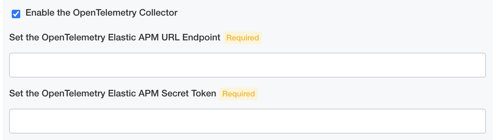
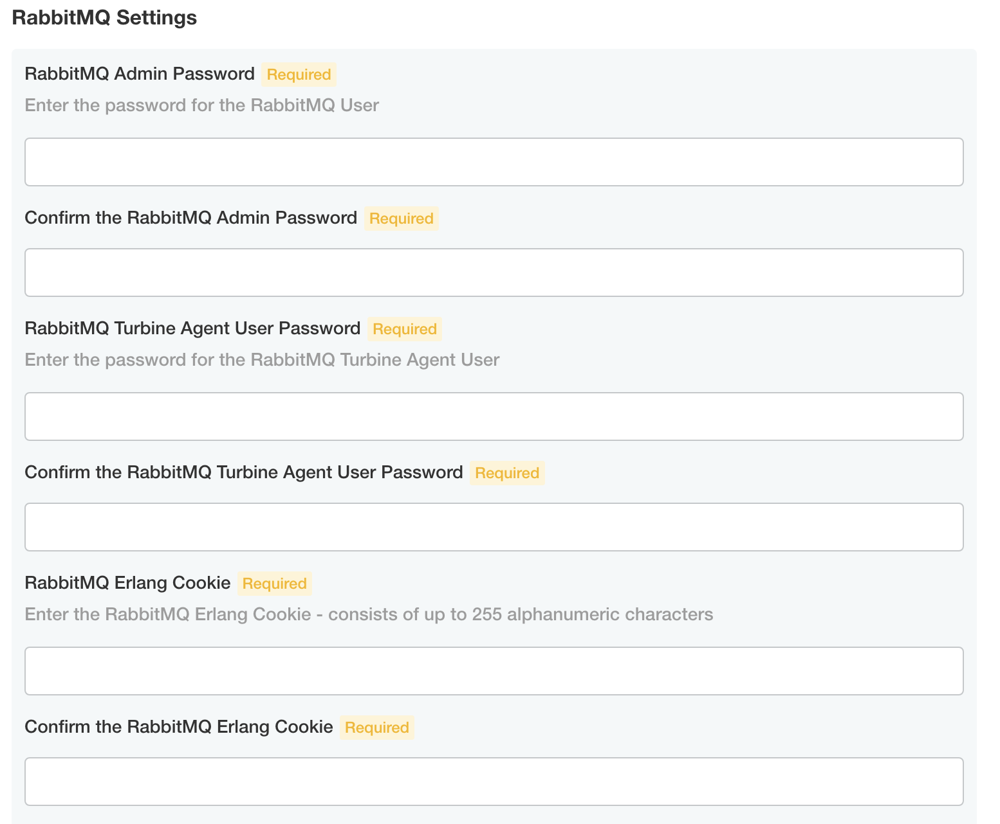
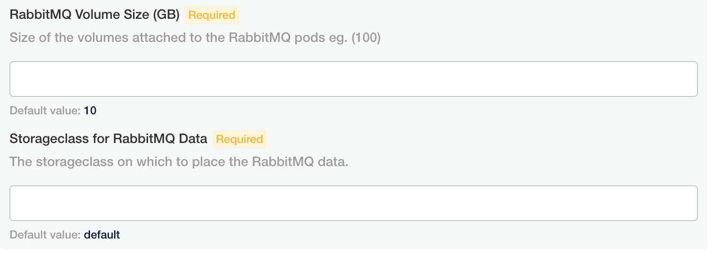
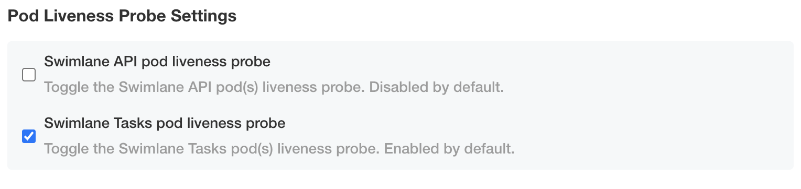
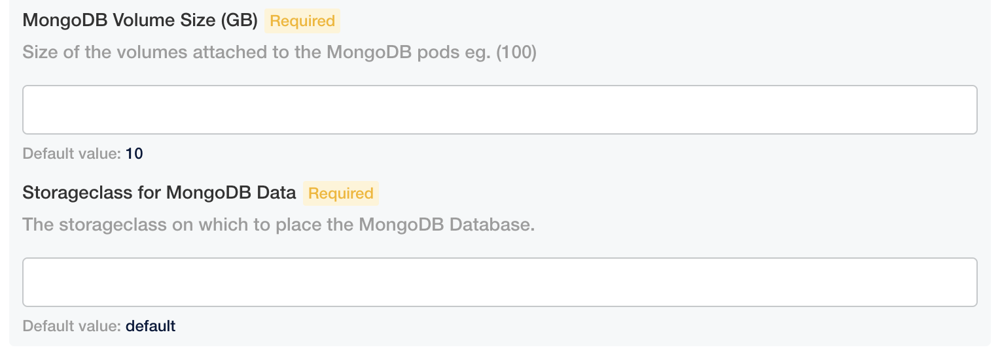
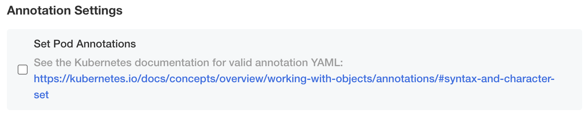
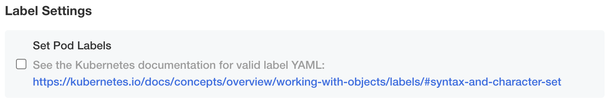
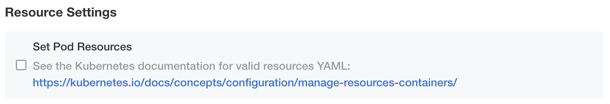
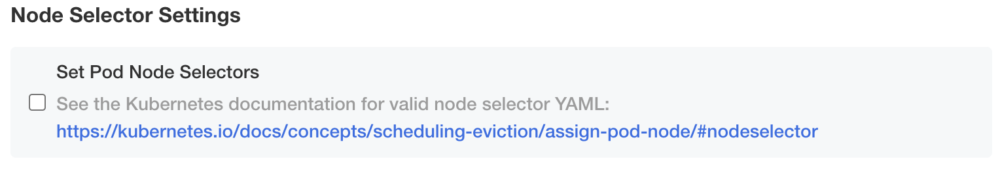
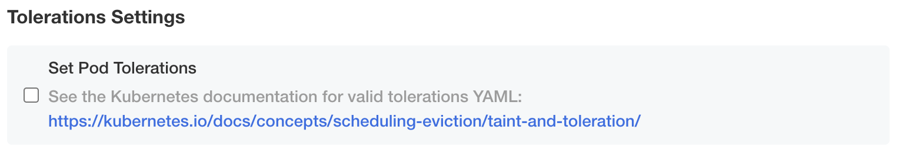

Configure the Turbine Platform for an Existing Cluster Install
==============================================================

When you need to access the Turbine Installer UI after the initial
install you can proxy it again by running this command and accessing it
in a Chrome browser:

kubectl kots admin-console --namespace your-namespace

**Note:** All configuration of the Turbine Installer and Turbine
platform must be done through the Turbine Installer admin console config
page. Editing or manipulating the underlying Kubernetes resources is not
supported and will not be permanent since they are managed and
controlled by the Turbine Installer.

#. First, configure ingress options.

   -  **Enable Ingress Resource** - Enable this option if you have an
      existing ingress controller installed in your cluster that you
      want to utilize to expose Turbine externally.

      -  **Ingress Resource Annotations** - Enter the annotations to
         apply to the ingress resource. See the documentation for your
         ingress controller for the required annotations to work
         properly.

         -  If your ingress controller requires a NodePort service then
            you must enable the **Expose the Swimlane Web Service
            Externally** option below.

      -  **Ingress Resource TLS** - Enter the TLS section for the
         ingress resource. See your ingress controller’s documentation
         for the required TLS settings. See the Kubernetes documentation
         for valid ingress `TLS
         YAML <https://kubernetes.io/docs/concepts/services-networking/ingress/#tls>`__.

      -  **Ingress Resource Hostnames** - Enter the hostnames to match
         to this ingress resource. Enter one per line with each line
         starting with a dash and a space (e.g. "- hostname.example").
         You must use DNS-compliant records. A DNS record can be up to
         63-characters long and can only contain letters, numbers, and
         hyphens. The record cannot start or end with a hyphen, or have
         consecutive hyphens. If left blank, it will match all
         hostnames.

         -  **Expose the Swimlane Web Service Externally** - Enable this
            option to expose the Swimlane web service as a NodePort from
            each node in the cluster on the TCP port below. You must
            configure your external layer 7 load balancer to forward to
            each node over the chosen port.

            -  **Swimlane Web Service Port** - Enter the port to use for
               the externally exposed Swimlane Web Service. This port
               must be within your cluster's NodePort range. If left
               blank, it will use a random port in your cluster's
               NodePort range.

         -  **Set Swimlane Web Service Annotations** - Enter the
            annotations to apply to the Swimlane Web service. See the
            documentation for your ingress controller for the required
            annotations.

         -  **Upload a certificate for Swimlane Web backend** - Enable
            this option to upload a certificate and key to be used by
            the backend Swimlane web service. If no certificate is
            uploaded a self-signed one will be used.

2. Next, set the Swimlane settings.

   -  **ASP.NET Hosting Environment** - Set this option to Development
      to have stack traces sent to the browser for 500 errors. Set this
      option to Production to not send them.

   -  **Enable Swimlane Audit Logging** - Enable this option to log raw
      Swimlane API requests and responses into Swimlane pods.

   -  **Swimlane Logging Level** - Set this option to specify the
      logging level for Swimlane pods.

3. Next, determine whether to override the OpenSSL settings for
   CipherString and MinProtocol for outgoing secure connections that
   originate from API and Tasks pods.

4. Next, determine whether you want to enable OpenTelemetry collector
   and connect it to Elastic APM.

   -  **Enable the OpenTelemetry Collector** - Enable this option to run
      an OpenTelemetry Collector and connect it to an Elastic
      APM service by providing the Elastic APM URL Endpoint and Elastic
      APM Secret Token.

   |image1|

5. Determine whether you want MongoDB to be exposed for external access.

   -  **Expose MongoDB Externally** - Enable this option to expose each
      MongoDB pod as a NodePort from each node in the cluster. Each one
      will use a random port in your cluster's NodePort range.

   |image2|

6. If you have third-party certificates for API and tasks, click
   **Upload Additional Trusted Certificates for API and Tasks** and then
   browse for and upload your certificates.

   -  **Upload Additional Trusted Certificates for API and Tasks**

   |image3|

7. Next, set the Turbine settings.

   -  **Enable the Turbine Logger** - Enable this option to log messages
      coming from all agents and reoutput them in a central location

   |image4|

8. Next, define the RabbitMQ settings.

-  **RabbitMQ Admin Password** - The admin password for the RabbitMQ
   deployment.
-  **RabbitMQ Turbine Agent User Password** - The password for the user
   that remote agents will use when connecting to this deployment.
-  **RabbitMQ Erlang Cookie** - The shared secret used for the RabbitMQ
   deployment nodes to communicate to one another.

|image5|

8. Next, define the RabbitMQ volume size and StorageClass.

-  **RabbitMQ Volume Size (GB)** - The size in GB for the RabbitMQ
   persistent volume.
-  **StorageClass for RabbitMQ Data** - The StorageClass to use for the
   RabbitMQ persistent volume.

|image6|

9. Next, choose whether to enable or disable a pod liveness probe for
   the API and Tasks pods. The default liveness probe setting for API
   pods is disabled and for Tasks pods is enabled.

|image7|

10. On Initial MongoDB Settings, enter the appropriate encryption keys
    and passwords for your Swimlane database and MongoDB.

11. Next, set the MongoDB volume size and StorageClass.

    -  **MongoDB Volume Size (GB)** - The size in GB for the MongoDB
       persistent volume.

    -  **StorageClass for MongoDB Data** - The StorageClass to use for
       the MongoDB persistent volume.

|image8|

12. Next, set the PostgreSQL volume size and StorageClass.

    -  **PostgreSQL Volume Size (GB)** - The size in GB for the
       PostgreSQL persistent volume.

    -  **StorageClass for PostgreSQL Data** - The StorageClass to use
       for the PostgreSQL persistent volume.

13. Next, set the HA Environment settings for this cluster.

14. Next, set the affinity settings.

    -  **Use Simple Pod Affinity** - Use simplified affinity options to
       decide how to balance the Swimlane and MongoDB pods across your
       cluster nodes.

15. Next, set the service account settings.

    -  **Automatically Create and Set the Service Account Used by the
       Swimlane Tools Deployment** - When enabled, a service account,
       role, and role binding named ``swimlane-backup`` will be created
       in the namespace Swimlane is installed in that will be used by
       the Swimlane Tools deployment. This service account requires
       special permissions in order for the Swimlane Tools deployment to
       process snapshots and support bundles. Uncheck this if you want
       to create the service account manually and then enable the Set
       the service account option and define the name of it below.

       -  **Kubernetes Service Account Name for the Swimlane Tools
          Deployment** - The service account name to use for the
          Swimlane Tools Deployment.

    -  **Set Service Accounts** - Enable this if you need to set the
       Kubernetes serviceAccountName for each pod type. Pod types that
       don't require special settings can be left blank. See `Service
       Account Permissions <service-account-permissions.htm>`__ for more
       information on the required permissions for the pod types that
       require it.

16. Next, set the pod annotations settings.

    -  **Set Pod Annotations** - Enable this if you need to to set pod
       annotations for the Swimlane deployments. Pod types that don't
       require special settings can be left blank. See the `Kubernetes
       Annotations <https://kubernetes.io/docs/concepts/overview/working-with-objects/annotations/#syntax-and-character-set>`__
       documentation for valid annotations YAML.

Sample annotations:

annotation1: "value1" annotation2: "value2"

|image9|

17. Next, set the pod labels settings.

    -  **Set Pod Labels** - Enable this if you need to set pod labels
       for the Swimlane deployments. Pod types that don't require
       special settings can be left blank. See the `Kubernetes
       Labels <https://kubernetes.io/docs/concepts/overview/working-with-objects/labels/#syntax-and-character-set>`__
       documentation for valid label YAML.

    Sample labels:

    label1: "value1" label2: "value2"

|image10|

18. Next, set the pod resources settings.

    -  **Set Pod Resources** - Enable this if you need to set pod
       resources for the Swimlane deployments. Pod types that don't
       require special settings can be left blank. See the `Kubernetes
       Resources <https://kubernetes.io/docs/concepts/configuration/manage-resources-containers/>`__
       documentation for valid resources YAML. See Pod Requests and
       Limits for a breakdown of requests and limits for each pod type.

Sample pod resources:

requests: memory: "500m" cpu: "500m" limits: memory: "1G" cpu: "1000m"

|image11|

19. Next, set the pod node selectors settings.

    -  **Set Pod Node Selectors** - Enable this if you need to set pod
       node selectors for the Swimlane deployments. Pod types that don't
       require special settings can be left blank. See the `Kubernetes
       Node
       Selectors <https://kubernetes.io/docs/concepts/scheduling-eviction/assign-pod-node/#nodeselector>`__
       documentation for valid node selectors YAML. See `Pod Requests
       and Limit <pod-requests-and-limits.htm>`__\ s for a breakdown of
       requests and limits for each pod type.

Sample node selector:

nodelabel: value

|image12|

20. Next, set the pod tolerations settings.

    -  **Set Pod Tolerations** - Enable this if you need to set pod
       tolerations for the Swimlane deployments. Pod types that don't
       require special settings can be left blank. See the `Kubernetes
       Tolerations <https://kubernetes.io/docs/concepts/scheduling-eviction/taint-and-toleration/>`__
       documentation for valid tolerations YAML.

Sample toleration:

- key: "key1" operator: "Equal" value: "value1" effect: "NoSchedule"

|image13|

21. When you save the configuration, preflight checks for your
    installation begin.

22. If all preflight checks pass, the Turbine platform will deploy.
    Click **Continue** to access the Turbine Platform Installer Admin
    Console.

23. Next, see `Backup and Restore on an Existing Cluster with
    Snapshots <backup-and-restore-on-an-existing-cluster-with-snapshots.htm>`__
    to set up snapshots.

.. |image2| image:: ../Resources/Images/expose_mongo.png
.. |image3| image:: ../Resources/Images/third_party_certs_settings.png
.. |image4| image:: ../Resources/Images/turbine_settings.png

