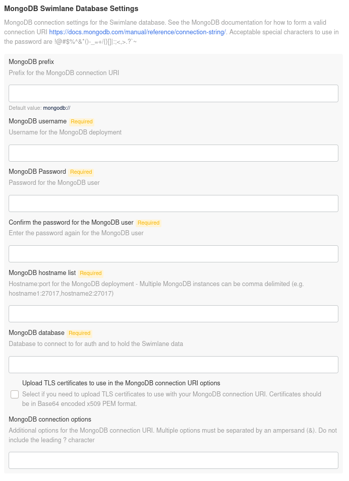

Deploy with an External MongoDB Cluster
=======================================

**Important!** Due to ongoing incompatibilities, Turbine does not
support using Amazon DocumentDB as an option for external MongoDB
Cluster deployment.

There are two primary deployment models for using an external MongoDB
cluster with Turbine:

-  `Self-Hosted MongoDB Cluster <#Self-Hos>`__

-  `MongoDB Atlas <#MongoDB>`__

**Important!** The physical location of the external Mongo deployment,
as it pertains to latency between the Turbine cluster and the standalone
Mongo instance, performs best with a latency delay of less than 5
milliseconds. Be aware that with every added millisecond of latency,
Turbine's performance drops linearly.

General Requirements
--------------------

-  MongoDB version 5.0 is currently the only supported version for any
   external deployment.

Self-Hosted MongoDB Cluster
---------------------------

Customer-maintained MongoDB clusters are supported as long as the
external MongoDB cluster meets the requirements listed in the `System
Requirements <system-requirements-for-an-existing-cluster-install/system-requirements-for-an-existing-cluster-install.htm>`__
for existing clusters.

Swimlane requires that you name your databases ``Swimlane``,
``SwimlaneHistory`` and ``Turbine`` in your deployment. In each
database, also create a ``Swimlane`` user and ensure that it is assigned
the ``dbOwner`` role.

MongoDB Atlas
-------------

You can use MongoDB Atlas as an external MongoDB cluster as long as the
cluster has been configured to use a compute tier that aligns with the
System Requirements for
`Existing <system-requirements-for-an-existing-cluster-install/system-requirements-for-an-existing-cluster-install.htm>`__
or
`Embedded <../embedded-cluster-install/system-requirements-for-an-embedded-cluster-install/system-requirements-for-an-embedded-cluster-install.htm>`__
cluster installations. Dedicated M40 clusters are the minimum compute
tier required for an external MongoDB cluster.

After creating your Atlas cluster, you must create three databases.
Swimlane requires that you name your databases ``Swimlane``,
``SwimlaneHistory`` and ``Turbine`` in your deployment. In each
database, also create a ``Swimlane`` user.

Users, databases, and roles are all managed through the Atlas UI. Atlas
does not have a "dbOwner" role that would be used in self-hosted
clusters. Instead, your created users should be assigned the specific
advanced privileges ``dbAdmin`` and ``readWrite``. Additionally, you can
scope the permissions of each user to their respective databases,
although it is not required.

**Note** The built-in role "Read and write to any database" is not
sufficient, as Turbine requires the ability to create indexes in
MongoDB, which is a dbAdmin privilege.

Configuring External Mongo in the Turbine Platform Installer
------------------------------------------------------------

When you select the **Use an external MongoDB deployment** option, the
TPI UI hides all of the embedded mongo options and displays these
sections **MongoDB Swimlane Database Settings**, **MongoDB Swimlane
History Database Settings** and **MongoDB Turbine Database Settings**.

|image1|

Both of these sections set their respective database's configuration and
contain the same options as described here:

**MongoDB prefix:** Describes the prefix of the MongoDB connection
string. The default value is ``mongodb://``, however ``mongodb+srv://``
is also a valid prefix. This prefix is common when using MongoDB Atlas.

**MongoDB username:** The username for the user associated with the
relevant database that is being configured, either *Swimlane* or
*SwimlaneHistory* or *Turbine*.

**MongoDB Password:** The password for the user associated with the
relevant database that's being configured, either *Swimlane* or
*SwimlaneHistory* or *Turbine*.

**MongoDB hostname list:** The hostname or set of hostnames for the
MongoDB cluster. For multi-node clusters, this is usually in the form of
a comma-separated list of hostnames and ports. In Atlas deployments,
this can be the SRV record for the cluster provided by the Atlas UI.

**MongoDB database:** The database name relevant to the database that's
being configured, either *Swimlane* or *SwimlaneHistory* or *Turbine*.

**Upload TLS certificates to use in the MongoDB connection URI
options:** Enables the uploading of a CA certificate if the MongoDB
cluster uses an internal CA.

**MongoDB connection options:** Provides additional options to the
connection string. Currently, the **only** supported options for the
Swimlane and Swimlane History database are ``ssl`` and
``sslVerifyCertificates``. The Turbine database supported optins are
``tls`` and ``tlsAllowInvalidCertificates``.

