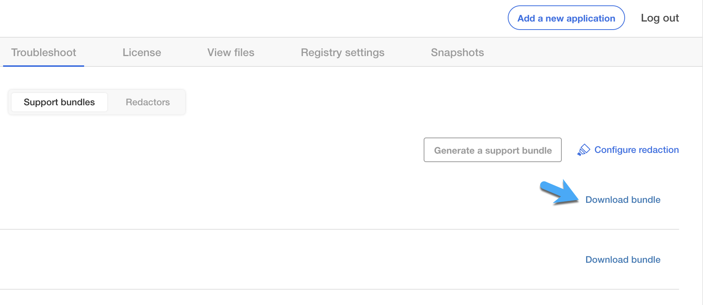

Generate a Support Bundle
=========================

If you're having issues with the Turbine Platform Installer (TPI), your
Swimlane support representative will likely ask you to generate a
support bundle to identify the diagnostics for your issue.

Support bundles contain logs from all relevant pods, as well as other
useful information from your deployment.

Airgapped Deployments
---------------------

Use these instructions for an airgapped deployment.

Before you begin generating a support bundle you must first ensure that
you have the support-bundle command installed.

Install the Support-Bundle Command
~~~~~~~~~~~~~~~~~~~~~~~~~~~~~~~~~~

If you have already installed the support-bundle command, you can skip
these steps.

To install the support-bundle command:

#. From a computer that is connected to the internet run:

     curl -o support-bundle https://krew.sh/support-bundle curl -o
   spec.yaml https://kots.io -H
   'User-agent:Replicated_Troubleshoot/v1beta1'

#. Move the files to the server:

     scp support-bundle <server>:/path/ scp spec.yaml <server>:/path/

#. Next, connect to the airgapped server and make the support-bundle
   file executable:

     chmod 777 support-bundle

#. Execute the installer for support-bundle:

     ./support-bundle

#. Finally, generate the support bundle:

     kubectl support-bundle /path/to/spec.yaml

   A support bundle is created in the directory from which you ran the
   command:

     support-bundle-2021-01-19T17_20_56.tar.gz

#. Give this support bundle to Swimlane support.

Generating a Support Bundle with CLI (Airgap)
~~~~~~~~~~~~~~~~~~~~~~~~~~~~~~~~~~~~~~~~~~~~~

To generate a support bundle with CLI (Airgap):

#. Log in to TPI, and connect to the server.

#. Run this support-bundle command:

     kubectl support-bundle secret/default/kotsadm-turbine-supportbundle
   --redactors=configmap/default/kotsadm-redact-spec/redact-spec,configmap/default/kotsadm-turbine-redact-spec/redact-spec

   If this command throws the following error, it means that a
   support-bundle file has been saved in the directory from which the
   commands were run:

     $ kubectl support-bundle
   secret/default/kotsadm-turbine-supportbundle \* failed to run
   collector "run/ping-google": timeout \* Failed to upload support
   bundle: execute request: Put
   "https://<swimlane-url>:8800/api/v1/troubleshoot/1n7plYfeeXJCdYH31LhYACWdVun/xjt595pdcr6m6fvts8wnbpbltbms6hhb":
   dial tcp [::1]:8800: connect: connection refused

   If you do not have the support-bundle command, see `Install the
   Support-Bundle Command <#Install>`__.

3. The support bundle uploads to your Turbine Platform Installer UI.

4. From the Turbine Platform Installer UI, click Dashboard and then open
   the Troubleshoot tab.

5. On Troubleshoot, click **Download bundle**.

6. |image1|

6. Deliver the downloaded file to Swimlane support.

Online Deployments
------------------

Use these instructions for an online deployment that is connected to the
internet.

Before you begin generating a support bundle you must first ensure that
you have the support-bundle command installed. See `Install the
Support-Bundle Command <#Install>`__ for details.

Generating a Support Bundle with CLI (Online)
~~~~~~~~~~~~~~~~~~~~~~~~~~~~~~~~~~~~~~~~~~~~~

To generate a support bundle with CLI (Online):

#. Log in to TPI, and connect to the server.

#. | Run this support-bundle command:

#.   curl https://krew.sh/support-bundle \| bash

3. Generate the support bundle by running this command: kubectl
   support-bundle secret/default/kotsadm-turbine-supportbundle

4. If this command throws the following error, it means that a
   support-bundle file has been saved in the directory from which the
   commands were run:

     $ kubectl support-bundle
   secret/default/kotsadm-turbine-supportbundle \* failed to run
   collector "run/ping-google": timeout \* Failed to upload support
   bundle: execute request: Put
   "https://<swimlane-url>:8800/api/v1/troubleshoot/1n7plYfeeXJCdYH31LhYACWdVun/xjt595pdcr6m6fvts8wnbpbltbms6hhb":
   dial tcp [::1]:8800: connect: connection refused  

4. The support bundle uploads to your Turbine Platform Installer UI.

5. From the Turbine Platform Installer UI, click Dashboard and then open
   the Troubleshoot tab.

6. On Troubleshoot, click **Download bundle**.

7. |image2|

7. Deliver the downloaded file to Swimlane support.

.. _generating-a-support-bundle-through-the-spi-ui:

Generating a Support Bundle Through the TPI UI
----------------------------------------------

Use these instructions to get a support bundle from the TPI UI.

#. Log in to the Turbine Platform Installer UI.

#. From the Turbine Platform Installer UI, click Dashboard and then open
   the Troubleshoot tab.
   If you do not have the support-bundle command, see `Install the
   Support-Bundle Command <#Install>`__.

#. On the Troubleshoot tab, click **Analyze Swimlane**.

#. The TPI checks the deployment for issues. This may take some time.
   You will know when the process is finished once you receive an
   analysis overview.

4. To view the content of the support bundle, click the File Inspector
   tab.

5. To download the support bundle, click **Download bundle**.

6. Deliver the downloaded file to Swimlane support.

