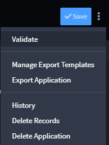

Applet Builder
==============

Applet Builder is the starting point for building and managing applets.
With Swimlane Turbine's Applet Builder you can:

-  Create and modify fields and layouts.
-  Set field level permissions and properties.
-  Configure calculations.
-  Access, build, and update workflow.
-  Run manual validations.
-  Create export templates.
-  View revision history.
-  Delete applets.

Applets share nearly all of the same features as applications. There are
a few important differences, including the way applets handle reference
fields and the way that applets configure workflow upon the addition of
an applet to an application.

**Note:** Users who do not have permissions set on any applications, but
have global permissions set in all other areas of Turbine, will be able
to view applications and applets in the Administrator menu. If users
have global permissions for applets, they will be able to edit applets.
However, since they do not have any permissions set for applications,
they will see applications listed, but will be unable to edit them or
otherwise modify them.

Page Components
---------------

The Applet Builder page consists of these main components:

+----------------------+----------------------------------------------+
| Component            | Description                                  |
+======================+==============================================+
| **Field Types**      | Available fields that you use to build your  |
|                      | applet. The fields support the various input |
|                      | data for the records.                        |
+----------------------+----------------------------------------------+
| **Form Layout**      | The container where you modify the           |
|                      | arrangement of fields for your applet.       |
+----------------------+----------------------------------------------+
| **Applet Settings**  | Settings you assign that are relevant to the |
|                      | entire applet, such as Name, Description,    |
|                      | and permissions.                             |
+----------------------+----------------------------------------------+
| **Field Properties** | Settings and properties that you assign for  |
|                      | specific fields within the applet, such as   |
|                      | permissions, size of the field in the        |
|                      | layout, values, and whether the field is     |
|                      | required.                                    |
+----------------------+----------------------------------------------+
| **Hidden Fields**    | A list of fields that exist within the       |
|                      | applet and are available for reports and     |
|                      | modification in workflow, but that are not   |
|                      | visible in the record entry form.            |
+----------------------+----------------------------------------------+

| You control the view of Applet Builder. Look for the small keyboard
  icon in the lower left corner of the applet.
| |image1|

| Click the keyboard icon to open a control panel that contains keyboard
  shortcuts for controlling the view of the applet. Adjust your view
  settings, and then click **X** to close the control panel.
| |image2|

Hidden Fields
-------------

Hidden Fields are fields that exist within the applet and are available
for reports, but are not visible in the record entry form.

Hidden fields are visible at the bottom of the Applet Builder form
layout.

Field Validation
----------------

While you build out the forms for your applet Turbine validates the
fields, looking for duplicate fields or empty fields. You will see
inline checks and pop-up error notifications that contain additional
detail about the error and how you can resolve it. The pop-up error
notification will lead you through the process of resolving the error
and will disappear once you've successfully saved the applet.

| Here is an example of an inline check for a duplicate field name:
| |image3|

| Here is an example of a pop-up error notification:
| |image4|

Click the errors, and then the field(s) on the pop-up notification to
edit and resolve the error(s).

You can also manually run a validation. From the Applet Builder task-bar
menu, select **Validate**.

| |image5|

.. |image1| image:: ../../Resources/Images/page-view-settings.png
.. |image2| image:: ../../Resources/Images/page-view-controls.png
.. |image3| image:: ../../Resources/Images/unique_field.png
.. |image4| image:: ../../Resources/Images/nag-error-resolution.png

.. toctree::
   :titlesonly:
   :caption: Children:

   /Content/applications-and-applets/applet-builder/build-an-applet
   /Content/applications-and-applets/applet-builder/applets-and-workflow
   /Content/applications-and-applets/applet-builder/view-revision-history
