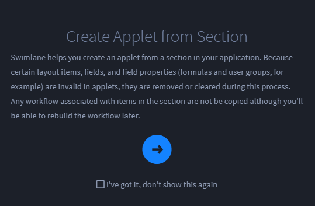

Build an Applet
===============

When you build an applet, you go through the same process as when you
build an application. For that reason, you can refer to the following
Application Builder topics for additional detail about building applets:

-  `Define the
   Foundation <../application-builder/define-the-foundation.rst>`__
-  `Create the Layout <../application-builder/create-the-layout.rst>`__
-  `Select Fields and Assign Field
   Properties <../application-builder/select-fields-and-assign-field-properties/select-fields-and-assign-field-properties.rst>`__

   -  `Text <../application-builder/select-fields-and-assign-field-properties/text.rst>`__
   -  `Numeric <../application-builder/select-fields-and-assign-field-properties/numeric.rst>`__
   -  `Date /
      Time <../application-builder/select-fields-and-assign-field-properties/date-time.rst>`__
   -  `Selection <../application-builder/select-fields-and-assign-field-properties/selection.rst>`__
   -  `Reference <../application-builder/select-fields-and-assign-field-properties/reference.rst>`__
   -  `Users /
      Groups <../application-builder/select-fields-and-assign-field-properties/users-groups.rst>`__
   -  `Attachments <../application-builder/select-fields-and-assign-field-properties/attachments.rst>`__
   -  `Comments <../application-builder/select-fields-and-assign-field-properties/comments.rst>`__

Create Applet from Section
--------------------------

You can also build applets from existing layouts in Application Builder.

To build an applet from an existing section in Application Builder:

#. | Open an application and find the section you want to recreate as an
     applet. Hover over the section's function bar and select the Create
     Applet from Section icon.
   | |image1|

#. | Swimlane Turbine describes the next steps in a dialog. Read the
     dialog, then click the arrow key.
   | |image2|

#. On Create Applet, name the applet and (optionally) provide a
   description.

#. Click the logo **Icon** to select a logo, then click the
   Administration tab.

   **Note:** If you do not use a logo, then Turbine will use the
   applet's acronym in its place.

#. On Administration Permissions, specify the roles for the applet. When
   finished, click **Create**.

   Return to the Applications and Applets main page to locate your new
   applet.

.. |image1| image:: ../../Resources/Images/create-applet-from-section.png

