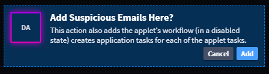

Add Applets
===========

You can add applets to your application from Application Builder. An
applet is a preconfigured set of fields and layout specifications for
Swimlane Turbine. Applets are appended to an existing application form
layout and are designed to allow users to easily update and expand their
existing applications.

To add applets to your application, select an applet, and then drag and
drop it to the Form Layout. Drop the field in the layout area and then
click **Add**.

|image1|

You can modify applets in the form layout after dropping them in.

For more about applets, see `Applet
Builder <../applet-builder/applet-builder.rst>`__.

