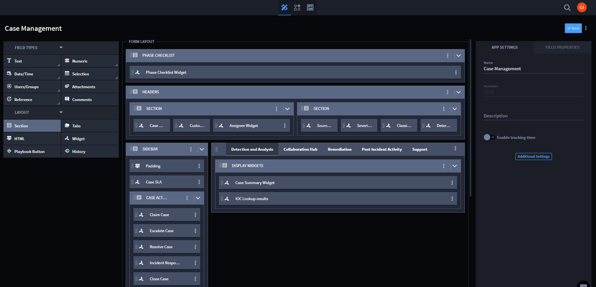
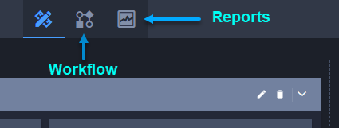
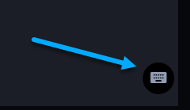

Application Builder
===================

Application Builder is the starting point for building and managing
applications. With Swimlane Turbine's Application Builder you can:

-  Create and modify fields and layouts.
-  Set field level permissions and properties.
-  Append applets to applications.
-  Configure calculations.
-  Access, build, and update workflow.
-  Access reports.
-  Run manual validations.
-  Create export templates.
-  View revision history.
-  Delete records associated with an application.
-  Delete applications.

Application Builder is available to any user or administrator of Turbine
who has permissions set to access applications or a sub-set of
applications.

|image1|

Click the icons in the Application Builder taskbar to jump from the
Application Builder view to workflow and reports.

|image2|

Page Components
---------------

The Application Builder page consists of these main components:

+----------------------+----------------------------------------------+
| Component            | Description                                  |
+======================+==============================================+
| **Field Types**      | Available fields that you use to build your  |
|                      | application. The fields support the various  |
|                      | input data for the application records.      |
+----------------------+----------------------------------------------+
| **Form Layout**      | The container where you modify the           |
|                      | arrangement of fields for your application.  |
+----------------------+----------------------------------------------+
| **App Settings**     | Settings you assign that are relevant to the |
|                      | entire application, such as Name,            |
|                      | Description, Roles, and Workspaces.          |
+----------------------+----------------------------------------------+
| **Applet Display**   | A list of available applets that you can add |
|                      | to your application.                         |
+----------------------+----------------------------------------------+
| **Field Properties** | Settings and properties that you assign for  |
|                      | specific fields within the application, such |
|                      | as permissions, size of the field in the     |
|                      | layout, values, and whether the field is     |
|                      | required.                                    |
+----------------------+----------------------------------------------+
| **Hidden Fields**    | A list of fields that exist within the       |
|                      | application and available for reports and    |
|                      | modification in workflow, but that are not   |
|                      | visible in the record entry form.            |
+----------------------+----------------------------------------------+

You control the view of Application Builder. Look for the small keyboard
icon in the lower left corner of the application.

|image3|

Click the keyboard icon to open a control panel that contains keyboard
shortcuts for controlling the view of the application. Adjust your view
settings, and then click **X** to close the control panel.

|image4|

Hidden Fields
-------------

Hidden Fields are fields that exist within the application and available
for reports and modification in workflow, but that are not visible in
the record entry form.

Hidden fields are visible at the bottom of the Application Builder form
layout.

Field Validation
----------------

While you build out the forms for your application Turbine validates the
fields, looking for duplicate fields or empty fields. You will see
inline checks and pop-up error notifications that contain additional
detail about the error and how you can resolve it. The pop-up error
notification will lead you through the process of resolving the error
and will disappear once you've successfully saved the application.

Here is an example of an inline check for a duplicate field name:

|image5|

Here is an example of a pop-up error notification:

|image6|

Click the errors, and then the field(s) on the pop-up notification to
edit and resolve the error(s).

.. |image4| image:: ../../Resources/Images/page-view-controls.png
.. |image5| image:: ../../Resources/Images/unique_field.png
.. |image6| image:: ../../Resources/Images/nag-error-resolution.png

.. toctree::
   :titlesonly:
   :caption: Children:

   /Content/applications-and-applets/application-builder/define-the-foundation
   /Content/applications-and-applets/application-builder/create-the-layout
   /Content/applications-and-applets/application-builder/select-fields-and-assign-field-properties/select-fields-and-assign-field-properties
   /Content/permissions/application-permissions
   /Content/permissions/field-level-permissions
   /Content/applications-and-applets/application-builder/add-applets
   /Content/applications-and-applets/application-builder/calculation-builder
   /Content/applications-and-applets/application-builder/view-revision-history
