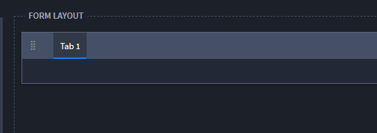
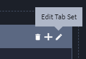
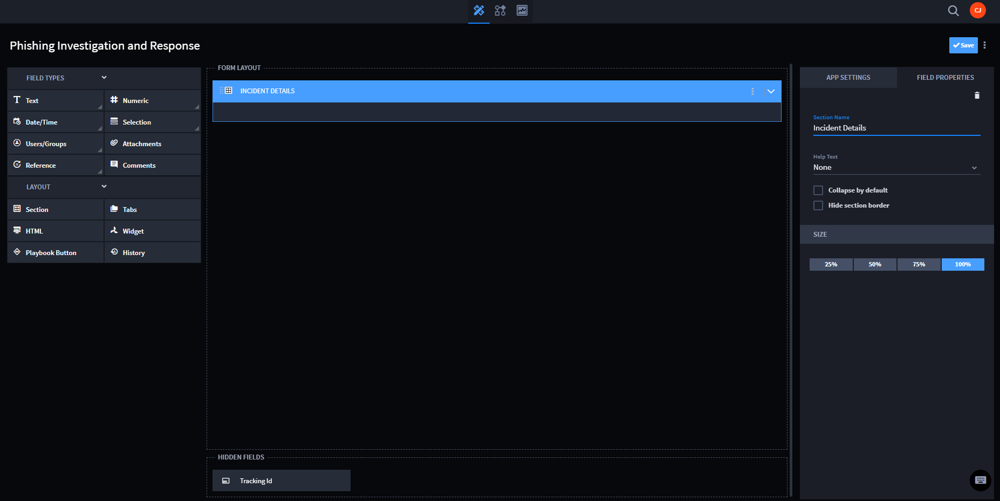
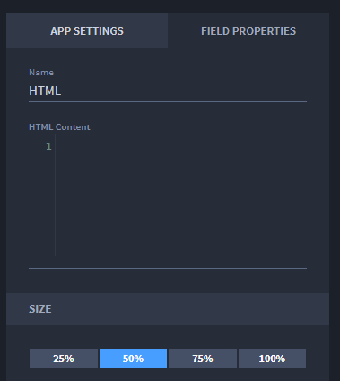

Create the Layout
=================

Now that you have defined your application's foundation, you build out
the format of the application. You organize your application in
sections, tabs, by playbook, or with HTML.

The layout of your application consists of fields and layout objects.
Drag and drop the fields and layout objects to the Form Layout area of
Application Builder.

Any of the layout objects can be re-sized to a percentage of the page.

**Available Layout Objects**

+---------------+-----------------------------------------------------+
| Layout Object | Description                                         |
+===============+=====================================================+
| **Tab**       | Groups multiple sections in the same area. Each tab |
|               | can have it's own layout, which can contain         |
|               | additional sections and tab elements.               |
+---------------+-----------------------------------------------------+
| **Section**   | Groups multiple fields and layout elements into a   |
|               | single area. Sections can contain additional        |
|               | sections and tab elements and can be collapsed or   |
|               | expanded in the record.                             |
+---------------+-----------------------------------------------------+
| **HTML**      | Displays HTML in the record.                        |
+---------------+-----------------------------------------------------+
| **Playbook**  | Adds a button to the record form that allows you to |
|               | run a playbook from the records page. You must have |
|               | already defined the playbook that will run in order |
|               | to set up a playbook from a record.                 |
+---------------+-----------------------------------------------------+

Creating Tab Layouts
--------------------

To create tab layouts:

#. From the FORM LAYOUT section of the Application Builder page, select
   **Tabs**, and then drag and drop it into the Form Layout.

   |image1|

#. Select the pencil icon to edit the tab settings, or double click the
   default tab title text.

   |image2|

#. To create additional tabs on your tab layout, click the plus icon.

   |image3|

   Another tab is added. Name the tab and add additional tabs as needed.

#. Add sections and fields, as needed, to the tab layouts, and click
   **Save**.

   |image4|

Creating Section Layouts
------------------------

To create a section:

#. Select **Section\ ,** then drag and drop it to the Form Layout area.

   |image5|

#. On the FIELD PROPERTIES tab, enter a name and description (optional)
   for the section.

   You can also resize the section on the FIELD PROPERTIES tab.

#. On **Help Text\ ,** specify whether you want optional help text to
   appear for the record. Select either *Above* or *Below* to indicate
   where you want the help text to display on the section.

   |image6|

   Once you select the location for the help text, enter the text for
   the record UI on **Help Text Context**.

   When creating a record, the help text displays as seen in the
   following image:

   |image7|

#. You can also specify two additional section-specific behaviors. You
   can specify whether a section will display collapsed as a default
   when a record is created or whether the border of the section should
   be hidden when viewed in a record. To specify these things, select
   from either **Collapse by default** or **Hide section border**.

5. Next, to start filling in the fields, drag and drop a field type,
   such as **Selection**, **Text\ ,** or **Comments** into the section.

   Fields in Application Builder have multiple sub-types. For example,
   you can select a Text field type, and further identify it by sub-type
   such as *Single-Line, Multi-Line, Email, Telephone, or URL,* for
   example. In addition, the field type you select can have various
   Field Properties assigned. See `Select Fields and Assign Field
   Properties <select-fields-and-assign-field-properties/select-fields-and-assign-field-properties.htm>`__
   for detail about fields.

6. Continue to add fields and layout objects until you have your
   application configured the way that you need it, then click **Save**.

Creating HTML Layouts
---------------------

You can use HTML to further customize the layout of your application.
For example, you can include code for a button that, when clicked, opens
internal documentation for reference.

**Note:** Any JavaScript code in the HTML Content field will be executed
by the browser when the record is viewed.

To create HTML layouts:

#. Select **HTML**, then drag and drop it to the Application Builder
   Form Layout area.

#. Double-click the title of the HTML layout object to rename it.

   |image8|

#. On FIELD PROPERTIES, enter your code in **HTML Content** and then
   click **Save**.

   |image9|

Creating Playbook Layouts
-------------------------

Including a playbook layout object in your applet or application allows
you to press a button and run a playbook from within a record.

To create playbook layouts:

#. Select **Playbook Button,** and then drag and drop it to the
   Application Builder Form Layout area.

#. Double-click the title of the Playbook button to rename it, or rename
   it on the FIELD PROPERTIES tab.

   |image10|

#. To assign the playbook to run, on the FIELD PROPERTIES tab click the
   playbook drop-down menu and select a playbook. To add new playbook
   inputs and properties, select **Configure**.

   |image11|

#. Click **Save**.

.. |image3| image:: ../../Resources/Images/add-tab.png
.. |image4| image:: ../../Resources/Images/three-tabs.png

.. |image6| image:: ../../Resources/Images/field-property-help_text.png
.. |image7| image:: ../../Resources/Images/new-record-with-help.png
.. |image8| image:: ../../Resources/Images/html-rename.png

.. |image10| image:: ../../Resources/Images/playbook-button.png
.. |image11| image:: ../../Resources/Images/playbook_dropdown.png
