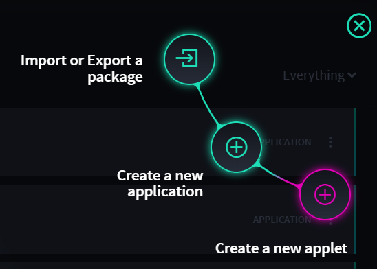

Define the Foundation
=====================

You create a new application from the Applications and Applets home
page. During the process of creating an application, you are prompted to
define its foundational details.

#. From the Applications and Applets home page task bar, click the plus
   menu icon, and then select **Create an application.**

   |image1|

#. The Create Application dialog opens, to the GENERAL tab. Name your
   application, and optionally provide a description.

   |image2|

   Swimlane Turbine automatically assigns an acronym to your
   application, according to the name that you provided. During this
   step you can override the automatic assignment by typing in the field
   instead. **Acronym** is a four-character field.

   **Note:** Once you create an application you cannot change the
   acronym.

#. Select **Enable tracking time** to allow time tracking on records.

When you track time on records, action on records will generate a hidden
field, *Total Time Spent,* which can be used to generate reports and
charts. You can enable and disable time tracking at any time for any
application. Enabled time tracking also enables a dialog that displays
the amount of time you've worked on a record upon saving a record.

4. Click **Next**, or click the ADMINISTRATION tab.

   **Note:** Once you click the **Create** button, the application is
   created and saved. You can edit many of the application settings
   again, but others are set once the application is created.

5. On Administration Permissions, add the roles you want to be able to
   access your application and then assign the role their specific
   actions.

   |image3|

   **Note:** If you don't assign a role here, the default permissions
   are set to a general administrator role.

6. Select the editing action you want to enable for the role for your
   application, then click **Next**.

Alternatively, click the RECORDS tab.

7.  On Record Permissions, the role that you've previously specified is
    displayed. Select the editing and access you want to create for this
    role for this application.

    |image4|

    **Note:** Users access records from the navigation menu, APPLICATION
    RECORDS. You must allow users' access to an application's records in
    order for them to be viewed or modified.

8.  Click **Next,** or click the WORKSPACE tab.

9.  On Workspace Associations, select **Automatically create workspace**
    if you want a new workspace added upon creation of this app.

    |image5|

    **Note:** You can only create a workspace upon creation of an
    application if you have permission to do so.

10. Next, add the roles you want to have read, edit, and delete access
    to this application's workspace.

11. Once you have the workspace foundation defined, click **Create.**
    Application Builder opens.

    You are now ready to create the layout of your application.

.. |image2| image:: ../../Resources/Images/create-application-general.png
.. |image3| image:: ../../Resources/Images/app-administration-permissions.png
.. |image4| image:: ../../Resources/Images/app-record-permissions.png
.. |image5| image:: ../../Resources/Images/app-workspace-associations.png
