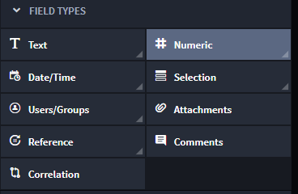
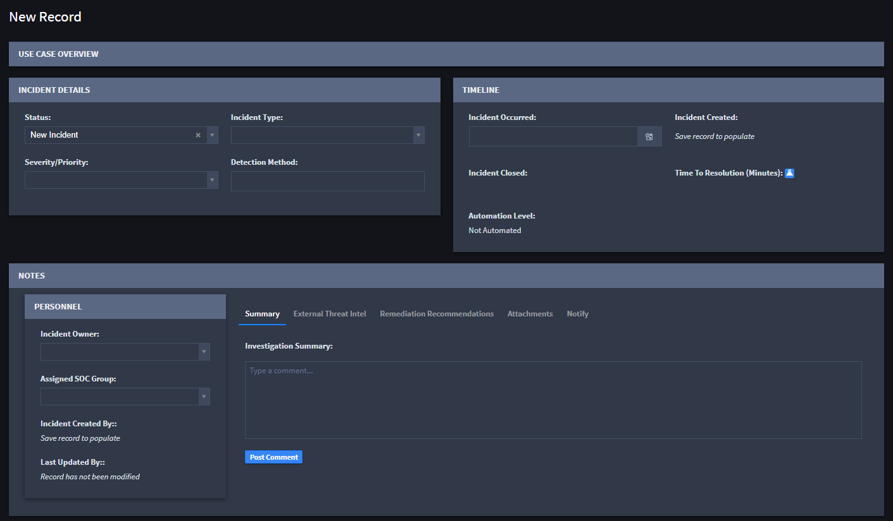

Select Fields and Assign Field Properties
=========================================

You select fields and assign field properties as you build your
application. This section covers the Application and Applet fields and
the options they provide for setup on the FIELD PROPERTIES tab.

|image1|

The fields you use to build your application are the fields that users
will access when they create or edit records in Swimlane. Here's a
screenshot of a new Swimlane record with multiple fields available to
fill out.

|image2|

Field Keys
----------

Field Keys function as aliases for fields. They allow for consistent
data ingestion, product upgrades, and imports of applications across
different environments.

Field Keys are validated for uniqueness against other Field Keys and
field Display Names within an application (they can be the same as their
corresponding Display Name). They can be a maximum of 32 characters and
can only contain:

-  Lower-case letters.
-  Numbers.
-  Hyphens.
-  Underscores.

When you first create a field, Swimlane names the Field Key based on the
field **Display Name\ .** Upper-case letters are converted to
lower-case, spaces are replaced with dashes, and non-alphanumeric
characters are removed. You can change the field key value at this time,
if desired.

Administrators can change field keys within Application Builder by
de-selecting the lock icon. The field key value, once unlocked, can be
changed. This lock allows changes to the Display Name of field to be
made without affecting the field key value.

|image3|

If an application is imported from an older version of Swimlane and
duplicate Key Field values would be created based on the established
Display Name values, integers will be added the field to prevent
duplication (e.g. field, field2, etc.). If the Field Key exceeds 32
characters, it is truncated at 29 characters, with integers added to the
end as needed.

.. |image3| image:: ../../../Resources/Images/field_keys.png

.. toctree::
   :titlesonly:
   :caption: Children:

   /Content/applications-and-applets/application-builder/select-fields-and-assign-field-properties/attachments
   /Content/applications-and-applets/application-builder/select-fields-and-assign-field-properties/comments
   /Content/applications-and-applets/application-builder/select-fields-and-assign-field-properties/date-time
   /Content/applications-and-applets/application-builder/select-fields-and-assign-field-properties/numeric
   /Content/applications-and-applets/application-builder/select-fields-and-assign-field-properties/reference
   /Content/applications-and-applets/application-builder/select-fields-and-assign-field-properties/selection
   /Content/applications-and-applets/application-builder/select-fields-and-assign-field-properties/text
   /Content/applications-and-applets/application-builder/select-fields-and-assign-field-properties/users-groups
   /Content/applications-and-applets/application-builder/select-fields-and-assign-field-properties/widgets
