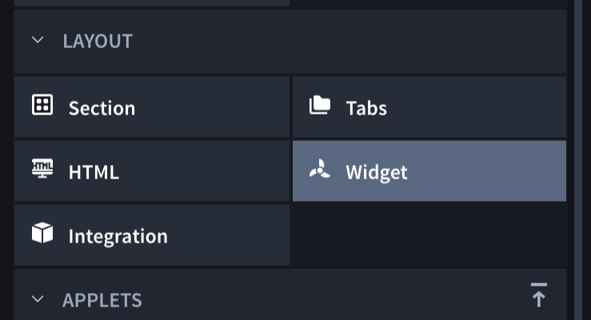

Widgets
=======

Widgets are javascript and html components that you can use to enrich
the User Interface (UI) of records. They allow you to create your own UI
components that interact with Swimlane or third-party endpoints.
Currently, Swimlane supports two types of widgets: Record widgets and
Report widgets.

This topic covers Record widgets. For more about using widgets for
reports, see `Reports Widgets. <../../../widgets/report-widgets.htm>`__

To create record widgets:

From the Layout section of the Application Builder or Applet Builder
page, select **Widgets**, and then drag and drop it into the Form
Layout.

|image1|

You can add multiple widgets per application or applet.

To edit the record widget, select the widget in the Form Layout, and
then, from the Field Properties click **Edit Widget**.

|image2|

Record widgets are rendered on the record page and have access to the
record values through the record attribute. Every change to the record
will automatically update the widget, by calling its ``update`` method.

The record attribute is a JavaScript object, where the keys are the
field's key property, and the value is the field value for that record.

Example: If you had an application that has a text field with the key
``text`` and a numeric field with the key ``numeric``, the record object
would look like this:

{ text: 'text field value', numeric: 55 }

This object can be used in the widget's ``update`` method to generate
the updated HTML of the widget after a change to the record.

Widgets do not save or retain any data and are used only to build a UI
component that interacts with other data on the record. Store record
data in a visible or hidden field on the record.

**Important!** When you export an application or applet that contains a
widget, the widget is exported too. This allows you to easily share and
reuse widgets. The widget's code is included in the exported
application. Since the widget's code is also included in the exported
application or applet JSON file, Swimlane recommends that you *do not*
include any sensitive information in widgets.

.. |image2| image:: ../../../Resources/Images/builder-edit-widget.png
