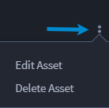
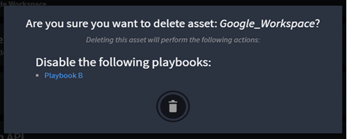

Assets
======

Assets are saved credentials and key/value pairs that help you connect
to technologies, and also serve as a key store for commonly used sets of
keys and values. Assets can be for a specific connector or customized,
which can be applied to any action inputs.

Assets are most useful for standardizing and securing configurations.

Create Assets
-------------

To create assets:

#. On ORCHESTRATION, click **Assets**.

#. | Click the plus icon to add and/or configure an asset.
   | On Select An Asset Type, available assets display based on the
     connectors that are installed on the system.
   | |image1|

3. Review the available asset types. Once you find the connector asset
   you want, click the radio button next to the asset.
   You can filter the assets to narrow your search.

4. To see parameters for that asset, click **Connector Details**. The
   OVERVIEW, ACTIONS, and ASSETS tabs provide an overview, the input and
   output parameters, and the associated connectors.
   |image2|

Configure Assets
----------------

To configure assets:

#. To select an asset to open, click **Configure your Connector Asset**.

#. Enter a title.

#. | From Asset Inputs section, fill out the required fields.
   | |image3|

4. Click **Create**.

#. On ORCHESTRATION, click **Assets**.

#. | Click the vertical ellipsis icon next to the asset you want to
     edit.
   | |image4|

3. Click **Edit**.

Customize Assets
----------------

**Tip:** You can assign custom assets to playbook actions.

To create custom assets:

#. On ORCHESTRATION, click **Assets**.

#. Click the plus icon to add and/or configure an asset.

3. Click the radio button next to **Custom Asset** to create a custom
   asset.

4. | Click **Create**.
   | |image5|

Delete Assets
-------------

To delete assets:

#. On ORCHESTRATION, click **Assets**.

#. | Click the vertical ellipsis icon next to the asset you want to
     edit.
   | |image6|

3. Click **Delete**.
   A confirmation dialog shows any playbooks that become disabled by
   deleting that asset. To view the playbooks listed, click the
   individual playbook hyperlink. To continue and delete, click the
   delete icon and hold.
   |image7|
   If deleting that asset does not disable any playbooks, the following
   confirmation dialog shows.
   |image8|

.. |image1| image:: ../Resources/Images/select-an-asset-type.png
.. |image2| image:: ../Resources/Images/connectors-tabs-secops-hub.png
.. |image3| image:: ../Resources/Images/asset-inputs-section.png

.. |image5| image:: ../Resources/Images/custom-assets.png

.. |image8| image:: ../Resources/Images/asset-delete-no-items.png

.. toctree::
   :titlesonly:
   :caption: Children:

   /Content/assets/create-custom-assets
