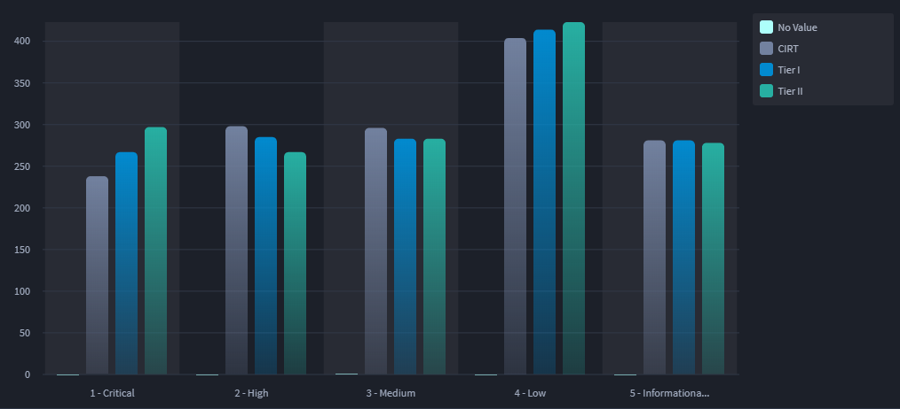
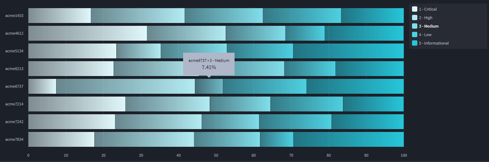
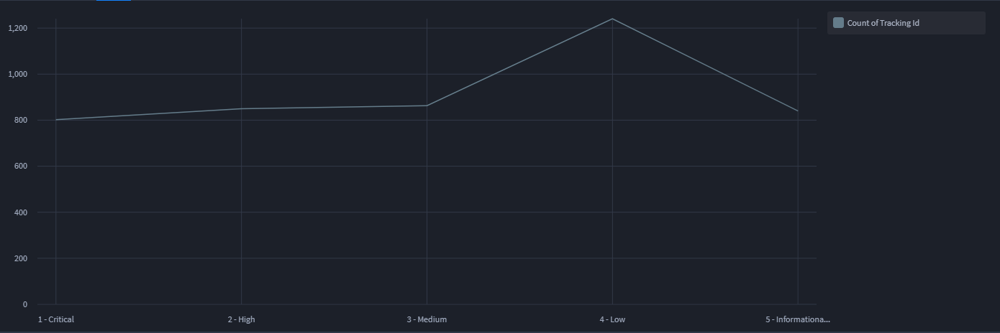
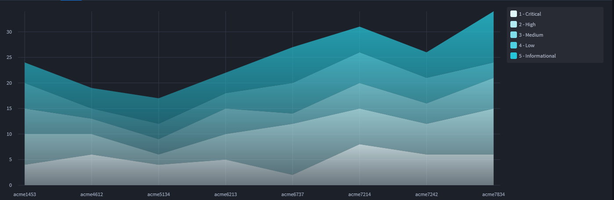
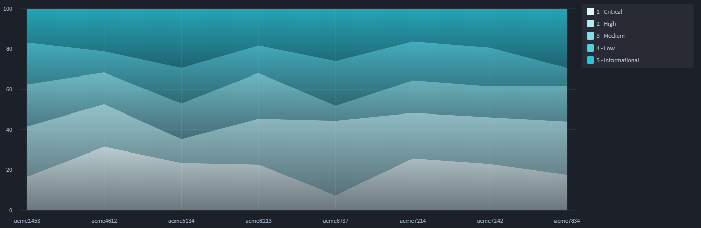
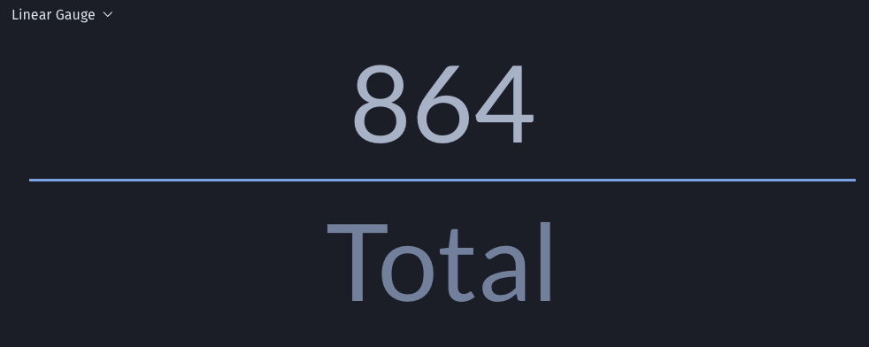
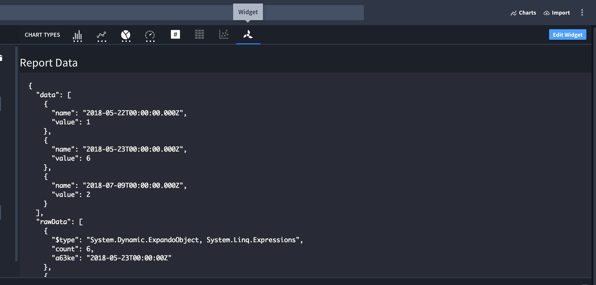

Chart Types
===========

This topic contains chart type examples.

Bar Charts
----------

Use bar charts to show comparisons between different categories of data.
The bars can display either vertically or horizontally.

Vertical Bar
~~~~~~~~~~~~

|image1|

Grouped Vertical Bar
~~~~~~~~~~~~~~~~~~~~

|image2|

Stacked Vertical Bar
~~~~~~~~~~~~~~~~~~~~

|image3|

.. _vertical-bar-1:

100% Vertical Bar
~~~~~~~~~~~~~~~~~

|image4|

Horizontal Bar
~~~~~~~~~~~~~~

|image5|

Grouped Horizontal Bar
~~~~~~~~~~~~~~~~~~~~~~

|image6|

Stacked Horizontal Bar
~~~~~~~~~~~~~~~~~~~~~~

|image7|

.. _horizontal-bar-1:

100% Horizontal Bar
~~~~~~~~~~~~~~~~~~~

|image8|

Line Charts
-----------

Use line charts when you want to represent continuous data in a chart.
Line charts work well with time data, but can also be used for other
types of continuous data such as levels or distances.

Line
~~~~

|image9|

Multi-Series Line
~~~~~~~~~~~~~~~~~

|image10|

Radar Charts
------------

Use radar charts to display multivariate data in a two-dimensional
format. The variables (3 or more) are typically represented on axes
starting from the same point.

|image11|

Area Charts
-----------

Area charts are similar to line charts. Use area charts to demonstrate
trends over time.

Area
~~~~

|image12|

Stacked Area
~~~~~~~~~~~~

|image13|

.. _area-1:

100% Area
~~~~~~~~~

|image14|

Pie Charts
----------

Use a pie chart when you want to display the composition of something.

Pie
~~~

|image15|

Donut
~~~~~

|image16|

Pie Grid
~~~~~~~~

|image17|

Advanced Pie
~~~~~~~~~~~~

|image18|

Number Card
-----------

|image19|

Heat Map
~~~~~~~~

|image20|

Linear Gauge
~~~~~~~~~~~~

|image21|

Gauge
~~~~~

|image22|

Bubble Chart
~~~~~~~~~~~~

|image23|

Report Widgets
--------------

|image24|

.. |image1| image:: ../Resources/Images/vertical-bar-example.png

.. |image3| image:: ../Resources/Images/stacked-vertical-bar.png
.. |image4| image:: ../Resources/Images/100-percent-vertical-bar.png
.. |image5| image:: ../Resources/Images/horizontal-bar.png
.. |image6| image:: ../Resources/Images/grouped-horizontal-bar.png
.. |image7| image:: ../Resources/Images/stacked-horizontal-bar.png

.. |image10| image:: ../Resources/Images/multi-series-line.png
.. |image11| image:: ../Resources/Images/radar-chart.png
.. |image12| image:: ../Resources/Images/area-chart.png

.. |image15| image:: ../Resources/Images/pie-chart.png
.. |image16| image:: ../Resources/Images/donut-chart.png
.. |image17| image:: ../Resources/Images/pie-grid.png
.. |image18| image:: ../Resources/Images/advanced-pie.png
.. |image19| image:: ../Resources/Images/number-card.png
.. |image20| image:: ../Resources/Images/heat-map.png

.. |image22| image:: ../Resources/Images/gauge.png
.. |image23| image:: ../Resources/Images/bubble-chart.png

