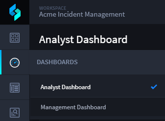

Charts
======

You can visualize data and create reports with charts.

To view charts:

#. Open the Default Report (or any report) view of Application Records.

   |image1|

#. Click **Charts** on the Default Report taskbar.

   |image2|

The visualization panel is split into two parts: chart configuration on
the left and preview on the right.

To create a visualization, select the desired chart type. Chart types
are listed above the chart preview, and are grouped into categories.

|image3|

.. |image2| image:: ../Resources/Images/charts-taskbar.png
.. |image3| image:: ../Resources/Images/displayinsearchbutton.png

.. toctree::
   :titlesonly:
   

   /Content/charts/chart-types
   /Content/charts/measures-and-dimensions
   /Content/charts/chart-options
   /Content/charts/colors
   /Content/charts/sorting
   /Content/charts/drill-in

