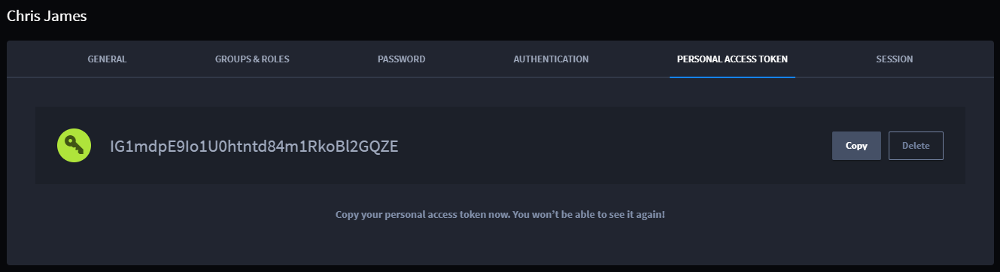

Customize Your User Profile
===========================

After the initial Swimlane Turbine installation, you customize your user
profile and create additional user profiles for your organization.

For details about installing Turbine, see the `Swimlane Turbine Platform
Installer
Guide <https://swimlane.com/knowledge-center/turbine_installer/>`__.

To create your user profile, click **Edit Profile** on the Complete Your
Profile Welcome screen.

|image1|

The initial installation of Turbine utilizes an administrator user
account that is necessary for the install steps. Once the installation
is complete, when you click **Edit Profile,** it takes you to the User
Profile editor for this administrator account. You can then customize
the admin account for your use, or create an additional administrator or
general user account.

|image2|

From the Profile editor, you can:

-  Upload an image to use as your Turbine profile picture.
-  Complete personal information.
-  Change your password.
-  Create a personal access token.
-  View a profile's most recent activity. (Admin only)
-  Specify groups and roles associated with the profile. (Admin only)
-  Select the Default Dashboard for the user profile.

**Note:** The roles and groups you want to assign must be created before
an administrator can assign them to specific users!

The Default Dashboard is the dashboard that displays each time you log
in to Turbine. If no dashboards appear in the list for selection, then
you either need to create a default dashboard, or the current user does
not have permissions to view those that have been created.

Creating a Personal Access Token
--------------------------------

Use your personal access token in python scripts or APIs that you use
from Turbine. Once you generate the token, take care to copy it
somewhere secure for use in scripts or APIs.

|image3|

You can delete and then regenerate the token if necessary, but it is
hidden from view after it's initially created.

|image4|

.. |image1| image:: ../Resources/Images/complete_profile.png
.. |image2| image:: ../Resources/Images/profile_editor.png

.. |image4| image:: ../Resources/Images/hidden-token.png
