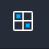
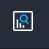

Navigation Basics
=================

Swimlane Turbine is organized into workspaces and dashboards where you
can view additional detail about the applications, records, and reports
that you manage within Turbine.

The workspaces, dashboards, records, reports, applications, and applets,
among other features in Turbine, are all permission-driven. A user must
give you permission as a user, or for your role within your
organization, to view or otherwise modify a specific feature of Turbine.

If you have administrator permissions on for users, groups or roles, or
playbooks, you will be able to view and access them from the Admin
portal. Admins then access workspaces, dashboards, and playbooks from
the global navigation menu.

**Important!** Access Turbine with the Google Chrome browser.

Profile Options
---------------

You access Profile Options from the upper-right corner of the Turbine
User Interface (UI). The Profile Options sub-menu is where you can begin
to complete the following basic steps:

-  **Profile & user settings:** edit user details, set password and
   personal access token, and see activity
-  **Documentation:** access Turbine platform documentation
-  **This version of Turbine:** see Turbine version, build, and
   copyright information
-  **Admin Panel**: (Admin users only) access the admin panel for the
   Account
-  **Sign out:** end active user session
   |image1|

Global record search is also available from the upper right corner of
the Turbine UI. For more information, see `Search Record
Data <../records/search-record-data.htm>`__.

.. _navigation-menu-options:

Global Navigation Menu Options
------------------------------

The menu on the left side of the screen is the global navigation menu.
Use this menu to navigate to the different areas of Turbine.

The menu can be minimized.

+-----------+--------------------------+---------------------------+
| Icon      | Function                 | Additional Information    |
+===========+==========================+===========================+
| |image18| | Workspaces               | Click to select a         |
|           |                          | workspace from a list of  |
|           |                          | workspaces.               |
+-----------+--------------------------+---------------------------+
| |image19| | Dashboards               | Click to view the         |
|           |                          | dashboards associated     |
|           |                          | with a specific           |
|           |                          | workspace.                |
+-----------+--------------------------+---------------------------+
| |image20| | Application Records      | Click to view, create,    |
|           |                          | and edit records.         |
+-----------+--------------------------+---------------------------+
| |image21| | Reports                  | Click to view reports.    |
+-----------+--------------------------+---------------------------+
| |image22| | Applications and Applets | Click to access a list of |
|           |                          | applications and applets  |
|           |                          | that you can manage,      |
|           |                          | edit, update, etc.        |
+-----------+--------------------------+---------------------------+
| |image23| | Orchestration            | Click to access           |
|           |                          | playbooks, webhooks,      |
|           |                          | assets, connectors,       |
|           |                          | playbook runs, and        |
|           |                          | events.                   |
+-----------+--------------------------+---------------------------+
| |image24| | Workspace Management     | Click to manage the       |
|           |                          | administrative tasks for  |
|           |                          | workspaces and            |
|           |                          | dashboards.               |
+-----------+--------------------------+---------------------------+
| |image25| | Library                  | Click to access the       |
|           |                          | Turbine Content for       |
|           |                          | drop-in content to boost  |
|           |                          | your workflow.            |
+-----------+--------------------------+---------------------------+

The icons visible in the global navigation panel are dependent upon what
you have permission to view, access, create, modify, and update.

Click the Turbine logo in the upper-left corner of the UI to go to the
default workspace and dashboard for your instance of Turbine.

.. |image1| image:: ../Resources/Images/admin-panel-login.png

.. |image3| image:: ../Resources/Images/left_nav_dashboards.png
.. |image4| image:: ../Resources/Images/left_nav_application_records.png

.. |image6| image:: ../Resources/Images/left_nav_app.png
.. |image7| image:: ../Resources/Images/left_nav_orchestration.png
.. |image8| image:: ../Resources/Images/left_nav_admin_workspaces.png

.. |image11| image:: ../Resources/Images/left_nav_dashboards.png
.. |image12| image:: ../Resources/Images/left_nav_application_records.png

.. |image14| image:: ../Resources/Images/left_nav_app.png
.. |image15| image:: ../Resources/Images/left_nav_orchestration.png
.. |image16| image:: ../Resources/Images/left_nav_admin_workspaces.png

.. |image19| image:: ../Resources/Images/left_nav_dashboards.png
.. |image20| image:: ../Resources/Images/left_nav_application_records.png

.. |image22| image:: ../Resources/Images/left_nav_app.png
.. |image23| image:: ../Resources/Images/left_nav_orchestration.png
.. |image24| image:: ../Resources/Images/left_nav_admin_workspaces.png

