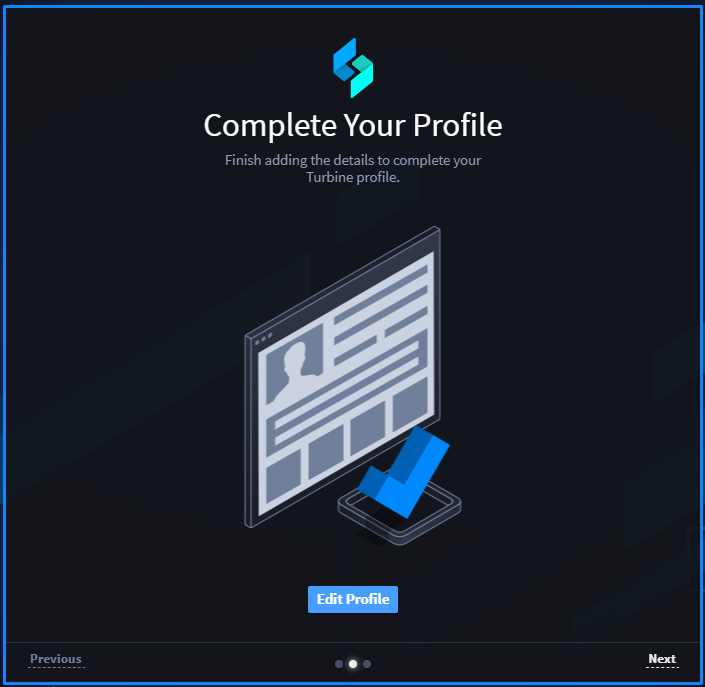
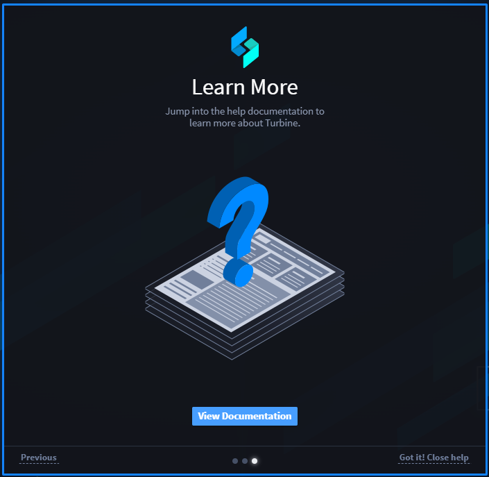

.. _introduction-to-swimlane-turbine:

Set Up Your Profile
===================

Swimlane Turbine is a low-code security automation platform. Use Turbine
to prioritize alerts, remediate threats and improve your operational
performance.

Welcome to Turbine!
-------------------

Once you've installed Turbine, you are greeted by a series of welcome
screens. The screens are there to help you get started. Click the
buttons on the screens to set up your user profile, start building
applications, or to view the Turbine documentation.

|image1|

|image2|

|image3|

**Note:** Once you have configured your Turbine user profile and have
specified a default dashboard, you will not see this set of screens
again.

.. |image1| image:: ../Resources/Images/welcome.png

.. toctree::
   :titlesonly:
   :caption: Children:

   /Content/introduction/customize-your-user-profile
