Case and Incident Management Application
========================================

The Case and Incident Management (CIM) application serves as a central
point of interaction for a Security Operations team. You can use this
application independently or with a solution such as Phishing Triage or
Alert Triage from the SOC Solutions Bundle.

In the following example, the CIM application works as part of the SOC
Solutions Bundle. For assistance with SOC Solutions Bundle installation
and setup, contact your Swimlane professional services point of contact.

Let's see how the Case and Incident Management application works.

How it Works
------------

The Case and Incident Management (CIM) application, as a part of the SOC
Solutions Bundle, serves as the central point of interaction for a
Security Operations team. The application provides the following best
practice capabilities:

-  Unified signal triage from alert triage, phishing triage, and manual
   creation playbooks with record creation automations

-  Threat Intelligence (TI) enrichment interface

-  Various orchestration launch points

-  Signal Triage, Case Management, Incident Management, Investigation
   details, Knowledge Base Articles, Remediation, Correlation, and After
   Actions Reports

-  Dedicated spaces for customizations

-  Automatic metric collection

-  Advanced mode for troubleshooting and fine tuning

Correlation Configuration
-------------------------

Turbine can `Correlate Records <../records/correlate-records.htm>`__,
which allows Turbine to compare a new record to a previous record that
has correlation keys. In the Case and Incident Management (CIM)
application, there is Correlation information on the CIM record in a
designated section and on the Support tab.

By default, correlation of CIM records happens when records match at
least three observables with other records. This correlation happens at
record creation time or when the **Correlate CIM Records** Button is
pressed in a CIM record.

|image1|

 

Correlated records are shown as tabs in the CIM record so you can
compare similar records.

|image2|

 

Users can configure correlation in two ways. You can change the number
of matches required for a correlation and you can change the fields
available to match on.

 

To change the number of matches necessary for a correlation, you will
edit the **Refine Search Results** action in the **CIM - Get CIM
Correlations** component.

#. From the left navigation pane, click **Components** under
   **ORCHESTRATION**.

#. Select the **CIM - Get CIM Correlations** component.

#. Edit the **Refine Search Results** script action.

#. Change **matches_required** to your desired value. The default value
   is 3.

#. **Apply** your changes.

|image3|

 

To add new fields to the values that correlation works on, you need to
edit the **CIM - Extract Raw Alert Fields to CIM** playbook.

#. From the left navigation pane, click **Playbooks** under
   **ORCHESTRATION**.

#. Select the **CIM - Extract Raw Alert Fields to CIM** playbook.

#. Edit the **Extract Fields** transform data action.

   |image4|

#. Add the values you would like to include in correlations. In the
   screenshot below, we're adding the **hostname** field from the raw
   event.

   |image5|

#. **Apply** your changes.

#. Then, edit the **Write to CIM Record** action.

#. Check the **Append array or multiselect** box and then choose
   **Correlation Array**. Choose the field you added in the Extract
   Fields action.

   |image6|

 

Correlation configuration is complete. Now continue to the next section
where an example walks you through how to configure other sections in
the CIM application to give you the best practice set-up for your CIM
records.

CIM Record Configuration
------------------------

After logging into Swimlane Turbine, follow these steps to get to the
Case and Incident Management (CIM) records.

#. From the left navigation pane, click **APPLICATION RECORDS**.

#. Select **Case and Incident Management**.

#. Select a CIM record from the list of CIM records in the default
   report.

You can see a CIM application record. The left-pane contains record
details, including signal type, intelligence verdict, signal source,
etc. Additionally, there are expand and collapse sections that provide
further record information. Let's review the CIM record and the
additional sections.

|image7|

Record Creation Actions
-----------------------

When a new record is created in the CIM application, two automation
actions execute to enrich the signal with observable verdicts and an
automated brief.

Record Lifecycle

The record lifecycle in the Case and Incident Management application is
described below. Orchestration Launch Points offer a conceptual
understanding of the record lifecycle.

**Orchestration Launch Points**

These represent natural points in the record lifecycle within the Case
and Incident Management application in which configurable
automation/orchestration may ideally take place.

**Type: Signal**

Records arrive in the application as Signals. Signals represent an
incoming event from a security information and event management (SIEM)
or endpoint detection and response (EDR) alerting system, a reported
phishing email, or a manually created ad-hoc indication of suspicious
activity. An incoming signal must have one of the following Signal
Source values:

-  Alert

-  Phishing E-Mail

-  Manual

Claim the record to take further action.

#. To claim the record, click **Claim**.

Once you claim the record, you are the Current Owner and the record
status updates to In Progress. After triaging the activity, you can
escalate the record to a case in the event that the case is a true
positive or other thresholds are met (thresholds are determined by your
organization's policies).

#. To escalate the record to a case, click **Escalate to Case** action.

**Type: Case**

Escalating to a Case simply changes the Type value to Case. It’s
important to mention again that this is a prime Orchestration Launch
Point.

When working a case, it may be a good opportunity to identify additional
signals or cases that can be correlated.

**Type: Incident**

In certain circumstances when working through a Case, a practitioner may
choose to Declare an Incident. Generally, this is done when a specified
impact threshold is met that requires additional steps, reporting,
stakeholder communications, etc.

#. To declare an incident, click **Declare Incident**.

This changes the Type value to Incident. Additionally, a red banner
displays at the top of the record to accentuate the criticality of the
record.

|image8|

As the incident is mitigated, the incident can be deescalated.
Deescalating an incident is an indication that the incident has been
mitigated and firefighting teams can stand down.

#. To deescalate an incident, click **Deescalate Incident**.

   |image9|

Customization
~~~~~~~~~~~~~

While you can customize through the application, the new CIM provides a
dedicated space where you can add custom fields without impacting the
look and feel of the core application space.

**Metrics**

Turbine has the ability to capture hyper-granular metrics. Throughout
the lifecycle of a record, strategic points exist in which a data point
or timestamp is captured. The expected flow and data capture points are
viewable in this diagram: 

|image10|

**Metrics Fields**

In the record, you can view the metrics. Click the **Metrics** tab.
These metrics feed various dashboard reports, such as MTTD, MTTR, Dwell
Time, etc.

|image11|

**Advanced Mode**

The Audit tab of the CIM application has an Advanced checkbox that, when
selected, shows the application’s functionality, widgets, and managed
references.

|image12|

There are six additional expand/collapse sections on a CIM record. The
following documentation provides specifics about each section and how it
engages in the CIM record.

Case Summary and Recommend Actions
~~~~~~~~~~~~~~~~~~~~~~~~~~~~~~~~~~

One of the most powerful features of Case and Incident Management is
that Hero AI can generate case summaries and recommend actions that a
security practitioner should take to mitigate or re-mediate a case. To
generate these summaries, click the Generate Case Summary & Recommended
Actions button.

|image13|

Hero AI will then look at all of the attributes of a case, including
correlated cases and knowledge base articles to create a clear text
summary of the case. Hero AI will also generate 5 recommendations for
how to mitigate or remediate a case and possibly keep it from happening
again. This feature uses the Swimlane LLM, so you can be confident that
your security data is not being shared with a third party, stored in
logs, or used to train a model.

|image14|

Investigation Notes & Evidence Locker
~~~~~~~~~~~~~~~~~~~~~~~~~~~~~~~~~~~~~

The Investigation Notes & Evidence Locker section contains a summary
field for the incident that you manually enter for the current record
and that would be included in an automatically generated after actions
report (AAR) (see Post Incident Activity section). Additionally, this
could be used for other use cases like the `Collaboration
Extension <collaboration-extension.htm>`__. The Investigation Comments
section shows the comments that are not included in the AAR but are
housed within Turbine. The MITRE ATT&CK Techniques section provides a
place to enter or review MITRE ATT&CK Technique / Tactic pairs usefd to
drive the MITRE dashboard in the SOC Solutions Bundle. You can also
manually populate the Evidence Locker drag-and-drop section with
miscellaneous files related to the investigation.

|image15|

Knowledge Base Articles
~~~~~~~~~~~~~~~~~~~~~~~

The Knowledge Base section houses previous user-crafted remediation
steps taken for this record. By using this section, you can access
lessons learned and other tips about that record or something that has
related record information (e.g., a similar signal type). Existing
Knowledge Base Articles (KBAs) contain the Tracking Id for the
corresponding KBA, alert title, context summary, guidance, and the last
date it was updated.

#. To add a new KBA to the current record, in the Knowledge Base
   Articles table, click the **plus** icon.

#. Click the **magnifying** **glass** icon to search for a KBA.

#. If needed, click the **trash** icon to delete a KBA from the record.

#. To ensure you have the latest and greatest set of KBAs for that
   record after making edits to your investigation such as MITRE ATT&CK
   mappings, click **Refresh Knowledge Base Links**.

|image16|

Threat Intelligence
~~~~~~~~~~~~~~~~~~~

**Intelligence Verdict**

If any observables are discovered in the incoming signal through an
alert or phishing email, those observables are automatically parsed and
enriched by the configured TI providers through the TI application
(scroll to the Threat Intelligence Application for additional details).
Based on the results from the chosen Primary Intelligence Provider, the
most critical verdict is passed into the Intelligence Verdict value. The
verdict criticality is ordered from most to least critical:

-  Malicious

-  Suspicious

-  Benign

-  Unknown

| The Threat Intelligence section displays the Primary Intelligence
  Provider enrichment results for each parsed observable (widget) and
  allows the user to perform ad-hoc observable enrichment (Observable,
  Observable Type, Add Observable) as the investigation progresses. This
  is the easiest option to view TI associated with a particular CIM
  record.

|image17|

This section exports TI data as well. In the drop-downs, select the
desired provider, verdict, observable, and type.

#. Once you have the desired information, click **Export** to download
   the data into a .csv file.

The .csv file provides the following TI details about the selected data:

-  Tracking ID

-  Indicator

-  Permalink (A resource such as an observable enrichment on
   VirusTotal/Recorded Future)

-  Tool (e.g., VirusTotal)

-  Tag (e.g., Malicious, Suspicious)

-  Score

-  Last Updated

Phishing attachments are saved to the TI application as file
observables. You can download the phishing attachment file from the TI
widget.

Remediation
^^^^^^^^^^^

The Case and Incident Management (CIM) application has a Remediation
section with multiple tabs, which execute eight different remediation
actions for a CIM record. As an orchestrator, this provides a way to
engage various remediation actions based on CIM record information. See
below for more details about each tab.

**Block/Unblock Observables**

As an orchestrator, you need to complete configurations to the
Remediation Actions playbook before updating the CIM record. In the
playbook, you'll see many different **Block/Unblock Observable
Remediation Action** components. You can replace any of these with
another component with the same interface to block or unblock the
observable. Note that different components handle different types of
observables.

|image18|

#. From ORCHESTRATION, click **Playbooks**.

#. Search and open the **Remediation Actions** playbook.

#. Find the **Block Observables** Record Action.

#. See the Block/Unblock Observable Remediation Action components below.
   You can replace any Block/Unblock Observable Remediation Action
   component with your own component with the same interface.

This can be a nested playbook or an action that you've already
configured. For example, a playbook that blocks IP addresses in a
firewall or isolates hosts on EDR.

#. Now find the **Unblock Observables** Record Action.

#. See the Block/Unblock Observables Remediation Action components
   below. You can replace any Block/Unblock Observable Remediation
   Action component with the same interface.

**Important!** While orchestrators must create the nested
componentsand/or actions within the **Remediate Actions** playbook,
practitioners can modify the contents of the **Remediation** tab in the
CIM record. Modifying CIM record observables does not require
orchestrator-level access. The same applies for all of the playbooks
that execute in the Remediation tab.

 

**Disable/Enable Users**

This tab functions like the Block/Unblock Observables tab. Orchestrators
first need to access the **Remediate Actions** playbook to replace the
components with components that execute your desired outcome.

#. Navigate to the desired CIM record and **Remediation** section.

#. In the Disable/Enable users tab, enter the users that you want to
   disable and/or enable.

#. Click **Disable Users** and/or **Enable Users**.

This runs the appropriate playbook and returns results in the **Disable
Users Response** and/or **Enable Users Response** fields with a response
that shows you what the playbooks did and acted upon with a date/time
stamp.

|image19|

**Isolate/Rejoin Hosts**

This tab also functions like the Block/Unblock Observables tab.
Orchestrators first need to access the **Remediate Actions** playbook to
replace the appropriate components with components that execute your
desired outcome.

#. Navigate to the desired CIM record and **Remediation** section.

#. In the Isolate/Rejoin Hosts tab, enter the hosts that you want to
   isolate or rejoin.

This is common with EDR use cases.

#. Click **Isolate Hosts** and/or **Rejoin Hosts**.

This runs the appropriate playbook and returns results in the **Isolate
Hosts Response** and/or **Rejoin Hosts Response** fields with a response
that shows you what the playbooks did and acted upon with a date/time
stamp.

|image20|

Correlation
^^^^^^^^^^^

A correlation action occurs every time a record is created. From the
Support tab on a CIM record, the Correlation Support Fields section
takes in 15 correlation key fields (observables) from the Process Alerts
or Process Emails playbooks. After the correlation occurs, Turbine runs
a playbook that extracts the Tracking IDs for correlating records.

In the example record, CIM-241 shows the Correlation section with
correlating Tracking IDs in records CIM-244, CIM-243, CIM-245,
and CIM-242. Each record's title, status, intel verdict, manual verdict,
and automated brief information displays in the Correlations table.

#. To see a specific record in detail, click the corresponding
   **Tracking Id**.

The selected record opens in a pop-up window. Click outside of the
window to return to your current record.

|image21|

The Signal Display widget provides a more visual representation of the
current and correlating records with record details that highlight
important data and the option to export that record's data to a .csv
file.

|image22|

Post Incident Activity
^^^^^^^^^^^^^^^^^^^^^^

The **Post Incident Activity** section of Case and Incident Management
records gives you the ability to generate an after actions report
summarizing the case. This report can include a Hero AI-generated
executive summary of the case.

|image23|

#. Expand the **Post Incident Activity** section and click on the
   **Generate Executive Summary** button. This will prompt Hero AI to
   create a short summary of the case, including a description of the
   incident, what steps were taken, and what the outcome was.

#. To generate the after actions report, click the **Generate After
   Actions Report** button.

#. Click the **Download** icon to download the PDF or click directly on
   the file name to preview the file.

The PDF opens after downloading or previewing it. The file has an
easy-to-read layout that includes the following information for that
record:

-  Case number

-  Automated brief

-  Investigation summary

-  Remediation actions taken

-  Timeline summary

-  Incident handler information

If you have a local copy of an AAR and want to add it to the record,
simply drag and drop the file into the After Actions Report section.

**Tip**: If an orchestrator wants to adjust the information that is
returned in the AAR PDF file, then you can navigate and open the **CIM -
Generate After Actions Report** playbook, click the **Generate HTML
Report** action, and click **Configure**. From the **Script** pane,
using HTML, you can modify the data that is returned.

Threat Intelligence Application
~~~~~~~~~~~~~~~~~~~~~~~~~~~~~~~

The TI application enriches observables coming from CIM. All unique
observables from an incoming signal in the CIM application generate a
new TI record.

Primary Intelligence Provider
^^^^^^^^^^^^^^^^^^^^^^^^^^^^^

Based on the Observable Type value, the appropriate Primary Intelligence
Provider (PIP) is selected. The resulting enrichment is at the top of
the application. The values of the PIP enrichment determine the
Intelligence Verdict, as mentioned in Automated Brief Summary.

|image24|

Additional Providers
^^^^^^^^^^^^^^^^^^^^

Again, based on the Observable Type value, additional intelligence
providers enrich the observable. The results from these providers, while
*not* contributing to the Primary TI Verdict, are visible directly in
the TI Record in a dedicated expandable widget. The enrichment key
details are displayed with the ability to click the widget card to
expand and view the raw JSON.

|image25|

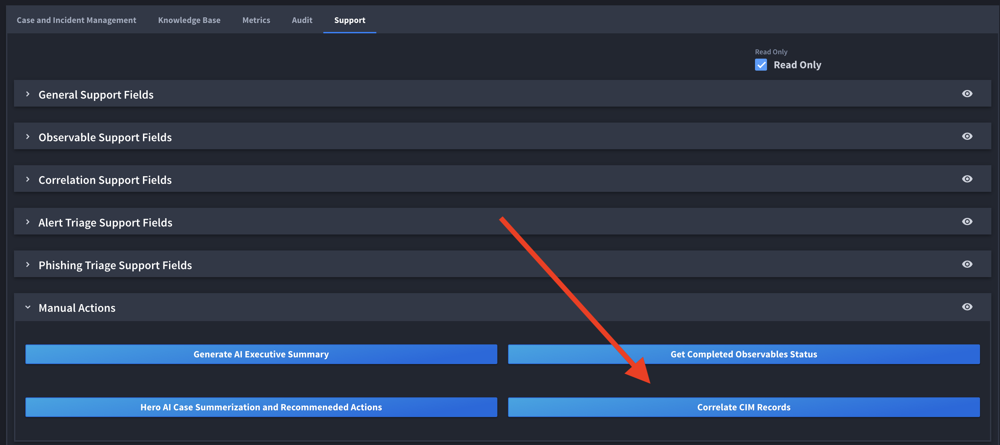
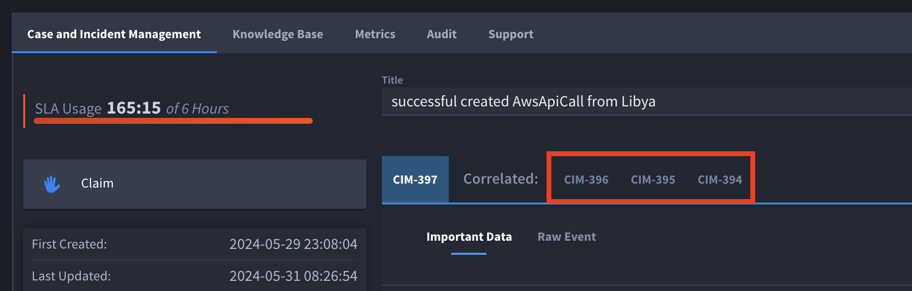
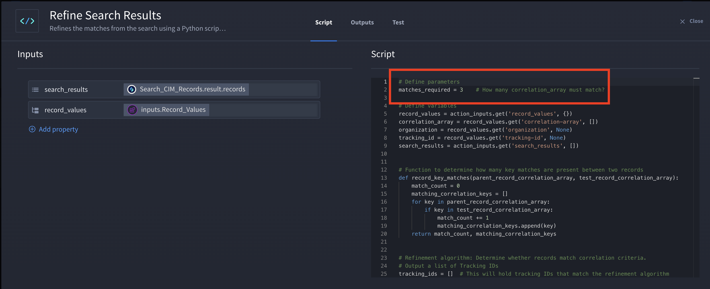
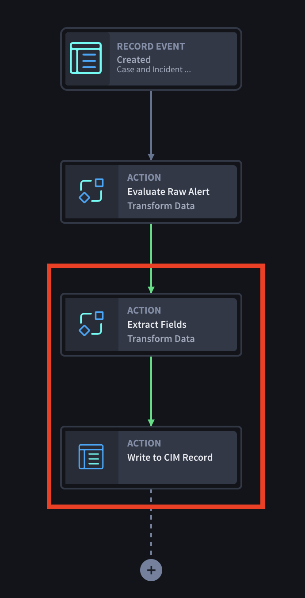
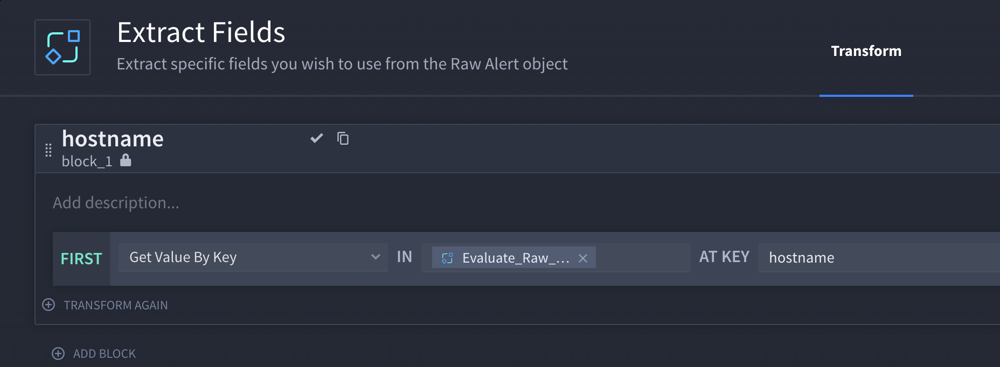
.. |image6| image:: ../Resources/Images/image12345.png
.. |image7| image:: ../Resources/Images/cim-241-full-record.png
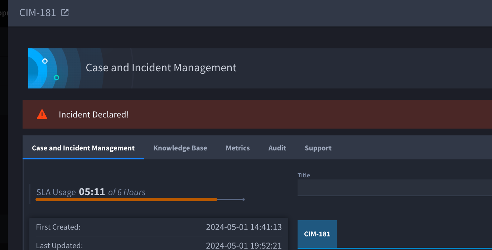
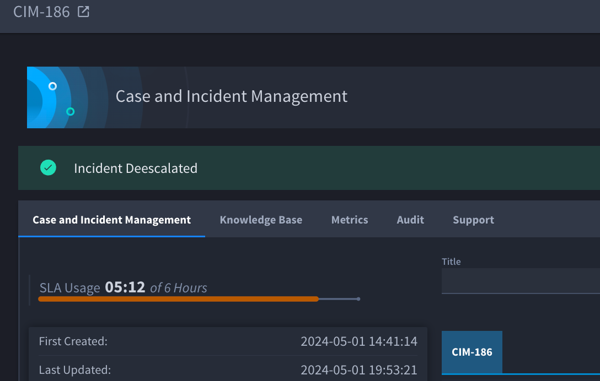
.. |image10| image:: ../Resources/Images/cim-metric-collection-diagram.png
.. |image11| image:: ../Resources/Images/cim-granular-metrics-fields-241.png
.. |image12| image:: ../Resources/Images/cim-advanced-mode.png
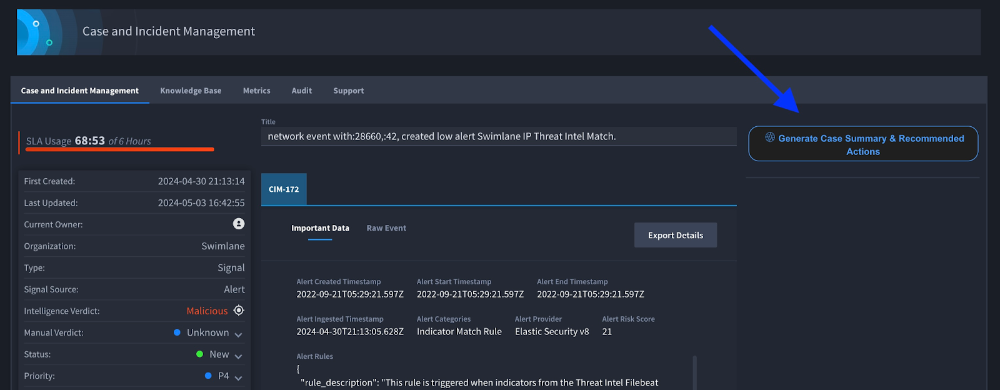
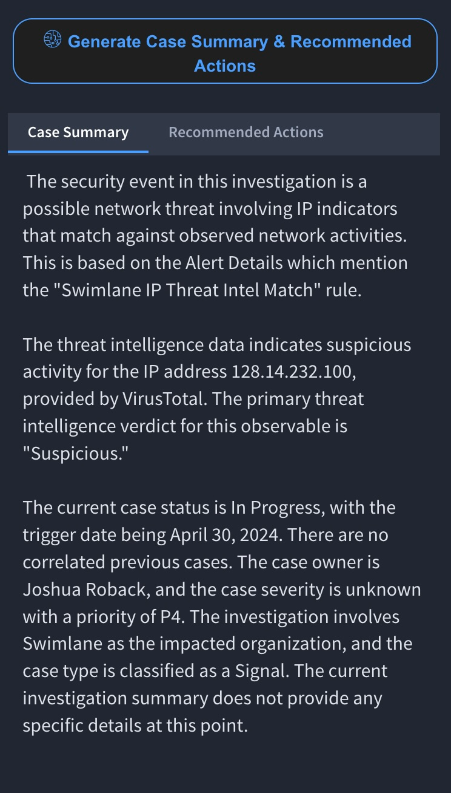
.. |image15| image:: ../Resources/Images/cim-241-investigation-details.png
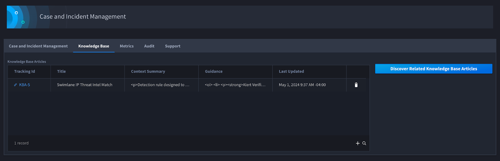
.. |image17| image:: ../Resources/Images/cim-threat-intell.png
.. |image18| image:: ../Resources/Images/cim-remediation-disableenable-users.png
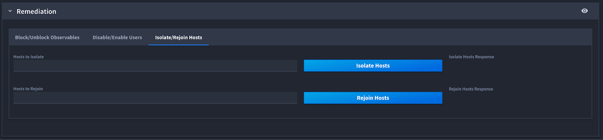

.. |image21| image:: ../Resources/Images/cim-241-correlations-section.png
.. |image22| image:: ../Resources/Images/cim-241-correlating-records-section.png
.. |image23| image:: ../Resources/Images/cim-241-post-incident-activity-aar.png
.. |image24| image:: ../Resources/Images/cim-pip.png
.. |image25| image:: ../Resources/Images/cim-additional-providers.png
