Case and Incident Management Application
========================================

The Case and Incident Management (CIM) application serves as a central
point of interaction for a Security Operations team. You can use this
application independently or with a solution such as SOC Solution.

In the following example, the CIM application works as part of the
SOC Solution. For assistance with SOC Solution installation and setup,
contact your Swimlane professional services point of contact.

Let's see how the Case and Incident Management application works.

How it Works
------------

The Case and Incident Management (CIM) application, as a part of the SOC
Solution, serves as the central point of interaction for a Security
Operations team. The application provides the following best practice
capabilities:

-  Unified signal triage from alert triage, phishing triage, and manual
   creation playbooks with record creation automations

-  Threat Intelligence (TI) enrichment interface

-  Various orchestration launch points

-  Signal Triage, Case Management, Incident Management, Investigation
   details, Knowledge Base Articles, Remediation, Correlation, and After
   Actions Reports

-  Dedicated spaces for customizations

-  Automatic metric collection

-  Advanced mode for troubleshooting and fine tuning

Correlation Configuration
-------------------------

Turbine can `Correlate Records <../records/correlate-records.rst>`__,
which allows Turbine to compare a new record to a previous record that
has correlation keys. In the Case and Incident Management (CIM)
application, there is Correlation information on the CIM record in a
designated section and on the Support tab. Before you can start working
with the CIM application and CIM records, you must configure the
Collaboration field types and settings.

#. Select your tenant.

   If you have multiple tenants available to you, ensure you’re on the
   right tenant. If you only have one tenant available to you, Turbine
   auto-selects the correct tenant.

#. Select **SOC Solutions** workspace.

#. From the left navigation pane, click **APPLICATION & APPLETS**.

#. Click on the **Case and Incident Management** application.

The FORM LAYOUT shows the preconfigured field types.

#. On the form, click the **Support** tab and scroll to the
   **CORRELATION SUPPORT FIELDS** section.

|image1|

From here, add a Correlation field type, so that you can map the
necessary playbook to this application and configure the settings to
return specific data.

#. From the Field Types left-hand pane, click, drag, and drop
   **Correlation** into the **CORRELATION SUPPORT FIELDS** section.

This field now displays in that section. Ensure it is highlighted, and
then under APP SETTINGS update the name field. This application has a
playbook for post correlation actions and an action that calls for CIM
record data. The field key you want to return is
case-and-incident-management-correlations.

For best practice, name this correlation field type after the field key
you want returned.

#. In the Name field, enter **Case and Incident Management
   Correlations**.

|image2|

#. To set up the correlation configuration for the data you want
   returned, click **Manage correlation settings**.

The Record Correlation window opens. Specify fields for correlation
based on matching values, and then specify the data type (e.g. domain,
email, or IP) in those fields. Multiple field types are supported,
including text list fields, file attachment fields, and plain text
fields.

For best practice, use the image below to configure.

#. Click **Correlation Fields** drop-down menu and select the fields,
   and then from the **Expected Value Type** drop-down menu, click the
   corresponding value type.

Under Correlation Fields, you can change the number of fields needed to
match to create a correlation. The example image shows that you only
need 1 element in any field out of the 15 listed to return correlated
data.

|image3|

After you configure the correlation fields and expected value types,
there are two remaining steps.

#. At the bottom of the Record Correlation window, under Correlation
   Action, click the **Playbook** drop-down menu.

#. Select/Enter **CIM_Post_Correlation_Actions**.

The last configuration step requires configuration on the the
CIM_Post_Correlation_Actions playbook trigger.

#. From the Correlation Action section, click **Open playbook**.

The playbook opens in a new tab. You must configure the playbook trigger
to ensure data is returned.

#. Click on the **Correlation** record event trigger and from the
   TRIGGER panel, click **Configure**.

#. From the drop-down menu, select **Tracking Id**.

|image4|

 

**Warning!** Once you add the Correlation Field Type, configure the
record correlation fields/expected value types, and save, you cannot
make changes to the information. To make changes, you must delete the
entire **Case and Incident Management Correlations** field, which
deletes any platform correlations. Then, you must repeat the steps above
and select new correlation fields/expected value types.

 

Correlation configuration is complete, and now continue to the next
section where an example walks you through how to configure other
sections in the CIM application to give you the best practice set-up for
your CIM records.

CIM Record Configuration
------------------------

After logging into Swimlane Turbine, follow these steps to get to the
Case and Incident Management (CIM) records.

**Note**: For this example, we will use CIM-241 to walk you through the
CIM features.

#. Select your tenant.

   If you have multiple tenants available to you, ensure you’re on the
   right tenant. If you only have one tenant available to you, Turbine
   auto-selects the correct tenant.

#. Select **SOC Solutions** workspace.

#. From the left navigation pane, click **APPLICATION RECORDS**.

#. Select **Case and Incident Management**.

#. Select a CIM record from the list of CIM records in the default
   report.

You can see a CIM application record. Immediately, you can see record
details on the left-pane including signal type, intelligence verdict,
signal source, etc. Additionally, there are expand and collapse sections
that provide further record information. Let's review the CIM record and
the additional sections.

|image5|

Record Creation Actions
-----------------------

When a new record is created in the CIM application, two automation
actions execute to enrich the signal with observable verdicts and an
automated brief.

**Automated Brief**

Front and center of the generated CIM record is the Automated Brief
summary that is based on the conditions listed in the expand/collapse
section.

|image6|

Record Lifecycle

The record lifecycle in the Case and Incident Management application is
described below. Orchestration Launch Points offer a conceptual
understanding of the record lifecycle.

**Orchestration Launch Points**

These represent natural points in the record lifecycle within the Case
and Incident Management application in which configurable
automation/orchestration may ideally take place.

**Type: Signal**

Records arrive in the application as Signals. Signals represent an
incoming event from a security information and event management (SIEM)
or endpoint detection and response (EDR) alerting system, a reported
phishing email, or a manually created ad-hoc indication of suspicious
activity. An incoming signal must have one of the following Signal
Source values:

-  Alert

-  Phishing E-Mail

-  Manual

Claim the record to take further action.

#. To claim the record, click **Claim**.

Once you claim the record, you are the Current Owner and the record
status updates to In Progress. After triaging the activity, you can
escalate the record to a case in the event that the case is a true
positive or other thresholds are met (thresholds are determined by your
organization's policies).

#. To escalate the record to a case, click **Escalate to Case** action.

**Type: Case**

Escalating to a Case simply changes the Type value to Case. It’s
important to mention again that this is a prime Orchestration Launch
Point.

When working a case, it may be a good opportunity to identify additional
signals or cases that can be correlated. At the moment, the Correlation
feature in SOC Solution is a simple reference field. Future versions of
SOC Solution will look to expand on the Correlation capability.

**Type: Incident**

In certain circumstances when working through a Case, a practitioner may
choose to Declare an Incident. Generally, this is done when a specified
impact threshold is met that requires additional steps, reporting,
stakeholder communications, etc.

#. To declare an incident, click **Declare Incident**.

This changes the Type value to Incident. Additionally, a red banner
displays at the top of the record to accentuate the criticality of the
record.

As the incident is mitigated, the incident can be deescalated.
Deescalating an incident is an indication that the incident has been
mitigated and firefighting teams can stand down.

#. To deescalate an incident, click **Deescalate Incident**.

Customization
~~~~~~~~~~~~~

While you can customize through the application, the new CIM provides a
dedicated space where you can add custom fields without impacting the
look and feel of the core application space.

**Custom Fields**

The application provides some sample fields to demonstrate the possible
use cases for this section.

|image7|

**Metrics**

Turbine has the ability to capture hyper-granular metrics. Throughout
the lifecycle of a record, strategic points exist in which a data point
or timestamp is captured. The expected flow and data capture points are
viewable in this diagram: 

|image8|

**Granular Metrics Fields**

In the record, you can view the metrics. Click the **Granular Metrics**
tab. These metrics feed various dashboard reports, such as MTTD, MTTR,
Dwell Time, etc.

|image9|

**Advanced Mode**

The CIM application has an Advanced check box that, when selected, shows
the application’s functionality, widgets, and managed references.

|image10|

There are six additional expand/collapse sections on a CIM record. The
following documentation provides specifics about each section and how it
engages in the CIM record.

Investigation Details
~~~~~~~~~~~~~~~~~~~~~

The Investigation Details section contains a summary field for the
incident that you manually enter for the current record and that would
be included in an automatically generated after actions report (AAR)
(see Post Incident Activity section). Additionally, this could be used
for other use cases like the
`Collaboration <collaboration-solution.rst>`__ solution. The
Investigation Comments section show the comments that are not included
in the AAR but are housed within Turbine. The Attack Phases section
provides a place to enter or review MITRE ATT&CK Technique / Tactic
pairs used to drive the MITRE dashboard in SOC Solution. You can also
manually populate the Evidence Lock drag-and-drop section with
miscellaneous files related to the investigation.

|image11|

Knowledge Base Articles
~~~~~~~~~~~~~~~~~~~~~~~

Just as the name suggests, the Knowledge Base section houses previous
user-crafted remediation steps taken for this record. By using this
section, you can access lessons learned and other tips about that record
or something that has related record information (e.g., a similar signal
type). Existing Knowledge Base Articles (KBAs) contain the Tracking Id
for the corresponding KBA, alert title, context summary, guidance, and
the last date it was updated.

#. To add a new KBA to the current record, in the Knowledge Base
   Articles table, click the **plus** icon.

#. Click the **magnifying** **glass** icon to search for a KBA.

#. If needed, click the **trash** icon to delete a KBA from the record.

#. To ensure you have the latest and greatest set of KBAs for that
   record after making edits to your investigation such as MITRE ATT&CK
   mappings, click **Refresh Knowledge Base Links**.

Threat Intelligence
~~~~~~~~~~~~~~~~~~~

**Intelligence Verdict**

If any observables are discovered in the incoming signal through an
alert or phishing email, those observables are automatically parsed and
enriched by the configured TI providers through the TI application
(scroll to the Threat Intelligence Application for additional details).
Based on the results from the chosen Primary Intelligence Provider, the
most critical verdict is passed into the Intelligence Verdict value. The
verdict criticality is ordered from most to least critical:

-  Malicious

-  Suspicious

-  Benign

-  Unknown

| The Threat Intelligence section displays the Primary Intelligence
  Provider enrichment results for each parsed observable (widget) and
  allows the user to perform ad-hoc observable enrichment (Observable,
  Observable Type, Add Observable) as the investigation progresses. This
  is the easiest option to view TI associated with a particular CIM
  record.

|image12|

This section exports TI data as well. In the drop-downs, select the
desired Indicator Selector, Result Selector, Vendor Selector, and
Filters Operator.

#. Once you have the desired information, click **Export** to download
   the data into a .csv file.

The .csv file provides the following TI details about the selected data:

-  Tracking ID

-  Indicator

-  Permalink (A resource such as an observable enrichment on
   VirusTotal/Recorded Future)

-  Tool (e.g., VirusTotal)

-  Tag (e.g., Malicious, Suspicious)

-  Score

-  Last Updated

Phishing attachments are saved to the TI application as file
observables. To enable saving the phishing attachment to the TI record,
see `Save Phishing Attachment <save-phishing-attachment.rst>`__. If the
attachment has been saved, you can download the file from the TI widget.

Remediation
^^^^^^^^^^^

The Case and Incident Management (CIM) application has a Remediation
section with multiple tabs, which execute eight different playbooks for
remediation actions for a CIM record. As an orchestrator, this provides
a way to engage various remediation actions based on CIM record
information. See below for more details about each tab.

**Block/Unblock Observables**

As an orchestrator, you need to complete configurations to the CIM -
Block Observables playbook before updating the CIM record. The first
action is a placeholder. You want to click and replace this action with
a remediation action or nested playbook. After, configure the action for
the task you want to take against the observables that you will
configure later in the CIM record.

#. From ORCHESTRATION, click **Playbooks**.

#. Search and open the for **CIM - Block Observables** playbook.

#. In the first action placeholder, replace and configure your desired
   remediation.

This can be a nested playbook or an action that you've already
configured. For example, a playbook that calls to a firewall to block
IP addresses or isolating hosts on EDR. The playbook takes in the
Tracking ID for the current ticket and values that you're passing in.
The other playbook actions generate the output response and update the
CIM record. Now navigate to the desired record and scroll to the
Remediation section and Block/Unblock Observables tab.

#. In this tab, enter observables that you want to block, then click
   **Block** **Observables**.

Once you've clicked the button, it runs a playbook and returns results
in the **Block Observables** **Response** field with a response that
shows you what the playbook did and acted upon with a date/time stamp.

To unblock an observable, follow the steps above for the **CIM - Unblock
Observables** playbook and enter the observables you want to unblock,
then click **Unblock Observables**. Again, the response displays with a
date/time stamp.

|image13|

**Important!** While orchestrators must create the nested playbooks
and/or actions within the **CIM - Block Observables** and **CIM -
Unblock Observables** playbooks, practitioners can modify the contents
of the **Remediation** tab in the CIM record. Modifying CIM record
observables does not require orchestrator-level access. The same applies
for all of the playbooks that execute in the Remediation tab.

 

**Disable/Enable Users**

This tab functions like the Block/Unblock Observables tab. Orchestrators
first need to access the **CIM - Disable Users** or **CIM - Enable
Users** playbooks to replace the placeholder action with a configured
nested playbook or action that executes your desired outcome.

#. Navigate to the desired CIM record and **Remediation** section.

#. In the Disable/Enable users tab, enter the users that you want to
   disable and/or enable.

#. Click **Disable Users** and/or **Enable Users**.

This runs the appropriate playbook and returns results in the **Disable
Users Response** and/or **Enable Users Response** fields with a response
that shows you what the playbooks did and acted upon with a date/time
stamp.

|image14|

**Isolate/Rejoin Hosts**

This tab also functions like the Block/Unblock Observables tab.
Orchestrators first need to access the **CIM - Isolate Hosts** or **CIM
- Rejoin Hosts** playbooks to replace the placeholder action with a
configured nested playbook or action that executes your desired outcome.

#. Navigate to the desired CIM record and **Remediation** section.

#. In the Isolate/Rejoin Hosts tab, enter the hosts that you want to
   isolate or rejoin.

This is common with EDR use cases.

#. Click **Isolate Hosts** and/or **Rejoin Hosts**.

This runs the appropriate playbook and returns results in the **Isolate
Hosts Response** and/or **Rejoin Hosts Response** fields with a response
that shows you what the playbooks did and acted upon with a date/time
stamp.

|image15|

**Notify Managers**

This tab functions like the Block/Unblock Observables tab. Orchestrators
first need to access the **CIM - Notify Managers** playbook to replace
the placeholder action with a configured nested playbook or action that
executes your desired outcome.

#. Navigate to the desired CIM record and **Remediation** section.

#. In the Notify Managers tab, enter the manager's email address to
   notify manager of a security event.

#. Click **Notify Managers**.

This runs the appropriate playbook and returns results in the **Managers
Notified Response** field with a response that shows you what the
playbooks did and acted upon with a date/time stamp.

|image16|

**SIEM Search**

This tab functions like the Block/Unblock Observables tab. Orchestrators
first need to access the **CIM - SIEM Query** playbook to replace the
placeholder action with a configured nested playbook or action that
executes your desired outcome.

#. Navigate to the desired CIM record and **Remediation** section.

#. In the SIEM Search tab, enter the SIEM query data.

A good use case is running an investigation on an IP address
(observable) to see if it occurs anywhere else in your environment.
Enter the observable in the SIEM query field and click the button to
execute the playbook and get results.

#. Click **SIEM Query**.

This runs the appropriate playbook and returns results in the
**SIEM Query Response** field with a response that shows you what your
SIEM returned, and a table which can display SIEM events in standardized
JSON format. The table also allows the ability to filter based on
columns or values.\ |image17|

Correlation
^^^^^^^^^^^

A correlation action occurs every time a record is created. From the
Support tab on a CIM record, the Correlation Support Field section takes
in 13 correlation key fields (observables) from the Process Alerts or
Process Emails playbooks. After the correlation occurs, Turbine runs a
playbook that extracts the Tracking IDs for correlating records.

In the example record, CIM-241 shows the Correlation section with
correlating Tracking IDs in records CIM-244, CIM-243, CIM-245,
and CIM-242. Each record's title, status, intel verdict, manual verdict,
and automated brief information displays in the Correlations table.

#. To see an specific record in detail, click the corresponding
   **Tracking Id**.

The selected record opens in a pop-up window. Click outside of the
window to return to your current record.

|image18|

Not only does the information display in this section, but there is a
widget under the AUTOMATED BRIEF section called Records. The Records
section provides a more visual representation of the current and
correlating records with record details that highlight important data
and the option to export that record's data to a .csv file.

|image19|

Post Incident Activity
^^^^^^^^^^^^^^^^^^^^^^

On a Case and Incident Management (CIM) record, this section has a
Generate After Actions Report button.

When you click this button, Turbine collects data points from your
record, where it passes the data into a script that generates an HTML
report, then converts that report into a digestible PDF file as an after
actions report (AAR).

#. From the Post Incident Activity section, click **Generate After
   Actions Report**.

|image20|

#. Click the **Download** icon to download the PDF or click directly on
   the file name to preview the file.

The PDF opens after downloading or previewing it. The file has an
easy-to-read layout that includes the following information for that
record:

-  Case number

-  Automated brief

-  Investigation summary

-  Remediation actions taken

-  Timeline summary

-  Incident handler information

If you have a local copy of an AAR and want to add it to the record,
simply drag and drop the file into the After Actions Report section.

**Tip**: If an orchestrator wants to adjust the information that is
returned in the AAR PDF file, then you can navigate and open the **CIM -
Generate After Actions Report** playbook, click the **Generate HTML
Report** action, and click **Configure**. From the **Script** pane,
using HTML, you can modify the data that is returned.

Threat Intelligence Application
~~~~~~~~~~~~~~~~~~~~~~~~~~~~~~~

The TI application enriches observables coming from CIM. All unique
observables from an incoming signal in the CIM application generate a
new TI record.

Primary Intelligence Provider
^^^^^^^^^^^^^^^^^^^^^^^^^^^^^

Based on the Observable Type value, the appropriate Primary Intelligence
Provider (PIP) is selected. The resulting enrichment is at the top of
the application. The values of the PIP enrichment determine the
Intelligence Verdict, as mentioned in Automated Brief Summary.

|image21|

Additional Providers
^^^^^^^^^^^^^^^^^^^^

Again, based on the Observable Type value, additional intelligence
providers enrich the observable. The results from these providers, while
*not* contributing to the Primary TI Verdict, are visible directly in
the TI Record in a dedicated expandable widget. The enrichment key
details are displayed with the ability to click the widget card to
expand and view the raw JSON.

|image22|

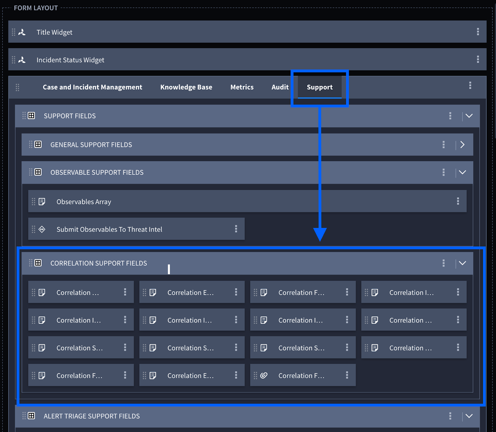
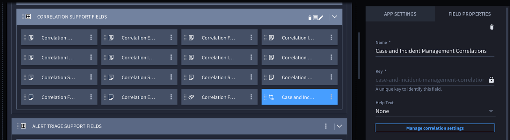
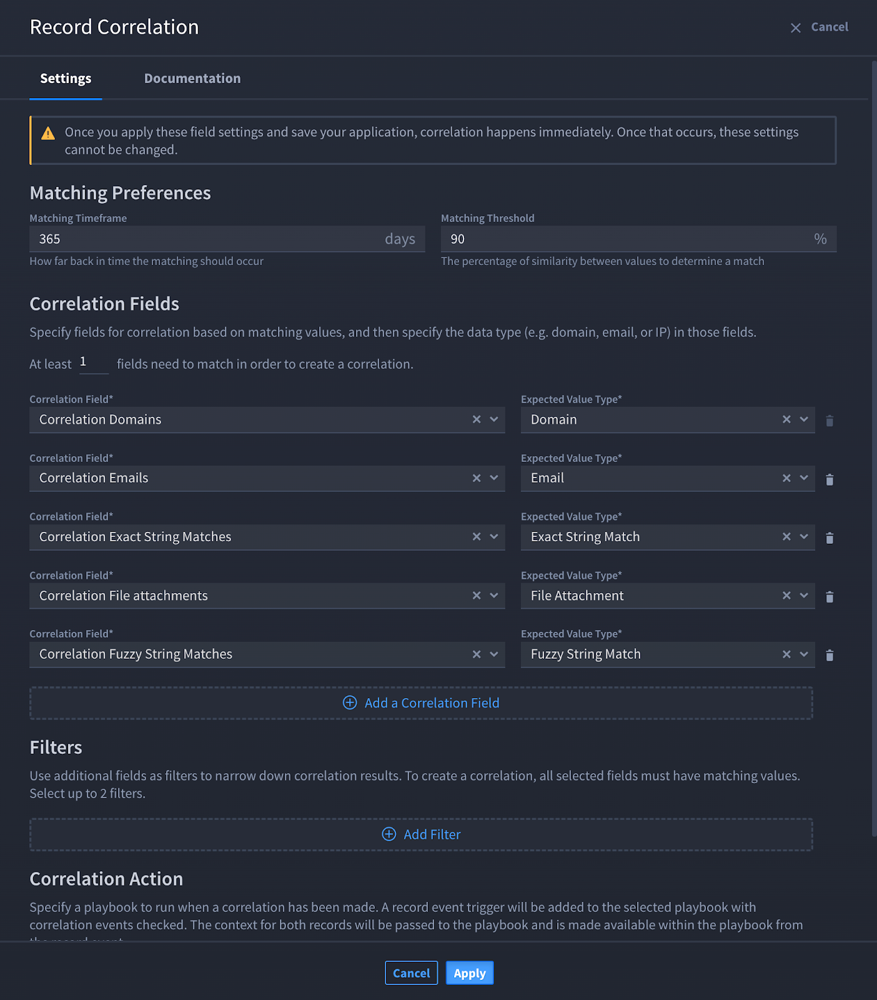
.. |image4| image:: ../Resources/Images/cim-correlation-map-tracking-id.png
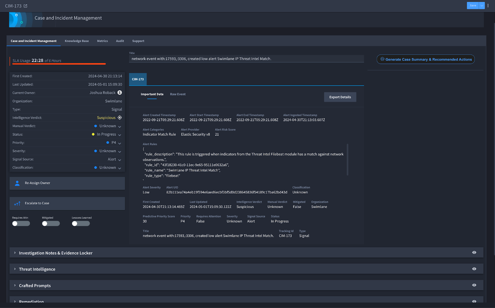
.. |image6| image:: ../Resources/Images/cim-automated-brief.png
.. |image7| image:: ../Resources/Images/cim-custom-fields.png
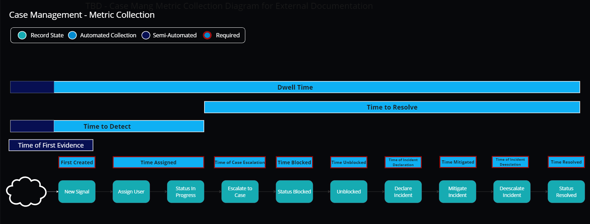
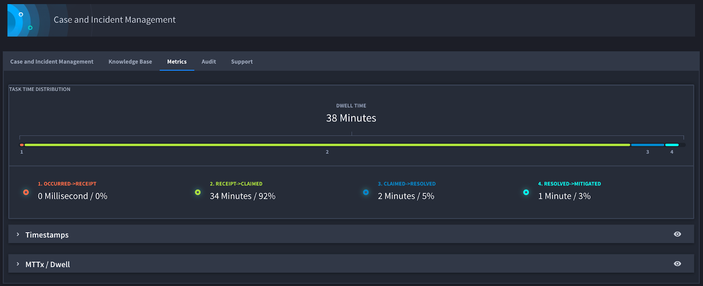
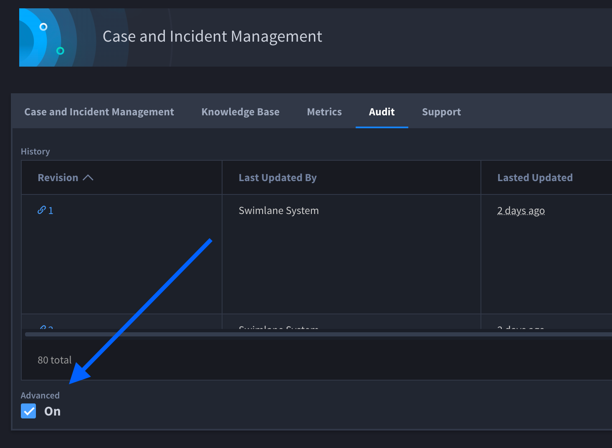
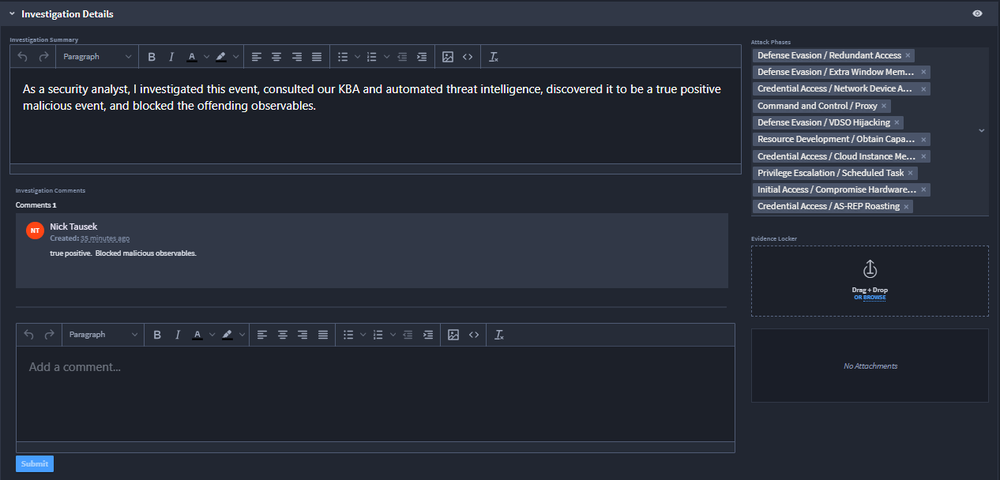
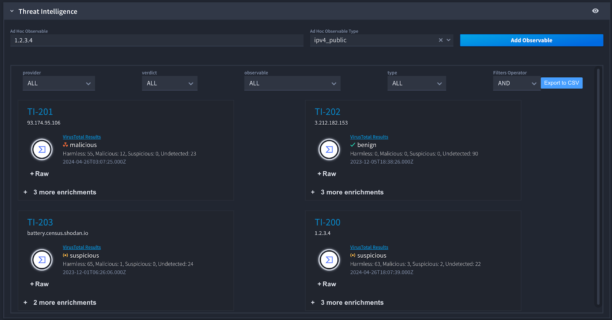
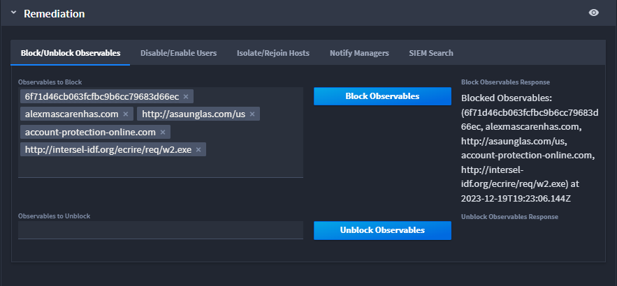
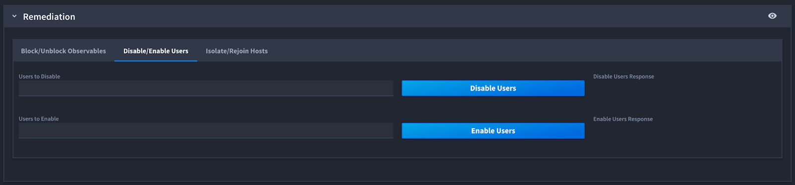
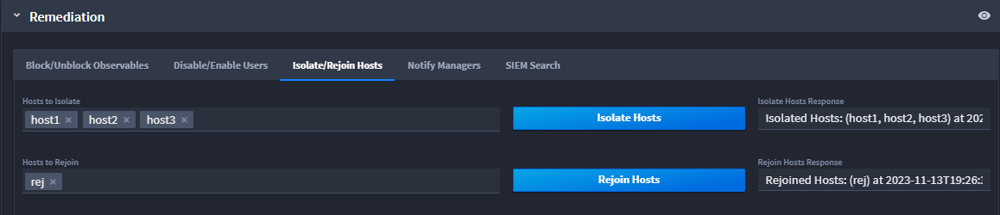
.. |image16| image:: ../Resources/Images/cim-remediation-notifymanagers.png
.. |image17| image:: ../Resources/Images/cim-remediation-siem-search.png
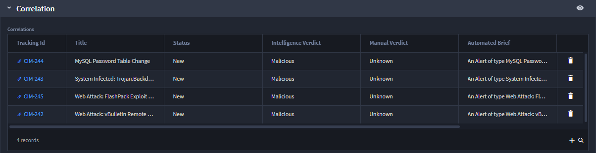
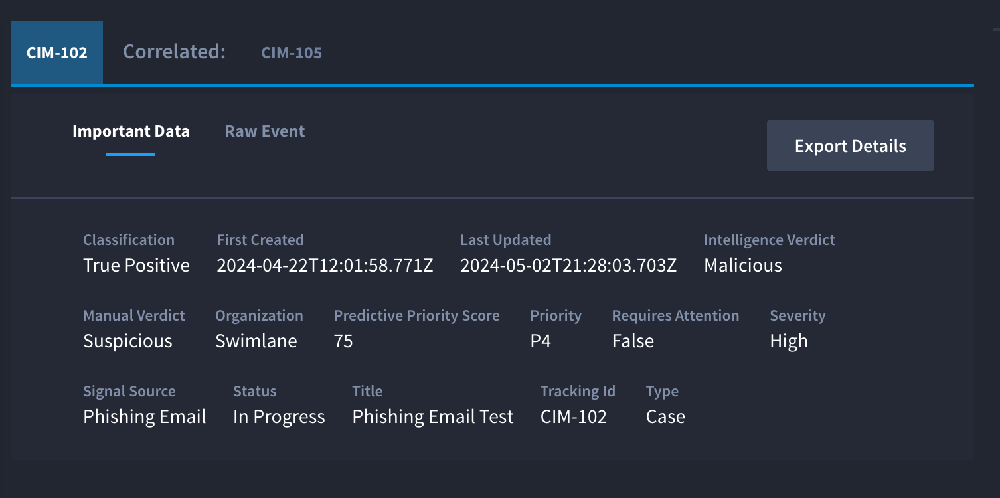
.. |image20| image:: ../Resources/Images/cim-241-post-incident-activity-aar.png
.. |image21| image:: ../Resources/Images/cim-pip.png
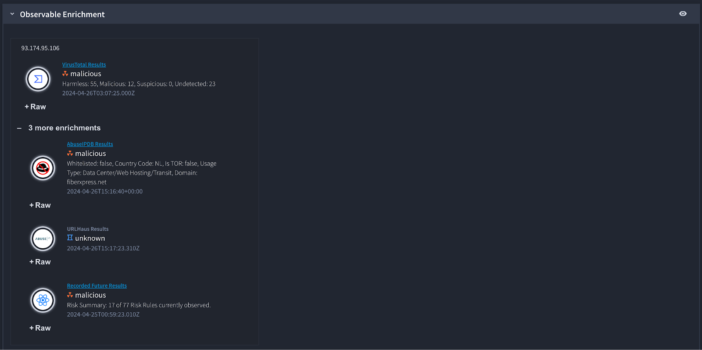
