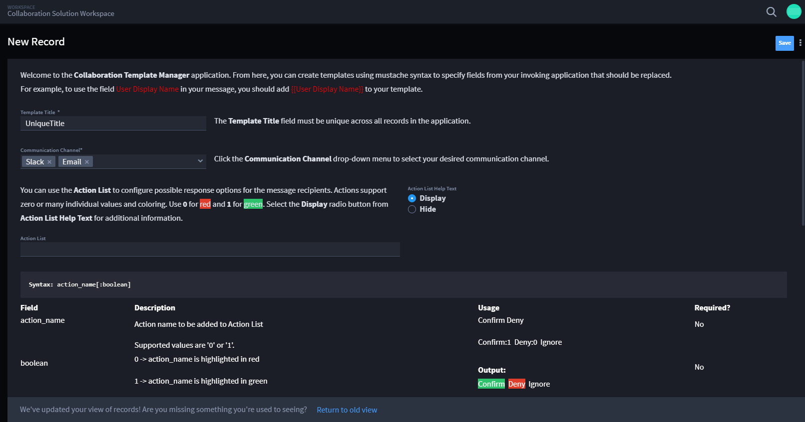
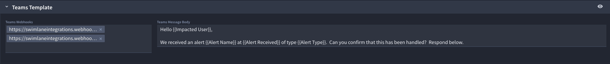

Configure Collaboration Extension Template
==========================================

Create a Template
-----------------

The Collaboration Extension is as self-service as possible for the
Turbine practitioner. The solution includes a dedicated Collaboration
Template Manager application to create and update templates. Each record
in the application represents a unique template.

To create a new template, follow these steps:

#. From the left-hand navigation pane, under APPLICATION RECORDS, click
   **Collaboration Template Manager** to create a new record.

The New Record window opens with free-text fields, a drop-down menu, and
in-document help text to assist in configuring the template.

#. In the Template Title field, enter a title that is unique across all
   records in the application.

   **Warning!** You will receive a validation error, if duplicate titles
   are detected.

#. In the Communication Channel drop-down menu, select **Email**,
   **Slack**, and/or **Teams**.

To select multiple communication channels, click the drop-down menu
again and select another communication channel. The selected
communication channels display in the field. As you select the
communication channel, the communication channel templates display. You
can come back to those in a minute!

First, let's complete the Action List field. Use the Action List to
configure possible response options for the message recipients. Actions
support zero or many individual values and coloring. Use **0** for red
and **1** for green.

#. In the Action List field, enter the appropriate values.

|image1|

**Tip**: Click the **Display** radio button from Action List Help Text
for additional information. It is *not* required to enter any Action
List values. If no Action List values are set, a message is still sent,
but there is no way for the recipient to respond. There are valid use
cases where this would be the desired behavior.

|image2|

Depending on the chosen communication channel, the body of the
parameters of the template is slightly different.

      -  Gmail has: Email Body

      -  Slack has: Slack Message Body

      -  Teams has: Teams Message Body

All three templates perform field replacement with data from the record
calling the template by using mustache syntax around the **field display
name** (case insensitive) or the **field key**.

#. Configure the body of the email as desired. See the MS Teams Message
   Body example.

|image3|

Depending on the chosen communication channel, the message destination
fields are different.

      -  Gmail has: Email To, Email CC, and Email BCC

      -  Slack has: Slack Channel IDs, channel name, and/or a username

      -  Teams has: Teams Webhooks

#. Configure the template's recipients. See examples.

**Gmail**

|image4|

**Slack**

One or multiple Slack message channels is supported. A channel name
should be prefixed with #, and a username should be prefixed with an @
sign. Channel IDs are also supported.

|image5|

**Teams**

Teams supports specific webhook URLs.

|image6|

#. Click **Save**.

You can add, remove, or modify templates as desired.

.. |image1| image:: ../Resources/Images/collab-solution-action-list.png

.. |image3| image:: ../Resources/Images/collab-solution-teams-body-message.png
.. |image4| image:: ../Resources/Images/collab-solution-email-to-fields.png
.. |image5| image:: ../Resources/Images/collab-solution-slack-channel-ids.png

