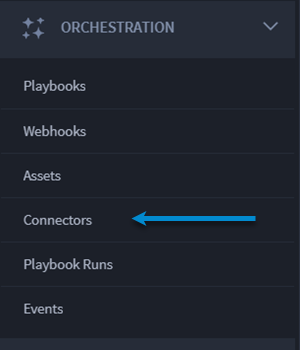
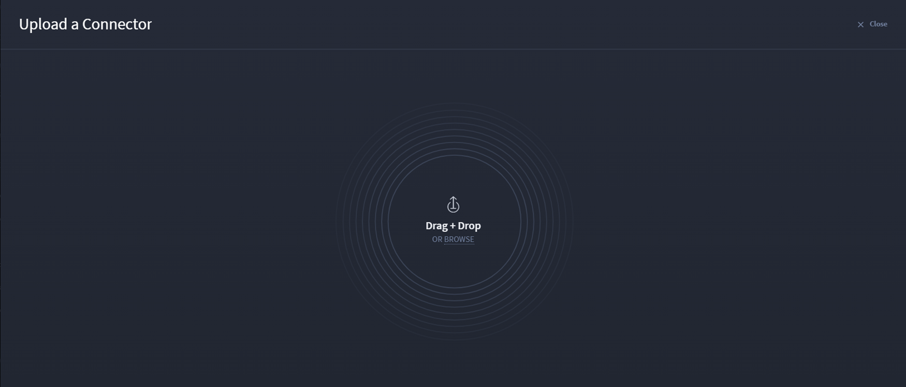

Connectors
==========

Connectors are distributable packages that provide simplistic
integration functionality for an application/service and connect to
third-party tools.

You can install defined capabilities from third-party services/platforms
for use in playbooks, and then use input/output configuration with APIs
without using code.

**Note:** In the Swimlane platform, this was known as a plugin.

.. _find-connectors-on-swimlane-marketplace:

Find Connectors on Swimlane Content
-----------------------------------

The Swimlane Content has optimized connectors available to you for use
within Turbine.

To find connectors on Swimlane Content:

#. On ORCHESTRATION, click **Connectors**.

#. | Access the plus menu icon, and click **Find a connector**.
   | |image1|

The Swimlane Content opens, from which you can browse and select
available connectors.

3. Once you find a connector you want, select it to see the connector
   details.

   |image2|

   Review the capabilities and details.

4. Click **+Connect** to install the connector.

.. _access-installed-connectors:

Connectors in Orchestration
---------------------------

Once a connector is installed, it is saved in persistent storage and
distributed down to all active agents to install.

To access an installed connector:

#. On ORCHESTRATION, click **Connectors**.
   |image3|

#. The CONNECTORS page opens with available connectors. The CONNECTORS
   tab shows the number of active connectors.

   |image4|

2. Click the plus icon to upload a connector.

3. | Click **Browse** or click and drag a connector to the window.
   | |image5|

   **Tip:** Click **Upload more connectors** to continue adding
   connectors, or click **I'm done adding connectors**.

   | The connector uploads.
   | |image6|

4. Now, new connectors are available.

   |image7|

.. |image1| image:: ../Resources/Images/find-a-connector.png
.. |image2| image:: ../Resources/Images/connector-details.png

.. |image4| image:: ../Resources/Images/connector-home-page.png

.. |image6| image:: ../Resources/Images/connector-upload-complete.png
.. |image7| image:: ../Resources/Images/connector-add-extra-connector.png
