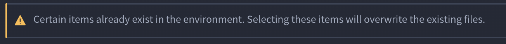
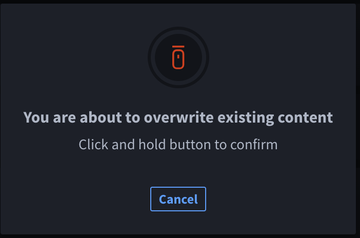
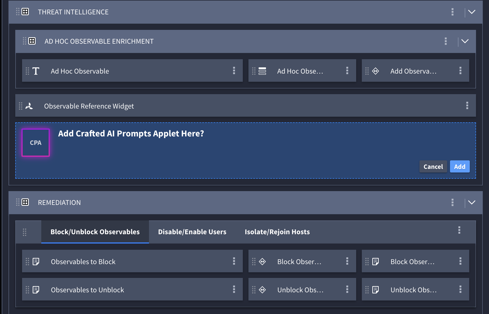
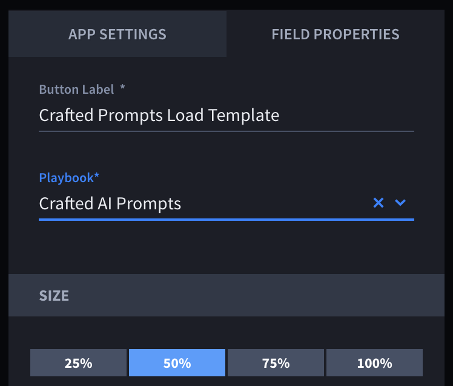

Install and Configure Crafted AI Prompts
========================================

The Crafted AI Prompts extension integrates and works well with the
Turbine SOC Solutions Bundle and the Case and Incident Management (CIM)
application. This user guide uses the SOC Solutions Bundle and CIM
application in examples to instruct how to utilize the Crafted
AI Prompts extension.

**Note:** To best understand the documentation and examples, you can
install and configure the SOC Solutions Bundle and the CIM application.
For assistance in SOC Solutions Bundle Installation and Setup, contact
your Swimlane professional services point of contact.

The Crafted AI Prompts extension is a collection of bundled components
to create custom prompts to be sent to large language models such as
OpenAI or the Swimlane LLM. For additional information, navigate to
`Crafted AI Prompts <Crafted%20AI%20Prompts.htm>`__.

Start by installing the extension

Go to Marketplace
-----------------

Navigate to the Turbine Marketplace. Follow these steps:

#. Log in to Turbine.

#. In the navigation pane, click **TENANTS**.

#. Select the desired tenant.

#. In the navigation pane, click **LIBRARY**.

#. In the LIBRARY navigation pane, click **Swimlane Content**.

Install
~~~~~~~

Now, you can install the Crafted AI Prompts extension:

#. From the Swimlane Content Library, under **Solutions**, click
   **Crafted AI Prompts Extension**.

#. | Click **Install** on the right-bottom of the solution.
   | The Crafted AL Prompts Extension details open.

   -  The **Overview** tab shows each individual solution that composes
      the Crafted AI Prompts Extension and their capabilities.

   -  The **Content** tab shows how many and which workspaces,
      applications, dashboards, and/or reports are included in the
      Crafted AI Prompts Extension.

   -  The **Documentation** tab has a link to the Crafted AI Prompts
      Extension topic in this user guide.

#. On the right-hand side of the window, click **+Install** again.

#. From the Install Crafted AI Prompts Extension window, choose which
   content you’d like to install.

| **Note:** You may see the following warning, if content already exists
  in your environment
| |image1|

You can avoid overwriting content by deselecting the items you do not
wish to overwrite, and it will still work. But if you deselect too many
items that are not being overwritten, you will not import the full
solution.

#. If prompted to overwrite existing content, click and hold the mouse
   icon until the circle is complete and the dialog box disappears.

   |image2|

You will see **Importing…**

If there are no issues, the Import Success window opens. You can import
successfully and still have potential issues. If that's the case, the
**Review Potential Issues** window opens. Review the potential issues
by:

#. | Clicking **Import More** to import more SSPs;
   | OR

#. | Clicking **Go to Application** to address issues, if the issues are
     in your application. If the issues are with assets or playbooks,
     navigate to their respective locations in Turbine to edit;
   | OR

#. Clicking **Close** to close the window.

If there are issues, you see the Import Error window. You must address
the errors to import successfully.

**Important!** You *cannot* continue installation without resolving the
errors. You must start over and re-install the Collaboration Extension
from the Integrated Marketplace, or import as an .ssp file.

**Configure Crafted Prompt Configuration Assets**

Crafted Prompts comes packaged with the Swimlane Hero AI and OpenAI
ChatGPT connectors. In order to use the Crafted Prompts solution, one or
both of these connectors must be configured.

Configure Applet
----------------

The example in this guide uses the Case and Incident Management (CIM)
application that was installed during the **SOC Solutions Bundle**
configuration process. However, you can use the following steps within
your desired application.

To configure for the Collaboration applet, follow these steps:

#. In the navigation pane, click **APPLICATIONS & APPLETS**.

#. | Click **Case and Incident Management**.
   | The CIM application opens.

#. Drag the **Crafted Prompts Applet** into the application at a desired
   location.

   | |image3|
   | A confirmation dialog opens: **Add Crafted Prompts Applet Here?**

   |image4|

#. Click **Add**.

#. Under the HIDDEN FIELDS section, create a new playbook button and
   enter the title: **Crafted Prompts Load Template**.

#. Map the playbook button to the **Crafted AI Prompts** playbook.

   |image5|

#. Click **Save**.

Configure Playbook
------------------

Now that the applet has been added to an application, we will configure
the playbook by attaching a component to the new trigger.

#. In the navigation pane, click **ORCHESTRATION** and then
   **PLAYBOOKS**.

#. In the search bar, type Crafted AI Prompts and click on the **Crafted
   AI Prompts** result.

#. In the playbook, you should see a lone trigger action. This trigger
   represents the button you’ve added in the previous step. Click on the
   Components tab and search for the component titled Execute - Crafted
   AI Prompts

   |image6|

#. | Drop that component under your trigger. Feel free to rename the
     Title of the component if desired.
   | |image7|

   Click on **Configure** in the Component window to perform field
   mappings.

You can use the table below to map the other component inputs.

+-----------------------------------+-----------------------------------+
| Component Input                   | Choose The Field to Map your      |
|                                   | Inputs to                         |
+===================================+===================================+
| Invoking Record Tracking ID       | Current record                    |
|                                   | ``values.Values.Tracking`` ID     |
+-----------------------------------+-----------------------------------+
| Invoking Record                   | Current record ``values.Values``  |
+-----------------------------------+-----------------------------------+
| Applet Installing Application     | ``Application.Name``              |
| Name                              |                                   |
+-----------------------------------+-----------------------------------+
| Crafted Prompts Selected Template | Current record                    |
|                                   | ``values.Values.Crafted`` Prompts |
|                                   | Selected Template                 |
+-----------------------------------+-----------------------------------+

#. Click **Apply** and click **Save**.

.. |image3| image:: ../../Resources/Images/install-crafted-ai-applet.png

.. |image6| image:: ../../Resources/Images/Screenshot%202024-06-13%20at%2016.56.20.png
.. |image7| image:: ../../Resources/Images/Screenshot%202024-06-13%20at%2016.55.24.png
