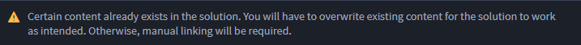
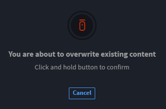
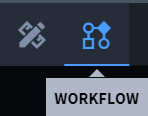
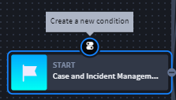
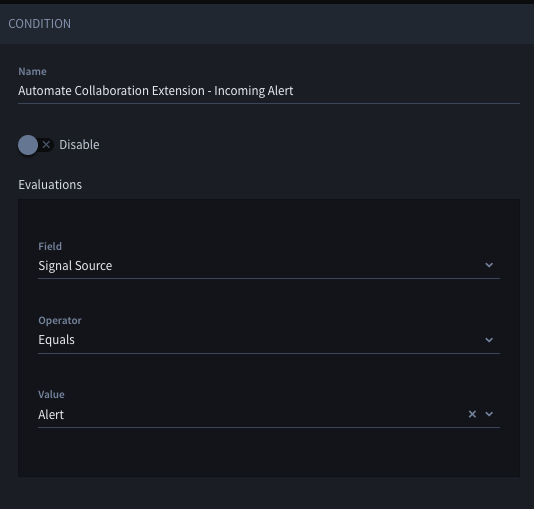
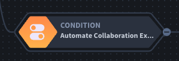

Install and Configure Collaboration Extension
=============================================

**Important!** The Collaboration Extension integrates and works well
with SOC Solutions Bundle and the Case and Incident Management (CIM)
application. This user guide uses the SOC Solutions Bundle and
CIM application in examples to instruct how to utilize the Collaboration
Solution.

**Tip**: To best understand the documentation and examples, you can
install and configure the SOC Solutions Bundle and the CIM application.
For assistance in SOC Solutions Bundle and setup, contact your Swimlane
professional services point of contact.

The Collaboration Extension is a collection of bundled components to
create context-aware messages from predefined templates to send to
external messaging systems, such as email, Slack, and/or Microsoft Teams
for processing by Swimlane, or non-Swimlane, users. For an additional
information, navigate to `Collaboration
Extension <collaboration-extension.htm>`__.

Start by installing the extension.

Go to Marketplace
=================

Navigate to the Turbine Marketplace. Follow these steps:

#. Log in to **Turbine**.

#. In the navigation pane, click **TENANTS**.

#. Select the desired tenant.

#. In the navigation pane, click **LIBRARY**.

#. In the LIBRARY navigation pane, click **Swimlane Content**.

Install
-------

Now, you can install the Collaboration Extension:

#. From the Swimlane Content Library, under **Solutions**, click
   **Collaboration Extension**.

#. Click **Install** on the right-bottom of the solution.

The Collaboration Extension details open.

-  The **Overview** tab shows each individual solution that composes the
   Collaboration Extension and their capabilities.

-  The **Content** tab shows how many and which workspaces,
   applications, dashboards, and/or reports are included in the
   Collaboration Extension.

-  The **Documentation** tab has a link to the Collaboration Extension
   topic in this user guide.

#. On the right-hand side of the window, click **+Install** again.

#. From the Install Collaboration Extension window, choose which content
   you’d like to install.

**Note**: All content is pre-selected as a default. Click check marks to
deselect any content.

 

| **Warning!** You may see the following warning, if content already
  exists in your environment.
| |image1|
| You can avoid overwriting content by deselecting the items you do not
  wish to overwrite, and it will still work. But if you deselect too
  many items that are not being overwritten, you will not import the
  full solution.

#. If prompted to overwrite existing content, click and hold the mouse
   icon until the circle is complete and the dialog box disappears.

|image2|

You will see **Importing**\ …

If there are no issues, the Import Success window opens. You can import
successfully and still have potential issues. If that's the case, the
**Review Potential Issues** window opens. Review the potential issues
by:

#. Clicking **Import More** to import more SSPs;

-OR-

#. Clicking **Go to Application** to address issues, if the issues are
   in your application. If the issues are with assets or playbooks,
   navigate to their respective locations in Turbine to edit;

-OR-

#. Clicking **Close** to close the window.

If there are issues, you see the Import Error window. You must address
the errors to import successfully.

**Important!** You *cannot* continue installation without resolving the
errors. You **must** start over and re-install from the Collaboration
Solution from the Integrated Marketplace, or import as an .ssp file.

Configure Custom Assets
-----------------------

Configuring the Collaboration Solution is a one-time task. You need to
configure two assets. The first is a mostly pre-defined Collaboration
Extension Configuration asset where you can figure certain inputs. The
second is the email provider asset that you choose.

Configure Collaboration Extension Configuration Asset
~~~~~~~~~~~~~~~~~~~~~~~~~~~~~~~~~~~~~~~~~~~~~~~~~~~~~

To configure custom assets, follow these steps:

#. In the navigation pane, click **ORCHESTRATION** and click **Assets**.

#. Search for and click **Collaboration Extension Configuration**.

#. Fill the following fields based on descriptions

+------------------------------+--------------------------------------+
| Asset Input                  | Field Information                    |
+------------------------------+--------------------------------------+
| Email_Medium                 | Options: **Gmail**, **O365**, or     |
|                              | **SMTP**                             |
|                              |                                      |
|                              | Enter one of the email options. The  |
|                              | field is not case sensitive.         |
+------------------------------+--------------------------------------+
| Post_Interaction_Webhook_URL | Grab the webhook URL from the **Post |
|                              | Interaction** trigger in the         |
|                              | Collaboration Extension playbook and |
|                              | paste it here.                       |
+------------------------------+--------------------------------------+
| Slack_Webhook_URL            | This field defaults as empty. Only   |
|                              | configure if you want to use Slack.  |
+------------------------------+--------------------------------------+
| Success_Response             | Default text: "Thank you for your    |
|                              | response!"                           |
+------------------------------+--------------------------------------+
| Reject_Response              | Default text: "A previous response   |
|                              | has been recorded for this message.  |
|                              | Your response has not been applied.  |
|                              | Please contact your administrator if |
|                              | you feel this is in error."          |
+------------------------------+--------------------------------------+

Configure Email Provider
~~~~~~~~~~~~~~~~~~~~~~~~

Based on the chosen **Email_Medium** in the previous step, the
appropriate email provider configuration asset must be set. Use the
table below to determine which asset should be configured.

 

============ ============================================
Email_Medium Email Provider Configuration Asset Name
Gmail         Collaboration - Google Settings
O365          Collaboration - Microsoft Exchange Settings
SMTP          Collaboration - SMTP Settings
============ ============================================

Each of the assets above must be provided with their own unique
configuration parameters to facilitate communication with the email
provider.

Configure Applet
----------------

The example in this guide uses the Case and Incident Management (CIM)
application that was installed during the **SOC Solutions Bundle**
configuration process. However, you can use the following steps within
your desired application. To configure for the Collaboration applet,
follow these steps:

#. In the navigation pane, click **APPLICATIONS & APPLETS**.

#. Click \ **Case and Incident Management**\ .

The CIM application opens.

#. Drag the **Collaboration Extension Applet** into the application at a
   desired location.

A confirmation dialog opens: **Add Collaboration Extension Applet
Here?**

#. Click **Add**.

#. Under SELECT TEMPLATE SECTION, create a new playbook button and enter
   the title: **Load** **Template**.

#. Map the playbook button to the **Collaboration Extension** playbook.

#. Under **COLLABORATION TEMPLATE SELECTED**, create a new playbook
   button and enter the title: **Send Message**

#. Map the playbook button to the **Collaboration Extension** playbook.

#. Click **Save** to save the application.

   To finish configuring the applet, let's enable some of the
   application workflow actions.

#. From the application toolbar, click the **WORKFLOW** icon.

|image3|

The application workflow opens.

#. Click the **Collaboration** **Hide Default Sections** action and from
   the ACTION panel, toggle the status to **Enable**.

#. Click the **Collaboration** **Set Application Name** action and
   replace the value with the name of the application in which the
   applet was installed and from the ACTION panel, toggle the status to
   **Enable**.

#. Click the **If Collaboration Selected Template Not Blank** action and
   from the ACTION panel, toggle the status to **Enable**.

#. Click **Save**.

Configure Playbook Triggers
---------------------------

Now it is time to configure your newly created playbook trigger from the
previous step.

#. Navigate to the **Orchestration** section and select **Playbooks**.

#. Search for and click the playbook titled **Collaboration Extension**.

#. Find the new trigger for your newly created playbook button titled
   **Load Template**.

#. Under the **Add** section, click **Components** and find the
   component named **Write - Load Template**.

#. Drag and drop the **Write - Load Template** component under the
   **Load Template** playbook trigger.

#. With the component clicked, under the **Data** section on the right,
   click **Configure**.

#. | This is where you’ll map application record data to the component
     interface inputs. Map data according to this chart.

+-----------------------------+---------------------------------------+
| Component Input             | Choose This Field to Map Your Inputs  |
|                             | To                                    |
+=============================+=======================================+
| **Applet Application Name** | ``Application.Name``                  |
+-----------------------------+---------------------------------------+
| **Applet Tracking ID**      | Current record                        |
|                             | ``values.Values.Tracking`` Id         |
+-----------------------------+---------------------------------------+
| **Selected Template**       | Current record                        |
|                             | ``values.Values.Collaboration``       |
|                             | Selected Template                     |
+-----------------------------+---------------------------------------+
| **Application Record**      | Current record ``values.Values``      |
+-----------------------------+---------------------------------------+

#. | Find the new trigger for your newly created playbook button titled
     **Send Message**.

#. Drag and drop the **Write - Create Record** **in Message Sender**
   component under the **Send Message** playbook trigger.

#. With the component clicked, under the **Data** section on the right,
   click **Configure**.

#. With the component clicked, under the Data section on the right,
   click Configure.

+-----------------------------------+-----------------------------------+
| Component Input                   | Choose This Field to Map Your     |
|                                   | Inputs To                         |
+===================================+===================================+
| **Invoking Record Tracking ID**   | Current record                    |
|                                   | ``values.Values.Tracking`` Id     |
+-----------------------------------+-----------------------------------+
| **Applet Application Name**       | ``Application.Name``              |
+-----------------------------------+-----------------------------------+

#. Click **Save** to save to Playbook.

 

Configure Automated Loading and Sending
---------------------------------------

You can configure templates to automatically load and send without any
practitioner interaction. To do this, create a new application workflow
condition and two actions and configure them to the scenario you desire
to initiate the automation. For this example, let's use the scenario
**If Signal Source equals Alert**.

#. From the Collaboration Solution Applet's workflow, click on the
   **Case and Incident Management** condition and click **Create a new
   condition**.

|image4|

The best practice is to name the condition after the scenario. Since we
are using the **If Signal Source equals Alert** scenario, follow the
steps to configure the condition:

#. In the Name field, enter **Automate Collaboration Extension- Alert**.

#. In the Field Type drop-down menu, select **Signal Source**.

#. In the Operator drop-down menu, select **Equals**.

#. In the Value drop-down menu, select **Alert**.

The condition is enabled by default.

|image5|

#. Click the **Automate Collaboration Extension- Incoming Alertt**
   condition to show the condition icons and click the **create a new
   action** icon.

|image6|

The ACTION panel opens. Configure the new action.

#. In the Name field, enter **Set Collaboration Selected Template**.

#. In the Action Type drop-down menu, select **Set Field Value**.

#. From the Field drop-down menu, select **Collaboration Selected
   Template**.

#. In the Value field, enter the name of the template title that you
   want to load and automate sending. This will come from your
   **Collaboration Template Manager** application.

This example has **Incoming High Priority Alert** as a template name.

|image7|

#. Repeat step 6 to create another new action from the **Automate
   Collaboration Extension - Incoming Alert** condition.

#. In the Name field, enter **Set Automated Collab to TRUE**.

#. In the Action Type drop-down menu, select **Set Field Value**.

#. In the Field drop-down menu, select **Collaboration Automate Template
   Selection**.

#. In the Value drop-down menu, select **TRUE**.

|image8|

#. Click **Save**.

Multiple conditions can be created to automate the loading and sending
of different templates based on your desired use case.

Set the Application Trigger
---------------------------

For the application to initiate, you need to set up the application
trigger. To set up the trigger, follow these steps:

#. From the navigation pane, click **ORCHESTRATION** and click
   **Playbooks**.

#. Search for and open the **Collaboration Extension** playbook.

#. Click **Add a trigger** and select **Record Event**.

#. From the **TRIGGER** panel, drag a drop a new **Record Event**
   trigger onto the playbook canvas.

#. Click on the new trigger and from the **Application** drop-down menu,
   select the application name in which the **Collaboration Extension
   Applet** was installed.

#. Select if the trigger should run on Record Create, Record Update, or
   both.

**Note**: If you select Record Update, this may result in duplicate
messages being sent if there are many record actions taking place in a
short period of time. Only use this option if record updates are
infrequent at the point where an automated message should be sent using
Collaboration Extension.

#. Navigate to the Components tab and search for the component named
   **Execute- Automate Collaboration Message Send**. Drag and drop the
   component under the created **Record Event** trigger.

#. With the component clicked, under the **Data** section on the right,
   click **Configure**.

#. This is where you’ll map application record data to the component
   interface inputs. Map data according to this chart.

======================= ============================================
Component Input         Choose This Field to Map Your Inputs To
======================= ============================================
Applet Application Name ``Application.Name``
Applet Tracking ID      Current record ``values.Values.Tracking`` Id
======================= ============================================

#. Click **Apply**.

#. Click **Save** to save the playbook.

.. |image7| image:: ../Resources/Images/collab-solution-new-action-template-title.png
.. |image8| image:: ../Resources/Images/collab-solution-new-action-TRUE-value.png
