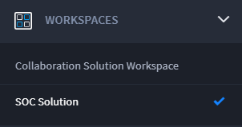

Select a Template and Send a Message
====================================

Before you choose a template and send a message, make sure you have
completed the following:

-  Read the Collaboration Solution Overview

-  Installed and configured the Collaboration Solution

-  Configured any Slack or Teams webhooks, if needed

-  Configured the settings asset for your selected Email_Medium

-  Created and configured the Collaboration Solution template(s)

-  Optional: Installed and configured the SOC Solution and Case and
   Incident Management (CIM) application (see
   `SOC Solution <soc-solution.rst>`__ for details)

**Note**: Installing and configuring the SOC solution is *not* a
requirement.

Examples in this section use the SOC Solution and CIM app for reference,
so this solution and application are needed to follow along with the
documentation. Great! Now you are ready to select the desired template
and send a message.

#. Navigate to WORKSPACES and click **SOC Solution**.

|image1|

#. From the navigation pane, click **APPLICATION RECORDS**.

#. Click **Case and Incident Management**.

If you have existing records, you can open and modify those records. For
this example, we are using the **CIM-47** record. The AUTOMATED BRIEF
section alerts you that there is an unwanted web attack. The
CIM application parsed and enriched data already. To respond to this
alert, navigate to the Collaboration section and select a template to
load, so you can send a response.

|image2|

#. From the CIM application record, scroll down to the **Collaboration**
   section.

This Collaboration section has numerical steps to walk you through
selecting, loading, and adjusting a template. In the CIM-47 example, the
steps have been completed.

-  Step 1: The **Incoming High Priority Alert** template was selected,
   which performs field value replacement from the template manager
   record.

-  Step 2: Loaded fields (**Email To**, **Collaboration Email Subject**,
   **Email Body**, and **Slack Webhook** details) from the selected
   template show.

-  Step 3: Loaded **Collaboration Communication Channe**\ l details and
   **Action List** details show.

#. Once satisfied, click **Send Message** to initiate the message
   sending process.

The Send Message playbook creates a new record in the Collaboration
Message Sender application, which then sends the message to the
specified communication channels. Additionally, the Collaboration
Solution Status field is set to Message Sent.

Response Handling
-----------------

If the message has any values defined in the Action List, then the
recipient can respond to the message with one of the predefined actions.
Upon response, the invoking record is updated to indicate that a
response was received and what response was selected by the recipient.
Specifically, the Collaboration Solution Status field is set to Response
Received and the Response Action field is set to the action that was
selected by the recipient.

**Note**: Further responses to the same message will *not* be recorded.
You receive an automated message indicating that a response has already
been received.

 

.. |image2| image:: ../Resources/Images/collab-solution-cim-47.png
