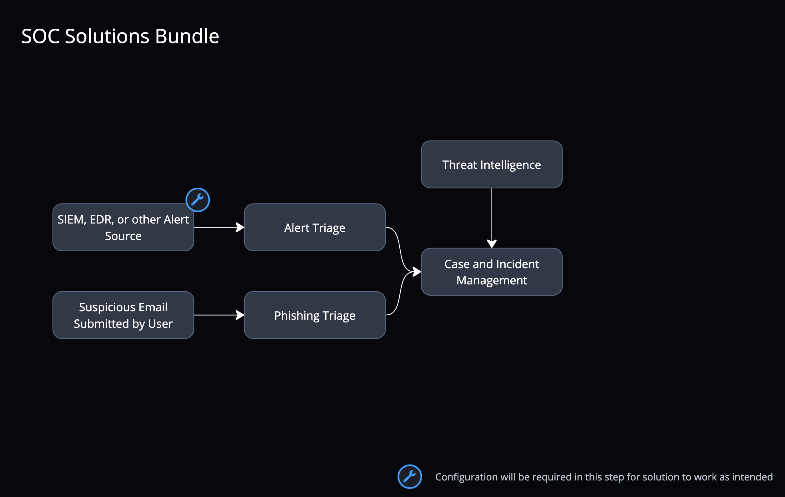
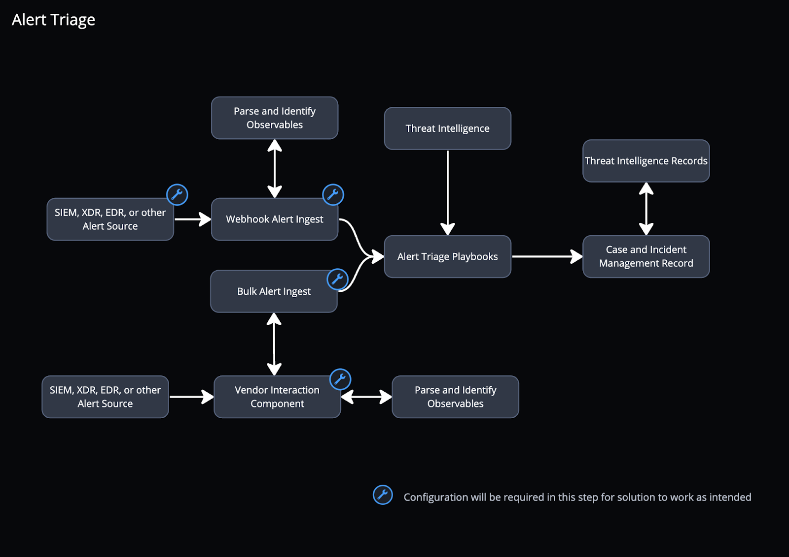
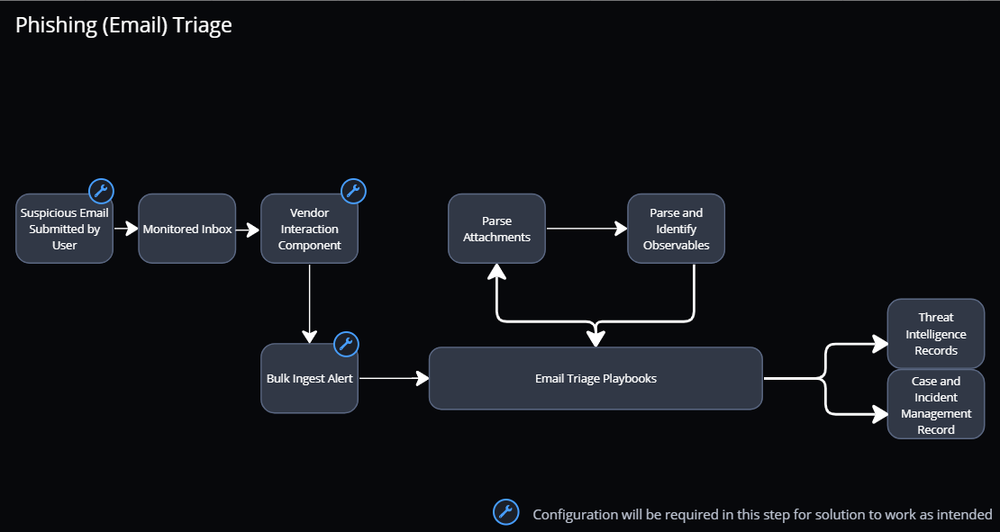
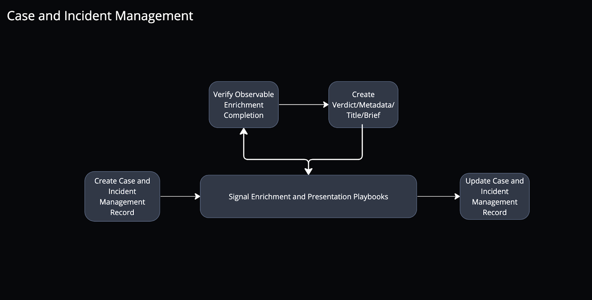

.. _soc-solution:

SOC Solutions Bundle
====================

The SOC Solutions Bundle is a solution bundle that is made of four
smaller, interconnected solutions: Phishing Triage, Alert Triage, Threat
Intelligence (TI), and Case and Incident Management (CIM). Phishing
Triage and Alert Triage are the primary ingestion workflows, processing
incoming events into signals in the CIM application. The TI solution
extension is used to enrich observables extracted from incoming cases.
Combined, the four solutions create a powerful set of workflows to
efficiently and effectively triage and manage critical security events.

|image1|

Let's dive into what these solutions do as part of the SOC Solutions
Bundle.

Alert Triage
~~~~~~~~~~~~

**How it Works**

The Alert Triage solution is composed of several playbooks that triage
events from a SIEM, XDR, EDR, or other security alert source. You can
use either a webhook to push alerts from your source into Turbine, or a
bulk ingestion component in the solution to pull alerts. Each alert is
processed to identify and extract the important observables. A signal is
created in the Case and Incident Management (CIM) application and
populates relevant alert data. Then the Threat Intelligence
(TI) application evaluates observables discovered in your alert to
categorize, evaluate, and prioritize the event before mitigation or
remediation.

You can configure the solution to work with any number of SIEMs, XDRS,
EDRs, or other security tools. Similarly, you can customize playbook
actions to fit any company’s existing or preferred SOC processes.

**Capabilities**

The Alert Triage solution:

-  Provides connectors, assets, and playbooks for triaging alerts from
   security information and event management (SIEM),  (extended
   detection and response) XDR or endpoint detection and response (EDR),
   etc. products
-  Automates ingestion of alerts via webhook or API request
-  Summarizes alert data
-  Enriches observables and identifies actionable data
-  Feeds into Case and Incident Management application

**Workflow**

|image2|

Phishing Triage
~~~~~~~~~~~~~~~

**How it Works**

The Phishing (Email) Triage solution is composed of several playbooks
that process emails that users submit because they suspect them to be
phishing attempts. The solution extracts the critical information from
the email (such as observables) and attaches them to a new signal in the
CIM application. Then threat Intelligence providers, configured in the
TI application, evaluate the observables discovered in the suspected
phishing email. A rendered image of the suspected phishing email is also
generated to provide a safe way to view the contents of the email.
Additionally, the solution automatically saves email attachments to the
TI record. For security reasons, this functionality is disabled by
default. To configure, review the Configuration information below.
Additionally for security reasons, an image of the original email is
saved as part of the case rather than the original content.

Turbine users can customize the phishing triage playbooks to fit any
company’s existing or preferred SOC processes.

**Capabilities**

The Phishing Triage solution has the following capabilities:

-  Provides connectors, assets, and playbooks for triaging reported
   phishing emails

-  Automates ingestion of emails with reported phishing emails attached

-  Summarizes reported phishing email data 

-  Enriches observables and identifies actionable data

-  Feeds into Case and Incident Management application

**Workflow**

|image3|

Threat Intelligence
~~~~~~~~~~~~~~~~~~~

**How it Works**

The Threat Intelligence (TI) solution works with one or more threat
intelligence providers to enrich the observable evidence extracted in
the Phishing Triage and Alert Triage solutions. When a TI Record is
created, several playbooks evaluate the observable against the
intelligence provided by the intelligence providers. The results are
used to update the TI Record, which is associated with the signal being
triaged.

**Capabilities**

The Threat Intelligence solution:

-  Provides connectors, assets, and playbooks for enriching TI
   observables
-  Allows configuration of multiple threat intelligence providers,
   including a configurable primary trusted intelligence provider per
   observable type (domain, IP, etc.)
-  Allows automated enrichment of observables identified from Alert and
   Phishing Triage playbooks and ad hoc searches through the
   CIM application

**Workflow**

|image4|

Case and Incident Management
~~~~~~~~~~~~~~~~~~~~~~~~~~~~

**How it Works**

The CIM solution works with the Alert Triage and Phishing Triage
solutions to create and manage signals for each event being
investigated. The created signals serve as the primary interaction point
for investigations, showing the details, status, and next steps for each
signal. Signals that are identified as true positive or important can be
escalated to case status. If cases are deemed to be impactful to
security, they can be promoted to incidents.

Turbine users can customize the CIM playbooks to fit any company’s
existing or preferred SOC processes.

**Capabilities**

The Case and Incident Management solution:

-  Provides an interactive user interface for:

   -  Triaging reported phishing emails from the Phishing Triage
      Solution
   -  Triaging alerts from the Alert Triage Solution
   -  Viewing, interacting with, enriching, and adding observables via
      the Threat Intelligence Solution
   -  Documenting research and notes regarding an investigation
   -  Providing investigation details and knowledge base articles
   -  Collecting granular metrics such as MTTR, MTTD, Dwell Time, etc.
   -  Identifying MITRE ATT&CK Phases
   -  Working an investigation through its entire lifecycle, from signal
      ingestion through case and incident escalations, remediation, and
      resolution

   For more information on configuring the CIM application, see `Case
   and Incident Management
   Application <case-and-incident-management-application.htm>`__.

**Workflow**

|image5|

.. toctree::
   :titlesonly:
   :caption: Children:

   /Content/marketplace/Install_and_Configure_SOC
   /Content/marketplace/case-and-incident-management-application
