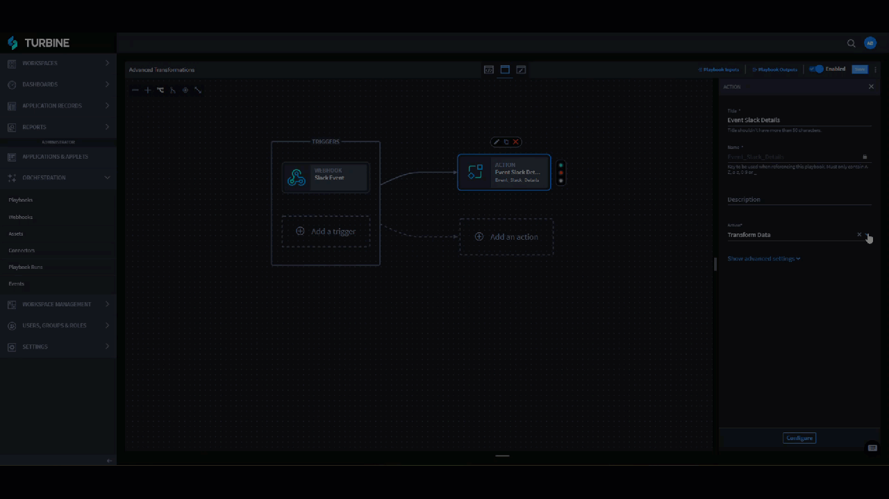
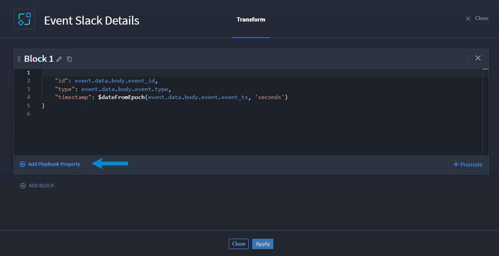

Advanced Transformations
========================

Need something more complex than basic transformations? Want to write
the code yourself?

You can use advanced transformations to write complex JSONata
expressions, which gives you significant flexibility to transform data
according to your needs. See `JSONata
Docs <https://docs.jsonata.org/overview.rstl>`__ to assist you in
writing expressions.

-  To access advanced mode, complete steps 1-4 on `Basic
   Transformations <../basic-transformations/transform-data.rst>`__ to
   open the transformation builder, then click **Switch to advanced** on
   a block.

**Warning!** Once you click **Switch to advanced**, you cannot revert
the block to a basic transformation.

**Warning!** A confirmation dialog displays **Switching "Block 1" to
advanced mode is irreversible. Existing transformations for this block
will be converted. Are you sure you would like to continue?** If you
want to continue, click **Confirm**.

When might you want to use advanced transformations? Currently, the most
common need for advanced data transformations transforming one object
structure into a different structure for use within the playbook.

Let's check out an example!

Transforming One Object Structure to a Different Structure Use Case
-------------------------------------------------------------------

Avery wants to take data from a Slack event and restructure the data to
Swimlane's common data model. To do that, Avery can use an advanced
transformation block to write the JSONata expression.

First, Avery creates a webhook trigger for ingesting Slack events. Now,
Avery is ready to add the Transform Data action, switch to advanced
mode, and define a new object with the attributes id, type, and
timestamp, using playbook values to fill in the values for those
attributes.

Watch as Avery creates the advanced transformation.

|image1|

Visit the `JSONata Exerciser <https://try.jsonata.org/>`__ to verify
and/or practice writing JSONata expressions.

**Important!** On the advanced mode block, click **Add Playbook
Property** to add a playbook property. You cannot manually enter a
playbook property.

|image2|

