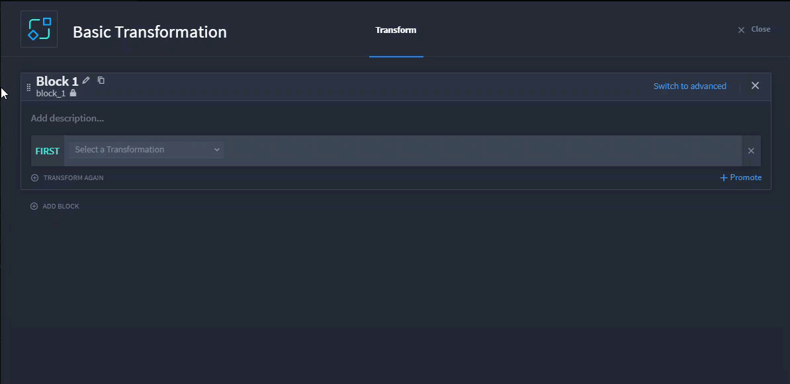
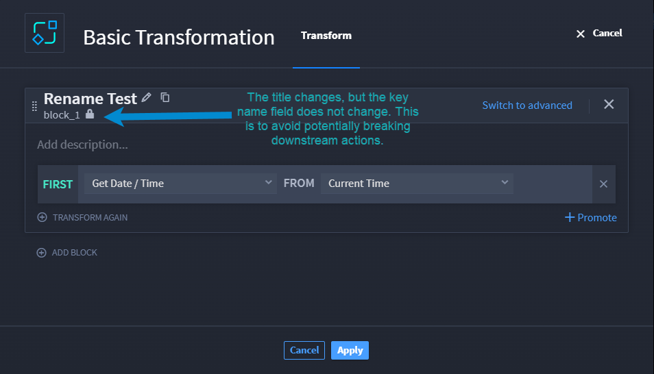

.. _basic-transformations:

Transform Data
==============

One of the most common data transformation jobs is converting data to
specific formats. Historically, this operation has required Python or
JSONata expertise. Turbine eliminates this need by using a
transformation action in a playbook.

Basic Transformation Action Set Up
----------------------------------

Time to start basic set-up for the Transform Data action.

You have already created a playbook, and you are ready to transform the
data from a property.

#. From your playbook, click **Add an action**.

#. From the ACTION panel, click the **Action** drop-down.

#. Select **Transform Data** and then click **Configure**.

   |image1|

   The transformation builder opens.

   |image2|

   Click the pencil icon and change the block name. Turbine also
   automatically updates the block name in snake case. To duplicate the
   block, simply click the |image3| icon.

   |image4|

   If you have already clicked Apply, then later return to a
   transformation block to rename it, the original block name does not
   change. Just like actions, click the lock icon to change the name.

   |image5|

   However, a warning dialog opens to remind you that changing the key
   name could potentially break downstream actions, if the block is
   referenced or used downstream in the playbook.

   |image6|

   From the Transform tab:

4. In Block 1, on the **FIRST** line, click the **Select a
   Transformation** drop-down and select a transformation type.

**Warning!** Wait until you have completely configured the entire block
(the FIRST and THEN rows) before adding a new Block to configure.

#. Once you complete the configuration, click **TRANSFORM AGAIN**.

The next line in the block is **THEN**. If necessary, select the next
transformation action to apply to the output of the previous line.

Marking Data as Sensitive
~~~~~~~~~~~~~~~~~~~~~~~~~

If your data has any sensitive information, you can mark as sensitive by
clicking the **Contains sensitive data** checkbox. The data is not shown
in the UI or in the logs.

|image7|

Basic Transformation Use Cases
------------------------------

See `Transform Data Action - Date and Time Use
Cases <../../use-cases/native-action-use-cases/transform-data-date-time-examples.rst>`__
for examples.

 

Continue to the next section for a table for advanced transformation
example.

.. |image1| image:: ../../Resources/Images/transform-data-action.png
.. |image2| image:: ../../Resources/Images/basic-transformation-window.png
.. |image3| image:: ../../Resources/Images/duplicate-block-icon.png

.. |image6| image:: ../../Resources/Images/basic-trans-caution-name-change.png
.. |image7| image:: ../../Resources/Images/basic-transformation-window.png

.. toctree::
   :titlesonly:
   

   /Content/native-actions/advanced-transformations/advanced-transformation-options

