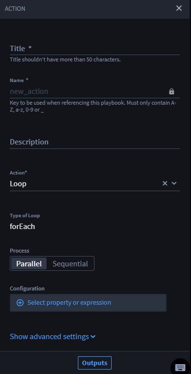

Loops
=====

As orchestrators, sometimes you need to apply one or more actions to
each item in an array. forEach Loops allow you to have access to the
iterative item in the array for easy configuration and action building.

Use the Loop native action to:

-  Receive an array of items and iterate through that array performing
   action(s) on each item.

-  Reduce the need for configuring a repeated nested playbook action to
   apply more than one action to each item in an array.

Loop Native Action Set Up
-------------------------

Time to start basic set-up for the Loop native action.

You have already created a playbook, and you want to iterate over an
array applying action(s) to each item individually.

#. From your playbook, click **Add an action**.

#. From the ACTION panel, click the **Action** drop-down.

#. | Select **Loop** and the Loop configuration window displays in the
     right-hand pane.
   | |image1|

   The window mirrors other actions but with additional configuration
   options.

   |image2|

   Turbine only uses forEach loops. However, you can make additional
   configurations.

   First, select your process by choosing between Parallel and
   Sequential.

   -  A forEach loop where each group of actions is applied to items in
      the array asynchronously. This could result in the item at index 3
      being finished before the item at index 2.

   Sequential forEach loops:

   -  A forEach loop where statements run following/after another
      forEach loop

   Next, you can configure the forEach loop by applying an array input
   with the playbook property selection or expression syntax.

   |image3|

   Lastly, you can click Outputs and promote outputs to use outside of
   the playbook.

   In the playbook, you can see the Loop native action is first,
   followed by the option to add an action, and a plus icon that allows
   you to add more actions. The blue border indicates the action or set
   of actions that the forEach loop iterates.

   **Note:** You cannot connect an action to any upstream action that is
   a forEach loop or is before a forEach loop.

   **Note:** You cannot connect an action to an action inside in a
   forEach loop.

   | 
   | |image4|

   You have successfully created a forEach loop in your playbook. To see
   the results of a loop, you must run a playbook in its entirety.

   **Warning!** The aggregated forEach loop results only come from the
   last action in loop.

   **Warning!** There are no branching or nesting capabilities in
   forEach loops.

   .. rubric:: Use Case
      :name: use-case

   See `Loops use
   case <../use-cases/native-action-use-cases/loop-use-case.htm>`__ for
   examples.

.. |image2| image:: ../Resources/Images/loop-configuration-window.png
.. |image3| image:: ../Resources/Images/loop-property-expression.png
.. |image4| image:: ../Resources/Images/loop-border.png

.. toctree::
   :titlesonly:
   :caption: Children:

   /Content/native-actions/nesting-branching-and-conditions
