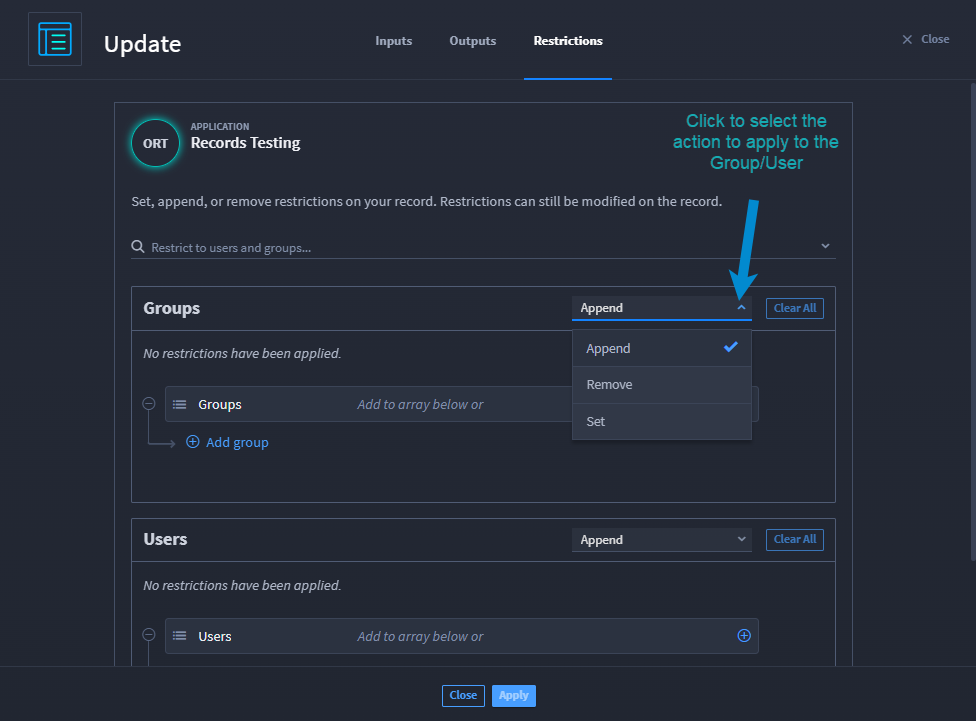
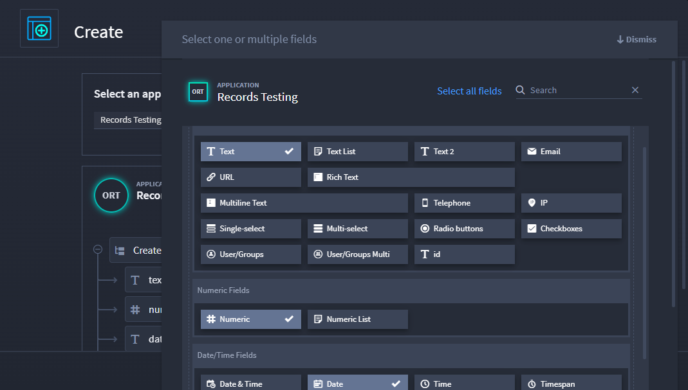
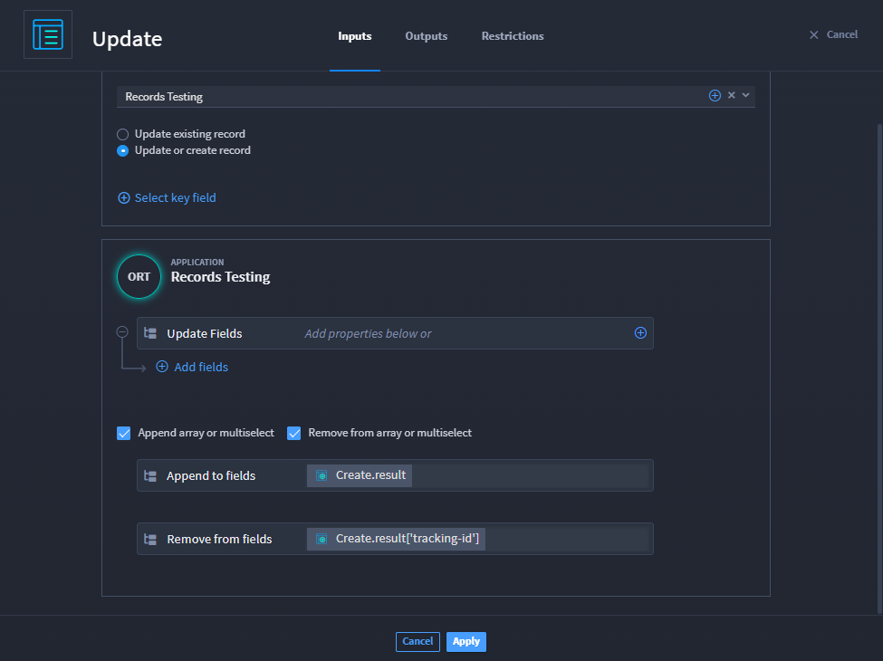
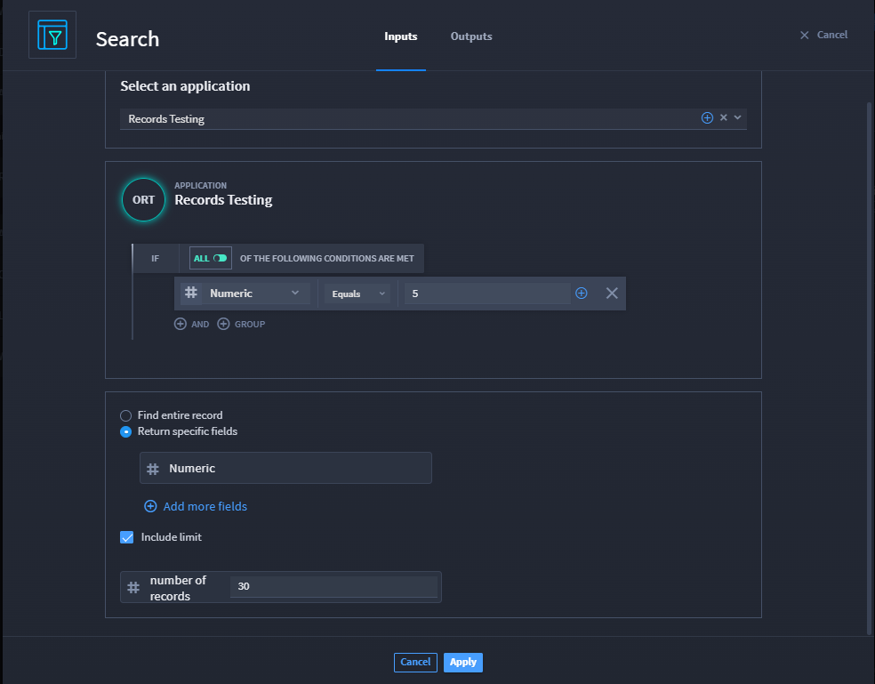
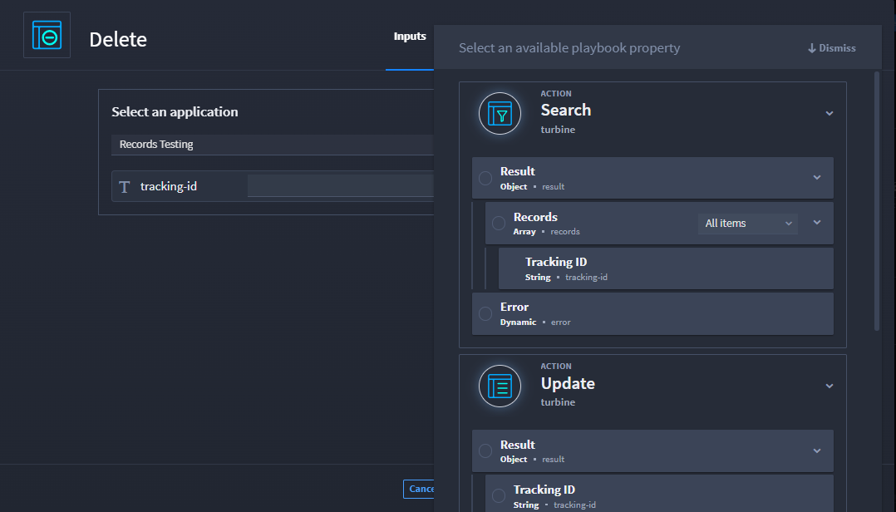

Record Actions
==============

The Create Record, Update/Create Record, Search Records, and Delete
Record native actions describe the functions for creating and
maintaining data used in Turbine application records. These actions
together are also commonly referred to as CRUD.

CRUD Actions in Playbooks
-------------------------

To access these native actions, follow these steps:

#. From the playbook builder, click **Add an action**.

#. From the ACTION panel, in the Action drop-down menu, select one of
   the desired CRUD options.

The following table shows the action and associated icon.

======== ======================
Icon     Record Action
======== ======================
|image1| Create Record
|image2| | Update/Create Record
         | aka Upsert
|image3| Search Record
|image4| Delete Record
======== ======================

 

The Create and Update/Create Record actions have the ability to
configure inputs, outputs, and restrictions to your record.

 

**Note:** Restrictions can be modified on the record as well.

Restrictions and Outputs
~~~~~~~~~~~~~~~~~~~~~~~~

Create and Update/Create Record actions have a Restrictions tab where
you can restrict application records to specific groups and/or users.

If you navigate to the Restrictions tab on a Create action, and you have
not configured any restrictions, there is a status indicating that no
restrictions have been applied. Values you can add when adding a user
are: email address, username, display name, or id. Under either the
**Groups** or **Users** sections, click **Clear All** to remove all that
section's restrictions. If you want to delete just a single group or
user, click on the ellipsis to the right of the field, then click
**Delete**.

|image5|

On the Create/Update record, you do more than add a group/user. From the
Restrictions tab, you have the options to Append, Remove, and Set
options.

|image6|

On any of the CRUD actions, if you want to use any outputs outside of
this playbook, navigate to the Outputs tab and promote the desired
output. See `Outputs <../playbooks/actions/outputs.rst>`__ for more
information.

Create Record
-------------

Using the Create Record native action creates a new record in a selected
application from the playbook builder. The data is mapped to the
application fields.

**Inputs:**

When creating a record from a playbook, the Inputs tab is where you
select an existing application in which to create the record and select
the fields you want to collect data. After selecting an application,
select data fields you want to add to the record by click the |image7|
icon and selecting a playbook property from any upstream actions or
playbook inputs, or you write an expression. Next you want to select the
fields for the record.

#. From the Inputs tab, click **Add fields**.

#. From the existing application fields, click on the desired fields to
   add to the record. You can select multiple.

#. Click **Dismiss** to close the window and return to the Inputs tab.

|image8|

#. Apply changes.

Update/Create Record
--------------------

Use the Update/Create native action to make changes to an existing
record from the playbook builder, or create a new record from the
playbook builder. This is also referred to as upsert--a combination of
"update" and "create."

When updating a record, navigate to the Inputs tab to upsert a new
record or update an existing record. You must select an application to
continue.

#. Click the appropriate radio button depending on your need.

If you select an existing record, the tracking-id field automatically
displays, since all existing records have a unique identifying tracking
ID.

#. Click **Dismiss** to close the window and return to the Inputs tab.

|image9|

Selecting to upsert a record has the same process on the Inputs tab as
when you configure a Create Record native action. On this window, click
**Select key field** to open the application form. Select the fields to
update when a record is updated or created.

 

**Warning!!** You can only select one field here.

 

|image10|

At the bottom of the Inputs tab are append and remove options. Both only
apply to array/multiselect field options. When you select Append array
or multiselect, you're adding to an existing array of items, and if you
pass an empty array, or null value, to one of the selected append
fields, nothing in the field changes. Once again, you can apply playbook
properties.

Let's say you want to remove values from array/multiselect fields. When
you select that check box, the action only removes the value(s) passed
if they match to an existing array item. What happens if you pass five
items, but none of them match existing array items? Nothing! Your values
do not change. If you remove all items, then the action removes the
field from overall results because it no longer contains data.
Basically, the field won't return empty array or null results in a
record action.

 

**Tip:** You can append and remove on the same record action.

 

Careful! When valid values are passed through an Update record action,
it overwrites existing data. For example, if you have an existing array
of three items and update to pass an array of one item, it now passes
the one array item. All fields work, except comments, which only work
when you append arrays. If you want to aggregate/add data to the record
action, use Append.

|image11|

 

**Tip:** Remove all data easily by sending a null for string, numeric,
and list types.

Search Records
--------------

Using the Search Records native action searches for actions based on the
provided filter criteria you select. After selecting an application from
the Inputs tab, a condition builder is available. The function of this
condition/filter builder is the same as `building filters in
records <../records/search-record-data.rst>`__. Use the radio buttons at
the bottom of the window to return the entire record or just specific
fields.

 

**Tip:** If you want all records for the application you selected, do
not create conditions.

 

**Warning!!** When you select the **Include limit** check box, the input
number is the max records that will be returned in a search.

 

|image12|

Delete Records
--------------

Use the Delete Record native action to delete a record in a selected
application. The tracking-id field automatically displays, since all
existing records have a unique identifying tracking ID. After selecting
an application from the Inputs tab, click the |image13| icon and
selecting a playbook property from any upstream actions or playbook
inputs.

|image14|

Apply changes.

 

**Tip:** Remember to save the playbook often.

.. |image1| image:: ../Resources/Images/canvas-na-create-record.png

.. |image3| image:: ../Resources/Images/canvas-na-search-record.png
.. |image4| image:: ../Resources/Images/canvas-na-delete-record.png
.. |image5| image:: ../Resources/Images/crud-restrictions.png

.. |image9| image:: ../Resources/Images/upsert-existing-record.png
.. |image10| image:: ../Resources/Images/upsert-map-fields.png

