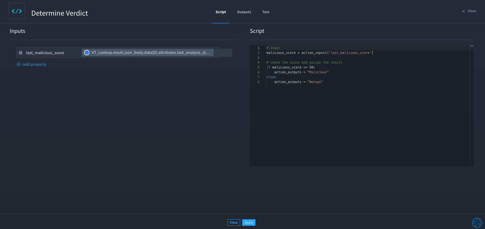
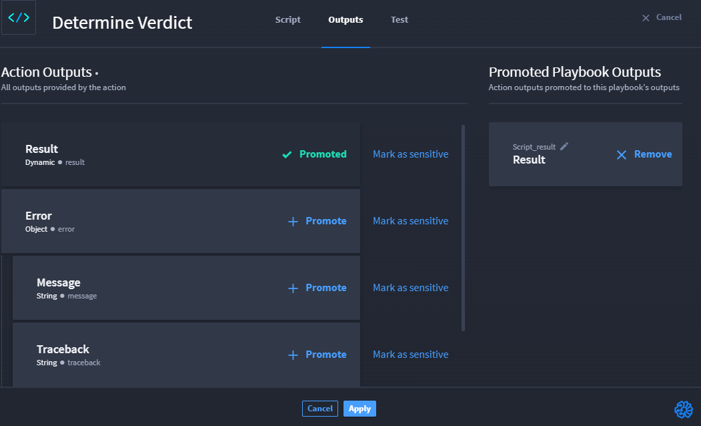

Scripts
=======

As analysts and security professionals, you have knowledge on writing
simple scripts in Python. And while Turbine allows you to write more
complex code with JSONata, you can also use a native action for simple
functions.

**Tip:** For Boolean and Null data types, we recommend importing JSON
and using **json.loads(<my ref>)** to ensure the data loads correctly.
Since all playbook data is JSON and Python does not support all JSON
types natively.

Use the controlled Script native action and write with Python to:

-  manipulate data and edge cases.

-  reduce complexity used with JSONata.

-  use the most common programming language in security today to do
   simple tasks.

Turbine uses Python 3.11 and accesses all the standard libraries that
come with Python, including the `Python Standard
Library <https://docs.python.org/3.11/library/index.html>`__. You can
also use `Numpy <https://numpy.org/doc/stable/index.html>`__ version
1.25.2, and `Pendulum <https://pendulum.eustace.io/>`__ version 2.1.2.

When configuring inputs, consider using the Swimlane Python Chatbot,
which uses ChatGPT's Open AI to help you formulate transformations and
customized Python code. See `Swimlane Python
Chatbot <swimlane-python-chatbot.htm>`__ for information.

Script Native Action Set Up
---------------------------

Time to start basic set-up for the Script native action.

You have already created a playbook, and you are ready to manipulate
data from a property.

#. From your playbook, click **Add an Action**.

#. From the ACTION panel, click the **Action** drop-down menu.

#. Select **Script**, then click **Configure**.

The Script window opens.

|image1|

The Script window has three tabs: Script, Outputs, and Test. The Script
tab has the Inputs pane (on the left side) and the Script pane (on the
right side).

Script Inputs
~~~~~~~~~~~~~

With the Script native action, you can build and map static and playbook
property data inputs to reference data in the Python Script native
action.

The current playbook properties you can add are:

-  String

-  Number

-  Boolean

-  Object

-  Array

Before you can test, set up your Script inputs. Let's take a look at a
quick example on how to set up inputs and use the Script pane.

**Tip:** The Script pane shows helpful information, such as
restrictions, available global variables, and a link to the Swimlane
*Turbine User Guide*.

#. From the Script tab, on the Inputs pane, click **Add property** to
   define inputs including any sub-input properties they may have.

#. Click the **pencil** icon to edit the name of the property.

In the example image, you can see a Numeric input with a VirusTotal
property mapped to it.

#. Write your code in the Script pane on the right.

In the example image, the Python script obtains the
**last_malicious_score** input, verifies whether it meets the
**Malicious** score threshold, and assigns the result.

|image2|

Great! You have entered the inputs and Python script.

Script Output Tab
~~~~~~~~~~~~~~~~~

Outputs tab allows you to select all outputs provided by the action and
you can promote them. The output tab also allows you to mark the data as
sensitive.

You can promote the action output by clicking **Promote** button next to
the action type from the **Action Outputs** list. The promoted output
action is displayed in the **Promoted Playbook Outputs** section.

You can remove the promoted output by clicking the **Remove** button
next to the promoted output.

Marking Data as Sensitive
^^^^^^^^^^^^^^^^^^^^^^^^^

You can mark the promoted data as sensitive so that it is encrypted or
it is not visible.

To mark the data as sensitive, click **Mark as Sensitive** option next
to the **Promote** button in the **Action Output** list.\ |image3|

You can remove data as sensitive by clicking **Marked as Sensitive**.

Script Testing
~~~~~~~~~~~~~~

Want to test your Script action before continuing to build your
playbook? In the Script action, from the Test tab, you can view Inputs
to the left and Script to the right.

The Result pane at the bottom shows the tested results. Just like
`discovered
outputs <../playbooks/actions/discovered-outputs-and-testing.htm>`__ in
an HTTP action, results vary. So in addition to the base of property
types, and depending on the inputs you select, the action outputs may
return additional properties. These are the discovered outputs, which
you can promote and/or delete from the Outputs tab.

See a `Script Test use
case <../use-cases/native-action-use-cases/script-test-use-case.htm>`__
for an example on testing the Script native action.

Script Attachment
-----------------

If you need to return an attachment or use an attachment as an input in
the Script native action, follow the instructions below:

**Output Attachment**
~~~~~~~~~~~~~~~~~~~~~

In your playbook, follow the instructions below to configure an output
attachment:

#. From the Action drop-down menu, select **Script**.

Let's title this action **Return Attachment** and click **Configure**.
There are two ways to write Python code to return an attachment. Let's
look!

2. Under Script, enter the following code:

3. The **test.txt** placeholder is the name of your attachment. You can
   also write the code as follows:

3. Click **Apply** to save changes.

Input Attachment
~~~~~~~~~~~~~~~~

You can use an attachment input in a Python script using a Script native
action.

#. From the Action drop-down menu, select **Script**.

2. Click **Add property** and select **Attachment**.

3. Click **Select a property** and select **Playbook Property**.

4. Under Script, enter the following code:

5. Click **Apply** to save changes.

Use Case
--------

See a `Script Test use
case <../use-cases/native-action-use-cases/script-test-use-case.htm>`__
for an example on testing the Script native action.

.. |image1| image:: ../Resources/Images/script-native-action.png

.. toctree::
   :titlesonly:
   :caption: Children:

   /Content/native-actions/swimlane-python-chatbot
