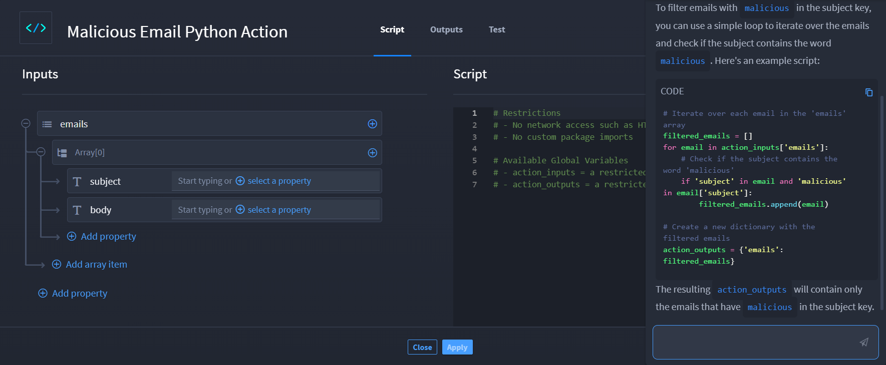
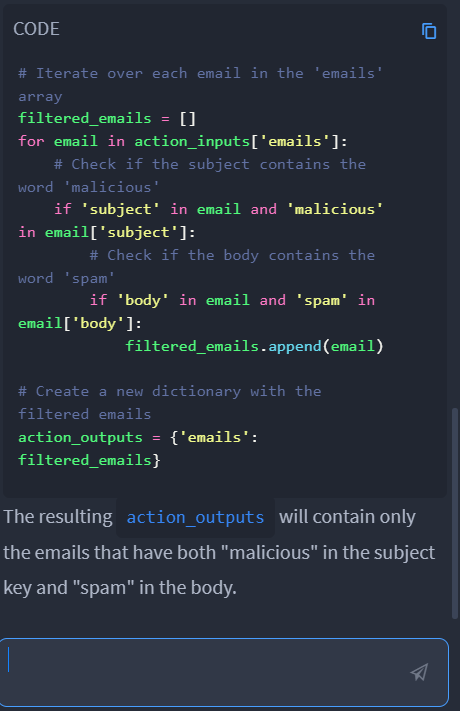
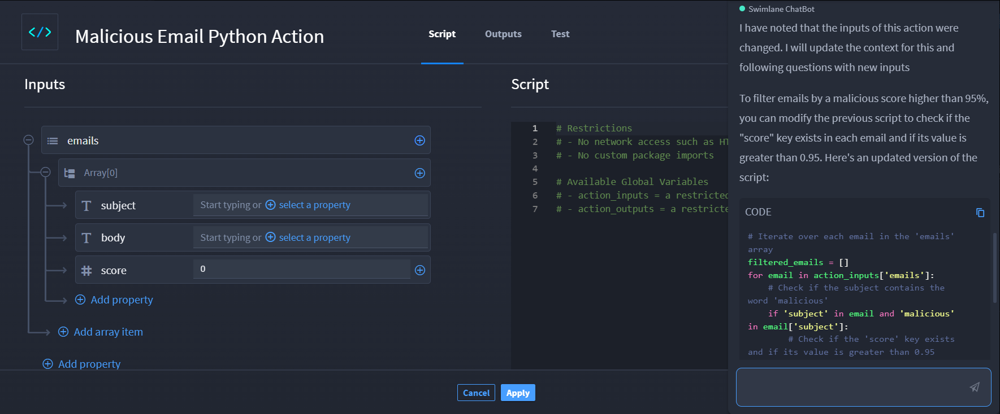

Swimlane Python Chatbot
=======================

When you are configuring a Script native action, notice the icon in the
lower right of your browser window. When you select a Script native
action, the system makes the Swimlane Hero AI Python Chatbot available
to you.

Consider it your Python scripting assistant that will help you write
scripts for the transformation logic you want.

 

|image1|

 

Click the icon to open a new chat. The first time you ask a question,
the chatbot will ensure that you acknowledge that your organization has
accepted the Swimlane Terms and Conditions. Click **Swimlane Terms and
Conditions** to review them. Next, select **Acknowledge**, and then
click the Send icon.

Now you can begin to formulate your Python scripts!

The goal is to allow you to formulate the operation (transformation,
filtering, extraction) you would like to perform on the JSON object in
the Inputs section and to generate a Python script that is capable of
performing the desired operation. The chatbot can help you create a
fully interoperable script with the conventions used within Python
Script native action. The chatbot is capable of helping you refine your
script as you go.

Python Chatbot Query Scenario
-----------------------------

In this scenario, our user Amir wants to generate Python code to perform
extraction, filtering, or transformation of an input JSON object.

Amir opens the Swimlane Python Chatbot and types, "Filter emails with
``malicious`` in a subject key" and clicks **Submit your question**.

The chatbot notices that Amir has yet to define the inputs of the Script
action and prompts him to define a JSON object for the script.

|image2|

Amir sets up an email JSON object, {"subject": string, "body": string},
and then returns to the chatbot and asks the same question he asked
before, "Filter emails with ``malicious`` in a subject key" and clicks
**Submit your question**.

The chat displays the answer as an example script. Note that the chatbot
picks the JSON schema of the Script action inputs and feeds them as the
context to Hero AI.

|image3|

Amir reviews the script and realizes he wants to refine it further. He
types and submits, "Additionally, filter the emails by body containing
word ``spam``" to the chatbot.

|image4|

Amir then remembers that his email object can also process the score of
a malicious object. He adds *score* to the email object. Then he returns
to the chatbot and enters, "Instead of filtering the body, filter emails
by malicious score to be higher than 95%" and submits.

|image5|

As you can see, the chatbot is interactive and Amir is able to make
changes as he goes.

This is the final script from the Swimlane Python Chatbot:

  # Iterate over each email in the 'emails' array filtered_emails = []
for email in action_inputs['emails']: # Check if the subject contains
the word 'malicious' if 'subject' in email and 'malicious' in
email['subject']: # Check if the 'score' key exists and if its value is
greater than 0.95 if 'score' in email and email['score'] > 0.95:
filtered_emails.append(email) # Create a new dictionary with the
filtered emails action_outputs = {'emails': filtered_emails}

Tip: Swimlane recommends splitting complex transformation logic into a
series of simple steps and to ask the Chat Assistant to prepare the
script sequentially.

.. |image1| image:: ../Resources/Images/swimlane-python-heroAI-1.png
.. |image2| image:: ../Resources/Images/no_json_object_defined.png

