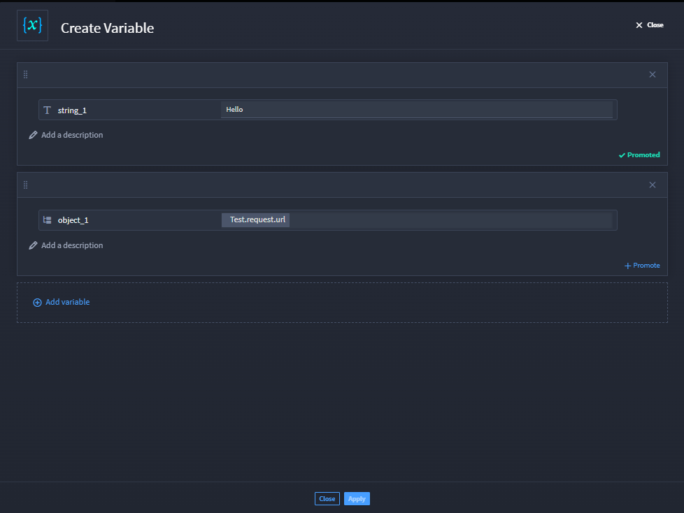

Variables
=========

Variables support Turbine orchestrators by allowing them to collect
data, store it, and use it in downstream actions. Using the Create
Variables and Update Variables native actions let orchestrators create
and/or update variables (without writing code), add variables, and apply
properties from the playbook.

Create Variables
----------------

How do you use the Create Variables native action?

First, create your playbook and/or add a trigger. For variables to be
applied, there must be previous inputs available upstream in the
playbook.

#. Click the Action drop-down menu and select **Create Variables**.

   Click **Configure**, then click **Add variable** to see a list of
   available property types that you can use. Currently, you can add:
   String, Number, Boolean, Object, Array, or Attachment. If you want to
   have more than one, just click the same button and select another
   property type.

#. In the variable box, enter a string value or click **select a
   property** to open the property drawer.

   The property drawer shows you all the available inputs from upstream
   playbook, action, and/or event inputs. If needed, you can select
   **Expression** and use that option by using dot notation.

   |image1|

#. You can mark the data as sensitive while creating a variable. Click
   the ellipsis button next to the **select a property** and click
   **Mark Sensitive**.

   | |image2|

#. Click **+Promote** if you want the variable accessible outside the
   playbook.

   |image3|

   Go ahead and add your next action, configure, and then under Inputs,
   click **select a property**. The playbook property drawer now shows
   the available variables.

   |image4|

   Now you have variables to use in the playbook.

Update Variables
----------------

Do you want to change your existing variable? Let's take a look at a
configured variable action. In the example, there are two variables: a
string and object.

|image5|

To update the inputs from this variable:

#. Add the **Update Variables** action and click **Configure**.

#. Click **Select variable to update** and the playbook property drawer
   opens.

   |image6|

   From here, you can select which variable you want to update. You can
   enter new data, choose a playbook property, or write an expression.

   |image7|

.. |image1| image:: ../Resources/Images/variable-playbook-property-drawer.png
.. |image2| image:: ../Resources/Images/sensitive_variable.png
.. |image3| image:: ../Resources/Images/variable-action.png
.. |image4| image:: ../Resources/Images/variable-available.png

.. |image6| image:: ../Resources/Images/variable-select-to-update.png
.. |image7| image:: ../Resources/Images/variable-updated.png
