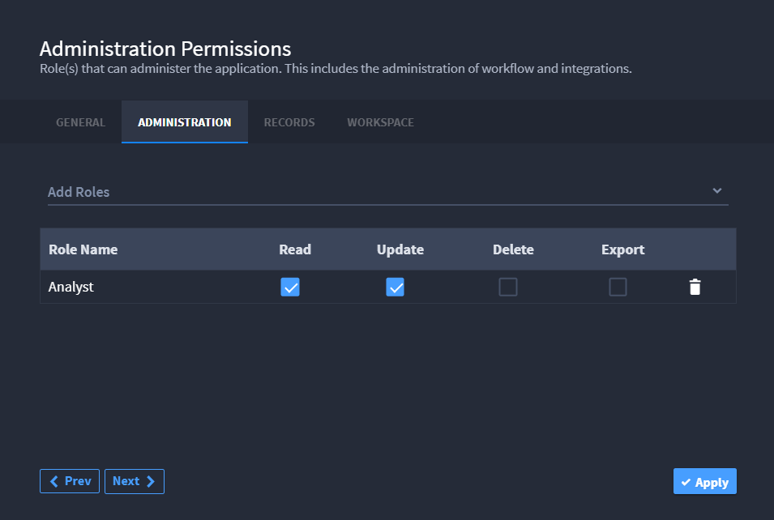

Application Permissions
=======================

You can access application permissions when creating a new application
or editing an existing application.

From the application settings, on the ADMINISTRATION tab, select **Add
Roles** and select the roles you want to administer the application.
This also includes the administration of workflow and playbooks for this
application.

|image1|

Permissions on the ADMINISTRATION tab allow users to create, read,
modify, or delete the application. On the RECORDS tab, permissions apply
specifically to records of the application.

A user with application update permissions will have access to the full
application within the Application Builder page. That means that
specific user can see all of the fields within that application, even if
they do not have field-level permissions. The user would not be able to
see the fields in read or edit mode of the record, but would be able to
see them in the application. You can change the field-level permissions,
however. Application level permissions trump field level permissions
within the application builder page.

