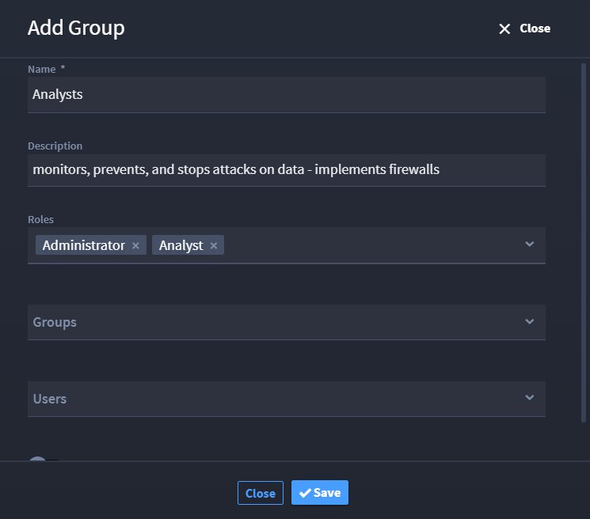

.. _group-permissions:

Groups
======

Administrators manage Swimlane Turbine groups. To access the Groups
page, from the Admin panel, select **GROUPS**.

|image1|

Administrators can create new groups and also access users and roles
from the icons on the User page taskbar.

Create a new group by clicking **Add Group**.

#. Enter the name of the group in the **Name** filed.

#. Enter the description if necessary.

#. Select the **Roles** the group is to be applied to.

#. After completing the required fields, the administrator can add users
   and/or other groups to the current group.

   Note: The Groups and Users must already exist for you to be able to
   select them.

#. Click **Save**.

|image2|

You can sort the groups in alphabetical order by clicking the **Name**.

You can manage the group by clicking the group name to change the
Description, Roles, Groups, and Users associated with it.

You can disable a group by clicking the **Disabled** toggle.

You can delete a group by clicking the **Delete** icon.

.. |image1| image:: ../Resources/Images/group_perms.png

