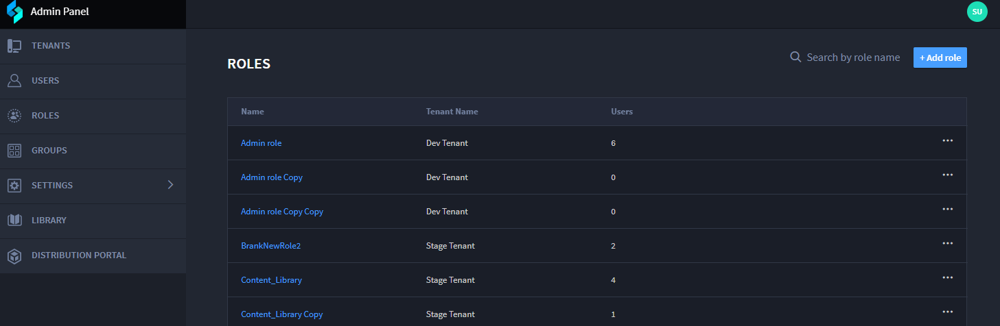
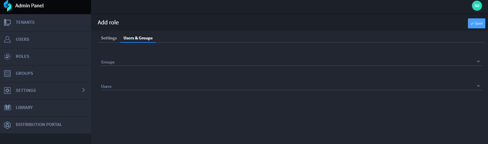
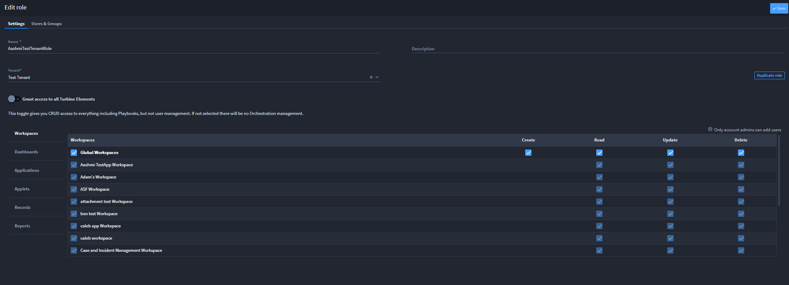

.. _role-permissions:

Roles
=====

Administrators manage Swimlane Turbine roles. To access the Roles page,
from the Admin panel, select **ROLES**.

|image1|

You can view the profile of each role (by clicking on the name) and
Search by role name. You can also **Edit**, **Duplicate Role**, or
**Delete** a role.

Adding a Role
-------------

Create a new role by clicking **Add Role**.

From the Settings tab:

-  Name: Enter the role name

-  Description: Provide the description for that role

-  Tenant: Select the tenant from the drop-down to associate a tenant
   for that role.

|image2|

From the Users and Groups tab:

-  Click Groups to search for groups, select the group, and add role to
   that group.

-  Click Users to search for users, select the group, and associate that
   role to that user.

|image3|

In order for the role to be able to access orchestration, you **must**
toggle on the Grant access to all Turbine Elements toggle.

**Note:** This role is created at a tenant level and is specific to a
tenant.

Editing a Role
--------------

You can edit a role by clicking on the role or by click the ellipses
button and click Edit.

You can control Role permissions for **Workspaces**, **Dashboards**,
**Applications**, **Applets**, **Records**, and **Reports**

|image4|

Refer to this table for more information about how role permissions and
field-level permissions work together:

|image5|

Duplicate Role
--------------

You can duplicate a role using the following:

-  Click the role. From the Edit role page, click **Duplicate role**.

-  Click the ellipsis button and click **Duplicate Role**.

The duplicated role is added to the list of roles. Click the role to
edit the properties or permissions.

**Note:** If you change the tenant for that role, you must set the
permissions again as it is considered as new role.

.. |image2| image:: ../Resources/Images/addrolepermissionsview.png

.. |image5| image:: ../Resources/Images/permissions_table.png
