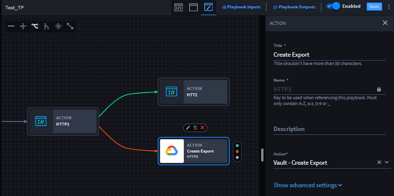
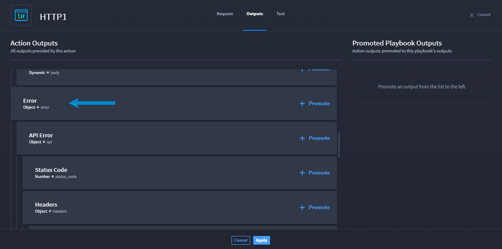
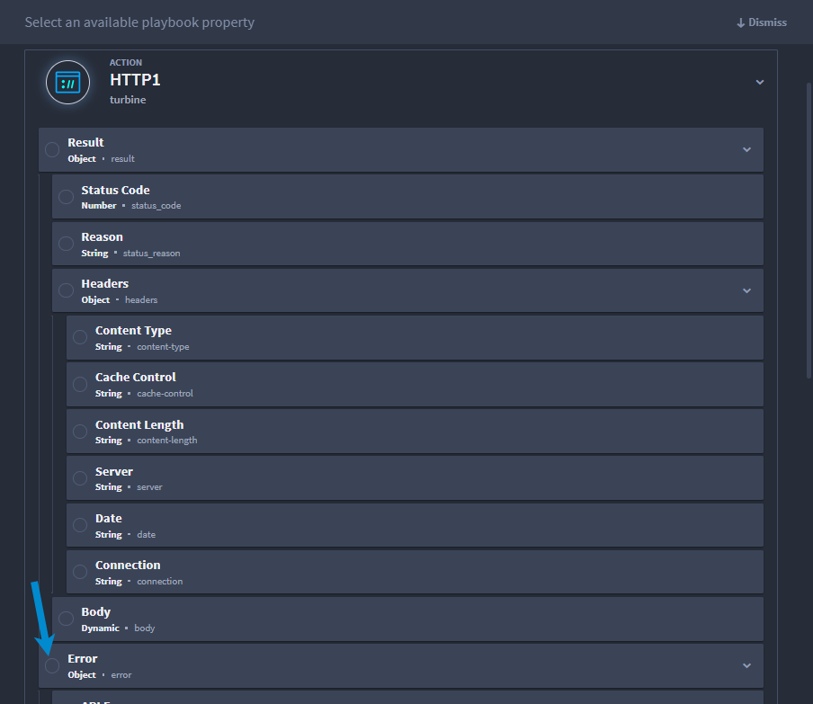
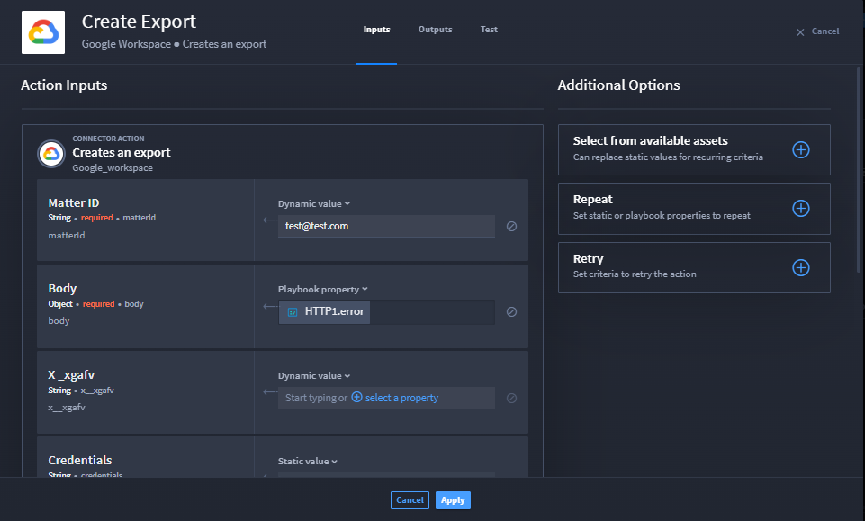

.. _action-outputs:

Discovered Outputs and Testing
==============================

For every action, there are outputs. Basically, when an action executes
(and does not fail), the output data returns a minimum base of property
types, which you can apply as inputs for other actions within your
playbook, or promote to use outside of the current playbook.

Discovered Outputs
------------------

Also! There are discovered outputs. Based on what action or connector
you use, the results may vary. So in addition to the base of property
types, and depending on the inputs, action outputs may return additional
properties. These are the discovered outputs.

What if you want to test your action to see the possible outputs? This
can be done at the action-level. Let's take a look at the how to test
the actions/connectors that Turbine supports.

Action Testing
~~~~~~~~~~~~~~

Let's test the action that you created! Testing a single action enables
better debugging, helps you detect errors in code earlier, saves time,
and lets you test inputs while playbook building.

To test connectors/actions, follow these steps:

#. Select your action and click **Configure**.

   The Request, Outputs, and Test tabs are available to configure.

#. From the Test tab, enter your inputs and configure the rest of the
   action as needed.

#. After entering configuring your request, click **Test** to the right.

The Result pane below provides the raw JSON data that you don't need to
worry about! Turbine turns that difficult-to-read JSONata into an
easy-to-read format under the **Discovered Outputs** tab. The discovered
outputs are combined with the base (original) outputs. All of the known
outputs display with check marks. The remaining outputs from the request
will be unchecked, and you can select one or all of them and click Add
those selected to outputs.

To view the added outputs, navigate to the Outputs tab. All of the
outputs that were custom (that you just added) display with the option
to delete. You'll notice that you cannot delete any outputs that are
part of the original outputs.

Error Outputs
~~~~~~~~~~~~~

What happens if your action fails? You need to know more information
about why the action failed. Turbine now provides a base-level Error
property type for action outputs. The Error property type gives you
access to any output properties when an error occurs.

Currently, the HTTP native action, Script native action, and connectors
have this property type. This makes for a better user experience when
testing actions and handling errors.

Let's walk through an example.

**Example:**

Miranda has a playbook with two HTTP native actions. She creates a
playbook that has an HTTP native action followed by an On Success action
flow and On Failure action flow. Her On Success action is another
HTTP native action. Her On Failure action is a Google Create Export
action.

|image1|

In the first HTTP1 action, she selects the POST option and enters
`www.google.com <http://www.google.com/>`__ as the URL.

|image2|

When she runs this action, it will fail, because Miranda cannot use the
HTTP method POST for the provided URL. From the Outputs tab, Miranda
sees the base-level property type: **Error**.

|image3|

When Miranda accesses the On Failure path, she sees the Error output
sub-properties.

Miranda configures the Create Export connector action by opening the
playbook property drawer and selecting the **Error** object. Once she
does, the property displays in the Action Inputs.

|image4|

|image5|

Now, if the first HTTP action fails, the On Failure workflow sends the
error response to the Create Export connector action.

Discovered Error Outputs
~~~~~~~~~~~~~~~~~~~~~~~~

You can discover outputs during action testing. You already know that
actions have outputs based on what action or connector you choose and
the base property types that are returned.

What if the action test has an error response? Let's use Miranda's
example again to view discovered error outputs.

**Example:**

Miranda selected the HTTP native action and configured as below: 

|image6|

Miranda clicks **Test**. There's an error response! It's easy to see,
because the Results pane now shows **Error**. The Result and Discovered
Outputs tabs on that pane are now **Error** and **Error Outputs**.

|image7|

Miranda wants to add the discovered Error Outputs results to the action
outputs. She clicks the **Error Outputs** tab and selects individual
properties to add, or she clicks **Select All** at the top of the pane
to add all of the discovered error outputs to the action outputs. Once
she does, she can go back to the tabs at the top of the HTTP1 action and
click the **Outputs** tab and Miranda's selected error output properties
are available to promote under the Error property.

.. |image2| image:: ../../Resources/Images/error-output-http-ex1.png

.. |image6| image:: ../../Resources/Images/error-output-http-ex1.png
.. |image7| image:: ../../Resources/Images/error-outputs-discovered-error.png
