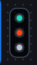
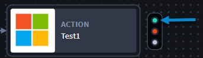
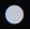
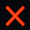
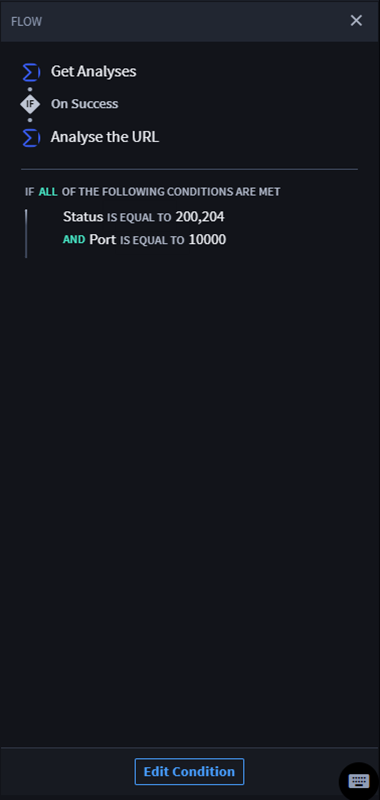

.. _create-action-flows-and-conditions:

Flows and Conditions
====================

Action flows occur from a preceding action to a subsequent action.

Types of Action Flows
---------------------

Turbine has these action flows:

-  On Success

-  On Failure

-  On Complete

The **Action Flow** icon has three types that determine whether the next
action should occur on the success, failure, or general completion of
the preceding action.

Every action has an **Action Flow** icon. The table below details icon
information.

==================== ========= ================================
**Position in Icon** **Color** **Action Flow Types / Tool Tip**
==================== ========= ================================
Top                  Green     On Success
Middle               Red       On Failure
Bottom               Grey      On Complete
==================== ========= ================================

| |image1|

Add Action Flows
----------------

#. Add an action.

#. Configure the action. See `Create Actions and Configure
   Inputs <inputs.htm>`__ for more information.

#. | Hover over the action to display the **Action Flow** icon, then
     click the **On Success**, **On Failure**, or **On Complete** action
     flow type.
   | |image2|

Playbook Condition Builder
--------------------------

Now you have an action flow. The table below shows the icons and
meanings of the action flow controls.

**Action Flow Control Icons**

===================== ===================
**Action Flow Icons** **Meaning**
===================== ===================
|image3|              On success
|image4|              On failure
|image5|              On complete
|image6|              Delete condition
|image7|              Configure condition
|image8|              Add condition
|image9|              Remove condition
===================== ===================

What’s next? Time to configure your action flow.

#. Hover over the **Action Flow** to display the **Action Flow Control**
   icon.
   |image10|

2. Next, select the **Action Flow** you want to run:

3. | To edit condition logic, click the action flow, and then **Add
     condition** icon.
   | |image11|

See the `Configure On Success Action Flow use
case <../../use-cases/playbook-use-cases/configure-on-success-action-flow.htm>`__
for details on how to configure the action flow.

**Configure Conditional Expressions**

Conditional expressions allow you to:

-  Create and configure conditions between playbook actions using
   comparison operators.
-  Build conditions with minimal code
-  Use conditions to execute actions that have different configurations
   based on data criteria coming into a playbook

**Comparison Operators**

Comparison operators compare the values on either side of the operator.
Use the following table to view the type of comparison operators and
options.

+------------------------------+--------------------------------------+
| **Comparison Operators**     | **Options**                          |
+==============================+======================================+
| Null Comparison Operators    | Is defined / Is not defined          |
+------------------------------+--------------------------------------+
| Boolean Comparison Operators | Is true / Is false                   |
+------------------------------+--------------------------------------+
| String Comparison Operators  | Matches / Matches (case insensitive) |
|                              | / Does not match / Is false / Does   |
|                              | not match (case insensitive)         |
+------------------------------+--------------------------------------+
| String Array Operators       | Contains / Contains (case            |
|                              | insensitive) / Does not contain /    |
|                              | Does not contain (case insensitive)  |
+------------------------------+--------------------------------------+
| Numeric Comparison Operators | Is greater than / Is greater than or |
|                              | equal to / Is less than / Is less    |
|                              | than or equal to / Is equal to / Is  |
|                              | not equal to                         |
+------------------------------+--------------------------------------+
| Numeric Array Operators      | Contains / Does not contain          |
+------------------------------+--------------------------------------+

**Read-Only Condition Panel**

| In a playbook, you can see the configured conditional logic easily to
  reference and understand how the playbook actions are executed by
  clicking on a condition line.
| |image12|

| On FLOW, you can view the condition workflow. If needed, click **Edit
  Condition** to modify the conditional expression.
| |image13|

.. |image3| image:: ../../Resources/Images/on-success-type-icon.png

.. |image7| image:: ../../Resources/Images/edit-pencil-icon.png
.. |image8| image:: ../../Resources/Images/add-condition-icon.png

.. |image10| image:: ../../Resources/Images/action-flow-control-horizontal.png
.. |image11| image:: ../../Resources/Images/add-condition-icon.png
.. |image12| image:: ../../Resources/Images/condition-line.png

