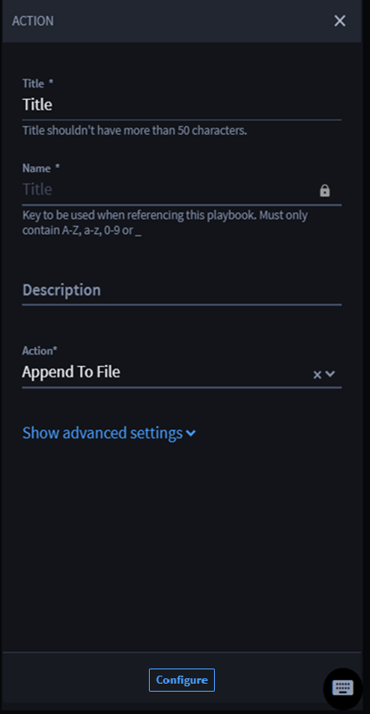
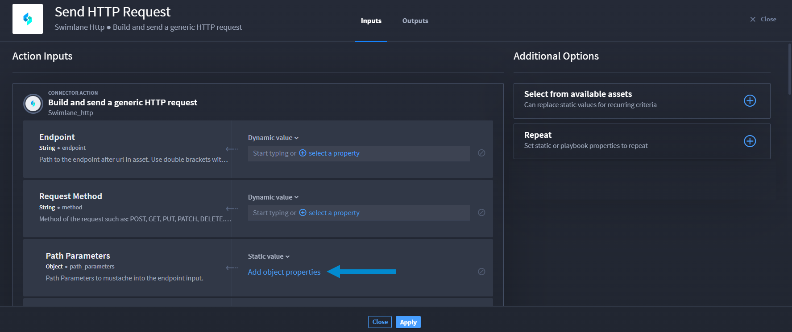
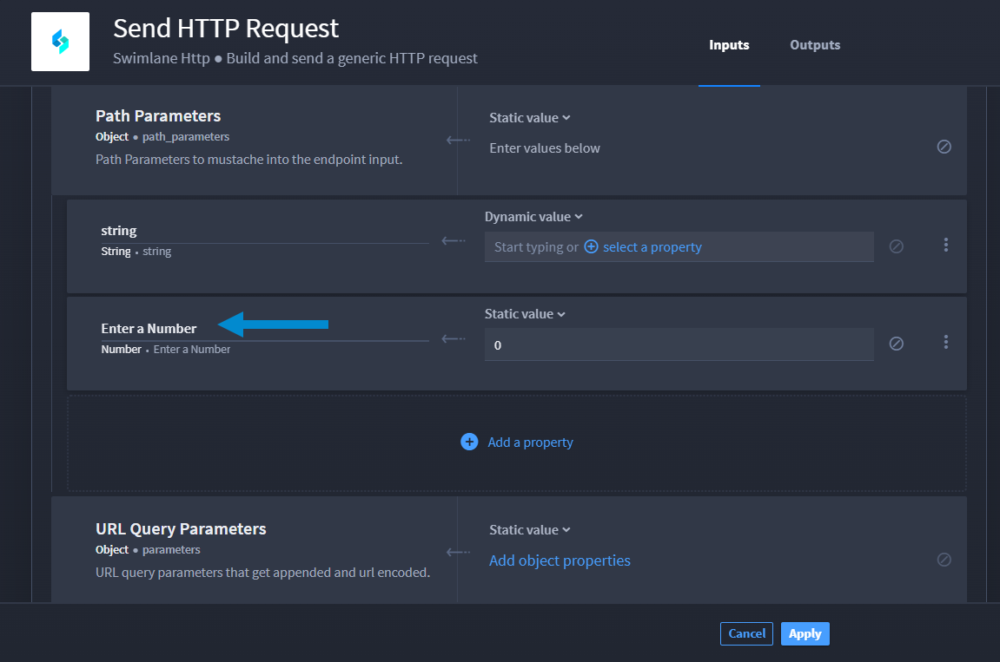

Inputs
======

Available in the playbooks, actions are individual capabilities of
connectors and interact with external technologies by passing in data
via action inputs and then results are available from action outputs.
You create actions by installing Turbine connectors.

Actions can:

-  Call another playbook

-  Interact with external technologies

-  Contain inputs and promote outputs

**Note:** You do **not** need a trigger to add an action to your
playbook.

Create Actions
--------------

#. From your current playbook, click **Add an action**.
   |image1|
   The ACTION window displays to the right of the playbook.

2. From ACTION, enter the required **Title** field.

3. Click the **Action** drop-down list.

4. | Select the desired action.
   | |image2|

5. Click **Show advanced settings** to see the pool drop-down menu. The
   **$default** pool is automatically assigned, but you can select a
   different pool.

6. Click **Configure**.

Configure Action Inputs
-----------------------

Action inputs are information necessary for the execution of the task.

**Action Icon Meanings**

+----------+----------------------------------------------------------+
| Icon     | Meaning                                                  |
+==========+==========================================================+
| |image9| | Edit icon: This icon is disabled until you create a      |
|          | condition for the action.                                |
+----------+----------------------------------------------------------+
| |        | Duplicate icon: This *only* duplicates the action.       |
| image10| |                                                          |
+----------+----------------------------------------------------------+
| |        | Delete icon: This deletes the entire action.             |
| image11| |                                                          |
+----------+----------------------------------------------------------+

**Add Action Inputs**

Once you add an action, you can configure action inputs.

To configure action inputs:

#. From ACTION, in the **Action** drop-down, select the desired
   connector.

#. Click **Configure**.

#. On Action Inputs, the **Inputs** and **Outputs** tabs display.

Based on the selected connector, Action Inputs auto-populates properties
under CONNECTOR ACTION.

Also, the Additional Options section displays available assets, which
are based on the connector. The section also includes repeat property
options. See `Action Repeats <repeats.htm>`__ for details.

Configure Connector Properties
------------------------------

When configuring an action, the available property types display under
CONNECTOR ACTION. Depending on the property type, there are different
values you can apply. The value options are different for string
property types and all other types.

-  | The default value for string property type is **Dynamic value**.
   | |image12|

-  | The default value for other property types is **Static value**.
   | |image13|

**What's a dynamic value?**

A dynamic value for string property types allows you to add context
and/or repeats to a playbook property or expression.

For details, see the Configure Concatenation for Strings Without Formats
sub-section and/or `Action Repeats <repeats.htm>`__.

**Configure Other Values for Property Types**

The default value for other property types is **Static value**.

For property types other than string, the drop-down menu options are:
*Static value*, *Playbook property*, or *Expression*, which allow you to
enter a static value, apply a playbook property, or create a dot
notation expression.

To configure the connector properties:

#. Click the **property type** drop-down, then select from *Static
   value*, *Playbook property*, or *Expression*.

#. Complete for all required properties.

#. Click **Apply**.

Select Assets
-------------

Connectors have assets. Assets are pre-defined configurations for some
input fields required in actions, or you can customize assets.

To select pre-defined assets:

#. Navigate to the action inputs.

#. | If you want to apply an existing asset, click the **Select from
     available assets** menu and select an asset.
   | |image14|
   | The available asset property fields are auto-filled.
   | |image15|

3. Complete any fields that are not auto-populated.

4. Click **Apply**.

**Customize Assets**

See `Create Custom Assets <../../assets/create-custom-assets.htm>`__ for
instructions on how to create and configure a custom asset and apply it
to a playbook.

Action Property Types
---------------------

Actions have the following input property types:

+--------------------+------------------------------------------------+
| **Property Types** | **Description**                                |
+====================+================================================+
| String             | Sequence of alphanumeric characters            |
+--------------------+------------------------------------------------+
| Number             | Floating point and integers                    |
+--------------------+------------------------------------------------+
| Integer            | Real numbers that do not have a floating point |
+--------------------+------------------------------------------------+
| Boolean            | Either of the values ``true`` or ``false``     |
+--------------------+------------------------------------------------+
| Object             | Structure that contains more properties        |
+--------------------+------------------------------------------------+
| Array              | Ordered list of zero or more elements, each of |
|                    | which may be of any type. Arrays use square    |
|                    | bracket notation with comma-separated          |
|                    | elements. Array Types: arrayNumber,            |
|                    | arrayString, and arrayObject                   |
+--------------------+------------------------------------------------+
| Null               | Empty value, using the word ``null``           |
+--------------------+------------------------------------------------+
| Date               | ISO 8601 date string without time information  |
+--------------------+------------------------------------------------+
| Date & Time        | ISO 8601 string with date and time             |
+--------------------+------------------------------------------------+
| Password           | Obfuscated string, the text will not be human  |
|                    | readable within the platform                   |
+--------------------+------------------------------------------------+
| Code               | Formatted code string                          |
+--------------------+------------------------------------------------+

Configure Concatenation for Strings without Formats
---------------------------------------------------

Concatenation is the ability to add context to a playbook input
property. Turbine currently only has the **String** property type
*without formatting*:

**Note:** Concatenation only works with string properties that do not
have a format, i.e., API keys would not be used with string
concatenation.

**Important!** The property types: **Date**, **Date & Time**, and
**Password** are string inputs; *however*, they are formatted.
Therefore, you *cannot* create a string concatenation using those
properties.

Before configuring concatenation for strings without formats, ensure you
complete (as needed):

#. Configure action inputs
#. Configure connector properties
#. Select assets

Now, create a concatenation for strings without formats. You need
playbook inputs and/or expressions to configure an action input for
string concatenation. Let's begin by creating a playbook input from the
Action Inputs window.

#. From Action Inputs, in the desired property field, click **+ select a
   property**.
   |image16|

#. Click **Playbook Inputs**.

#. Click **Done**, then select the playbook input you configured.

#. Next to the token, enter text, i.e., **world!**

Add Object Sub-properties
-------------------------

The property types Object and Array have sub-properties. You can map the
sub-properties as a static value, playbook property, or dot notation
expression.

To add an object sub-property:

#. Navigate to the action inputs.

#. Navigate to the **Object** property type.

#. | Now, click **Add object properties**.
   | |image17|

4. Select a sub-property from the drop-down.
   |image18|

Repeat steps 3 and 4, if desired to add more than one sub-property.

5. Map the property type by selecting from *Static value*, *Playbook
   property*, or *Expression*.

| The *Dynamic value* option defaults for string property types.
| |image19|

If desired, you can also change the name of the sub-property.

6. To enable editing, click in the sub-property field and enter a new
   name.

| Now, the new name and selected mapped option display.
| |image20|

Add Array Sub-properties
------------------------

To add an array sub-property:

#. Navigate to the action inputs.

Depending on the connector, array types might be available.

2. Navigate to the array property type.

3. | Click **Add array items**.
   | |image21|

4. Click **Add an item**.

5. Click **Add**.

6. Configure the array sub-property.

7. Click **Apply**.

Clear a Sub-Property Entry
--------------------------

To clear the information for the sub-property:

#. Click the **Clear value** icon.
   |image22|

2. To save the changes, click **Apply**.

Delete a Sub-Property Entry
---------------------------

To delete the information for the sub-property:

#. Click the **Delete** vertical ellipsis.
   |image23|

2. To save the changes, click **Apply**.

.. |image1| image:: ../../Resources/Images/action-entry-point.png

.. |image3| image:: ../../Resources/Images/edit-pencil-icon.png
.. |image4| image:: ../../Resources/Images/duplicate-icon.png
.. |image5| image:: ../../Resources/Images/delete-icon.png
.. |image6| image:: ../../Resources/Images/edit-pencil-icon.png
.. |image7| image:: ../../Resources/Images/duplicate-icon.png
.. |image8| image:: ../../Resources/Images/delete-icon.png
.. |image9| image:: ../../Resources/Images/edit-pencil-icon.png
.. |image10| image:: ../../Resources/Images/duplicate-icon.png
.. |image11| image:: ../../Resources/Images/delete-icon.png
.. |image12| image:: ../../Resources/Images/configure-action-inputs.png
.. |image13| image:: ../../Resources/Images/configure-action-inputs-static.png
.. |image14| image:: ../../Resources/Images/available-assets.png
.. |image15| image:: ../../Resources/Images/completed-asset-property-fields.png
.. |image16| image:: ../../Resources/Images/broadcast-message-input.png

.. |image18| image:: ../../Resources/Images/dropdown-sub-properties.png
.. |image19| image:: ../../Resources/Images/map-the-property-type.png

.. |image21| image:: ../../Resources/Images/array-sub-property.png
.. |image22| image:: ../../Resources/Images/delete-text-field-entry.png
.. |image23| image:: ../../Resources/Images/delete-sub-property-entry.png
