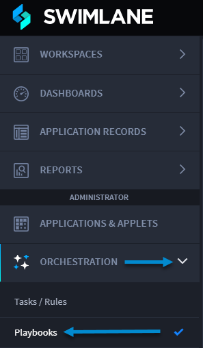

Enable and Disable Playbooks
============================

Want more control over your playbooks? Good news! You can enable and
disable playbooks.

Now when you create a playbook, you can choose to disable an incomplete
playbook and return to complete the playbook configuration later.

Enable and Disable
------------------

To learn more about how to enable or disable a playbook, follow the
instructions below:

#. Ensure you Create a Playbook.

2. Now, you can add an action to the playbook. Notice that the **Save**
   button is disabled.

Configure Actions and Save
--------------------------

Review steps 1 and 2 above.

**Scenario:** Now let's say that you have already added an action, and
you want to save your playbook.

To save playbooks:

#. In the **Title** field, enter an action title.

2. In the **Action** drop-down, select an action.

3. Click **Save**.

Save Incomplete Playbooks
-------------------------

Review steps 1 and 2.

**Scenario:** Now let's say that you have some configured actions, and
you have just added another action that you want to configure later.

To save incomplete playbooks:

#. Click the **Enabled** toggle to disable the playbook.

Copy Incomplete Playbooks
-------------------------

#. In the playbook, click the vertical ellipsis and click **Copy**.
   |image1|

2. On Duplicate Playbook, in the **Title** field, enter a title.

3. In the **Name** field, click the **lock** icon to enable the field.

4. | Enter a different name. You cannot duplicate the exact name of a
     playbook.
   | |image2|

5. Click **Create and Build**.

You have successfully copied the playbook.

Export Playbooks
----------------

#. In the playbook, click the vertical ellipsis and click **Export**.

Any un-configured actions, descriptions, and action names are present
when exporting a playbook and importing it into Turbine.

Upload Incomplete Playbooks
---------------------------

Let's say that you have created a playbook, you have exported an
incomplete playbook, and now you want to upload the playbook.

#. From the navigation menu, select ORCHESTRATION, and then click
   **Playbooks**.

   |image3|

#. From the Playbooks home page task bar, click the plus menu icon, and
   then select **Upload a playbook**.

   |image4|

#. Click **DRAG + DROP** or **Browse** to upload the playbook (.yml
   file).

#. On Upload a Playbook, in the **Title** field, enter a title.

#. In the **Name** field, click the **lock** icon to enable the field.

#. | Enter a different name. You cannot duplicate the exact name of a
     playbook.
   | |image5|

#. Click **Create and Build**.

The playbook opens.

.. |image1| image:: ../Resources/Images/copy-incomplete-playbook.png
.. |image2| image:: ../Resources/Images/enabled-playbook-copy.png

.. |image4| image:: ../Resources/Images/upload-a-new-playbook-button.png
.. |image5| image:: ../Resources/Images/upload-playbook-incomplete.png
