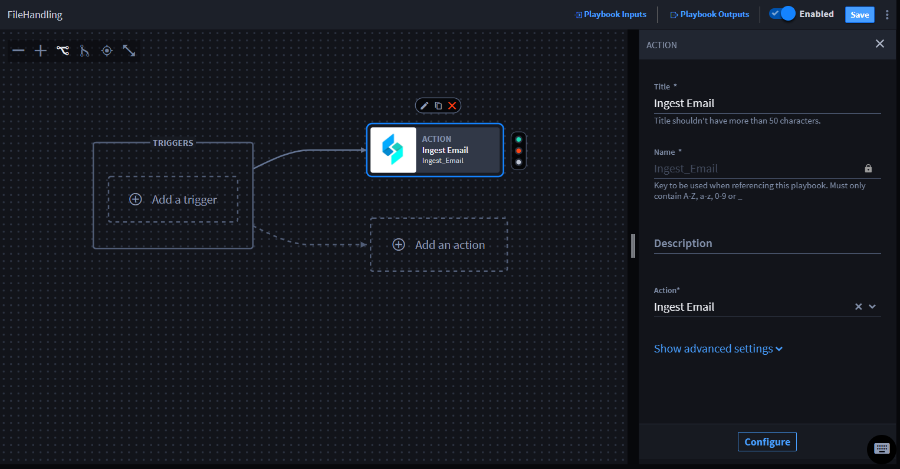

Playbook File Handling
======================

You can use a connector to handle files in playbooks by using a
file-handling connector in an action. For example, you can use a
connector that ingests an email that contains attachments.

The file is an attachment from an action output.

**Important!** There is a limit of 500MiB per file.

Use Files with a File-Handling Connector
----------------------------------------

To add files with a file-handling connector:

#. Open a playbook (or create/upload a playbook).

#. Click **Add an action**.

#. From ACTION, add a title.

#. | From the **Action** drop-down menu, select a connector that has the
     capability to handle files.
   | |image1|

5. Click **Configure** to map the property values.

The action window displays with the **Inputs** and **Outputs** tabs.

6. Click **Outputs**.

For a playbook to pass a file as data, you need to add a file as an
action output.

7. Click **+Promote** next to the attachments.

8. Click **Apply**.

You have promoted the file to the playbook outputs and you can now apply
them to an action or nested playbook.

