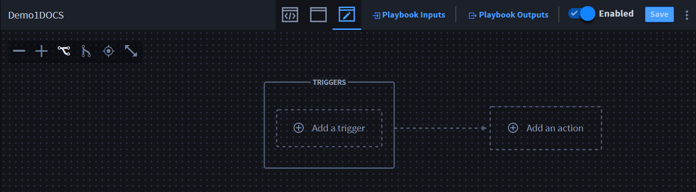

Create and Edit Playbook Inputs
===============================

Playbook inputs normalize data coming into the playbook. Even when
coming from multiple triggers. Your playbook can have multiple playbook
inputs.

Create Playbook Inputs
----------------------

Let's see how we configure inputs. Create a new playbook or upload an
existing playbook, then follow the steps below:

#. | From the playbook toolbar, click **Playbook Inputs**.
   | |image1|

   | The Playbook Inputs Manager window opens.
   | |image2|

#. | Click **Add a property** to view the list of properties available
     for you to map.
   | |image3|

   +----------------------+----------------------------------------------+
   | **Input Properties** | **Description**                              |
   +======================+==============================================+
   | String               | Sequence of alphanumeric characters          |
   +----------------------+----------------------------------------------+
   | Number               | Floating point and integers                  |
   +----------------------+----------------------------------------------+
   | Integer              | Real numbers that do not have a floating     |
   |                      | point                                        |
   +----------------------+----------------------------------------------+
   | Boolean              | Either of the values ``true`` or ``false``   |
   +----------------------+----------------------------------------------+
   | Object               | Structure that contains more properties      |
   +----------------------+----------------------------------------------+
   | Array                | Ordered list of zero or more elements, each  |
   |                      | of which may be of any type. Arrays use      |
   |                      | square bracket notation with comma-separated |
   |                      | elements. Array Types: arrayNumber,          |
   |                      | arrayString, and arrayObject                 |
   +----------------------+----------------------------------------------+
   | Null                 | Empty value, using the word ``null``         |
   +----------------------+----------------------------------------------+

From Property Configuration, configure the selected property.

#. | On the GENERAL tab, enter the appropriate data.
   | |image4|

4. Click **Apply**.

Depending on the type of trigger, you may need to map properties to the
created playbook inputs, or use a dot notation to extract data, and then
map the properties.

Edit Playbook Inputs
--------------------

Create a new playbook or upload an existing playbook, then follow the
steps below:

#. | From the playbook toolbar, click **Playbook Inputs**.
   | |image5|\ The Playbook Inputs Manager window opens.
   | |image6|

2. To edit, select a property, and click the gear icon.

The Property Configuration window opens.

3. Make your modifications and click **Apply**.

| This example shows an update to the property title.
| |image7|

That was easy!

Configure Concatenation for Strings without Formats
---------------------------------------------------

Concatenation is the ability to add context to a playbook input
property. Turbine currently has the following property type *without
formatting*:

-  String

**Note:** Concatenation only works with string properties that do not
have a format, i.e., API keys would not be used with string
concatenation.

**Important!** The property types: **Date**, **Date & Time**, and
**Password** are string inputs; *however*, they are formatted.
Therefore, you *cannot* create a string concatenation using those
properties.

Before configuring concatenation for strings without formats, ensure you
complete (as needed):

#. Configure action inputs
#. Configure connector properties
#. Select assets

Now, create a concatenation for strings without formats. You need
playbook inputs and/or expressions to configure an action input for
string concatenation. Let's begin by creating a playbook input from the
Action Inputs window.

#. From Action Inputs, in the desired property field, click **+ select a
   property**.
   |image8|

2. Click **Playbook Inputs**.

3. Click **Done**, then select the playbook input you configured.

The input displays as a token in the appropriate field.

| |image9|

4. Next to the token, enter text, i.e., **world!**

| The token and static value text display as string concatenation.
| |image10|

You have successfully created a string concatenation!

See `String Concatenation use
case <../../use-cases/playbook-use-cases/string-concatenation.htm>`__
for an example of executing string concatenation.

Need to make changes to your playbook inputs? Go to the next section to
see how to apply and remove playbook inputs.

.. |image2| image:: ../../Resources/Images/playbook-inputs-manager.png
.. |image3| image:: ../../Resources/Images/add-a-property.png
.. |image4| image:: ../../Resources/Images/property-configuration-general-tab.png

.. |image6| image:: ../../Resources/Images/playbook-inputs-manager.png
.. |image7| image:: ../../Resources/Images/modified-playbook-input-property.png
.. |image8| image:: ../../Resources/Images/broadcast-message-input.png
.. |image9| image:: ../../Resources/Images/concatenate-token.png
.. |image10| image:: ../../Resources/Images/concatenate-token-static-text.png
