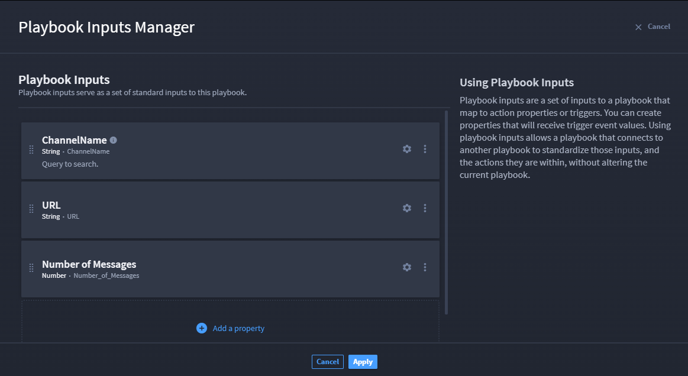
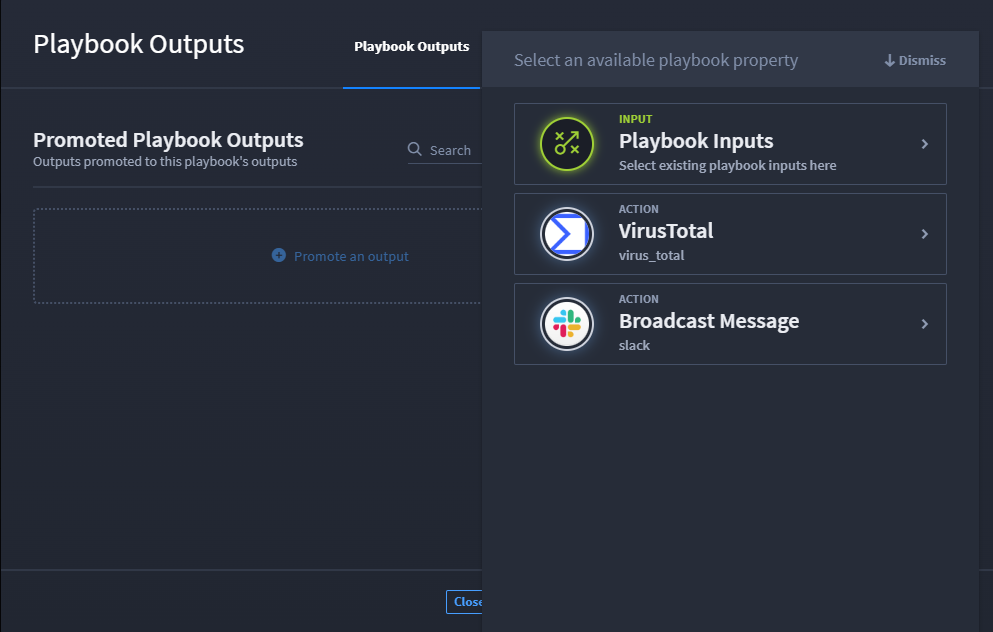

Promote Playbook Inputs to Outputs
==================================

Once you create your playbook inputs or configure action inputs, you can
promote the inputs to outputs, then map the outputs to applications. See
`Promote Action Outputs <../actions/outputs.htm>`__ for more information
about promoting from the action-level.

**Important!** To promote and map playbook inputs to outputs, ensure
that you complete the steps to create playbook inputs and/or configure
action inputs. See `Create and Edit Playbook
Inputs <create-and-edit-playbook-inputs.htm>`__ and/or `Create Actions
and Configure Inputs <../actions/inputs.htm>`__ for details.

Promote Playbook Inputs to Outputs Example
------------------------------------------

This example has two parts. First, let's add a new property in the
Playbook Inputs Manager. This playbook example has a Slack and a
VirusTotal action. The inputs have been configured. To add a new
property to inputs:

#. From your playbook, click **Playbook Inputs**.

   The Playbook Inputs Manager opens and existing input values display.
   Let's add another input, then promote.

#. On Playbook Inputs Manager, click **add a new property**.

#. From the drop-down menu, select a property.

   Let's add a number value.

#. Click **Number**.

#. On Property Configuration, configure the property.

| This example has Number of Messages.
| |image1|

#. Click **Apply**.

#. | Click **Playbook Outputs** to open the outputs window.
   | |image2|

#. Click **Promote an output** to open the playbook property drawer.

   | From here, the playbook-manager inputs and action-level inputs are
     available to select and promote.
   | |image3|

#. Select the desired input by clicking the radio button next to the
   input. You can click **Promote an output** again to add multiple
   outputs.

   The selected outputs now display to the left. And will be available
   to map to an application. Let's see how that's done!

What do you do with playbook inputs? Let's look at `Playbook
Outputs <../playbook-outputs/playbook-outputs.htm>`__.

.. |image2| image:: ../../Resources/Images/playbook-outputs.png

