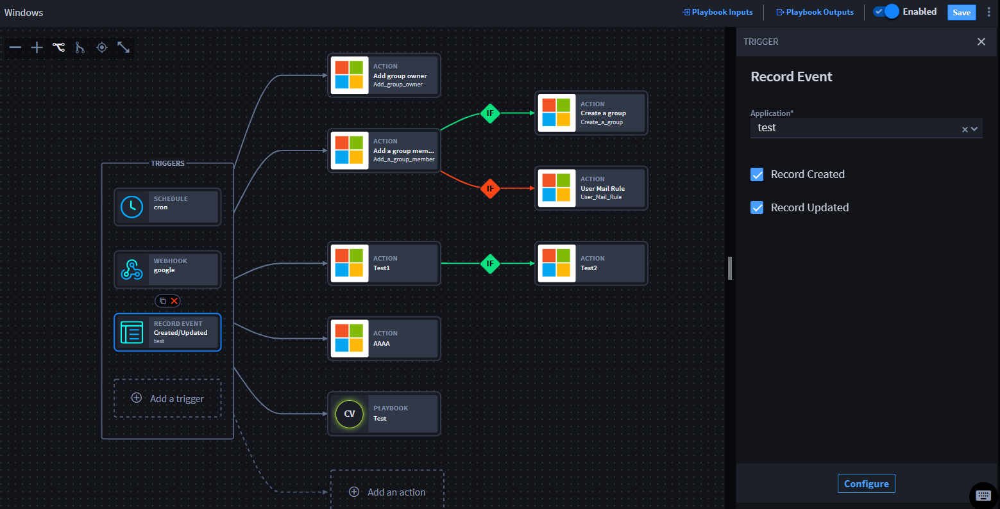

Create Playbook Outputs
=======================

Playbook outputs are the promoted responses and/or results from a
playbook's executed actions. Playbook outputs can be used as inputs in
other playbooks, or they can be mapped to records in one or more
applications.

.. _create-playbook-outputs-1:

Create Playbook Outputs
-----------------------

Create a new playbook or upload an existing playbook, then follow the
steps below:

#. Click **Playbook Outputs**.
   |image1|

From Playbook Outputs, configure playbook outputs and the
objects/properties that you want to promote and, optionally, map to an
application.

2. Click **Promote an output**.
   |image2|\ The playbook property drawer opens with available playbook
   inputs.
   |image3|

3. If you do not need to map the promoted properties to an application,
   click **Apply** and the window closes.

Do you need to map playbook outputs to an application? There are several
ways. Go to the next section for more information.

.. |image2| image:: ../../Resources/Images/playbook-outputs-window.png
.. |image3| image:: ../../Resources/Images/playbook-outputs-drawer.png
