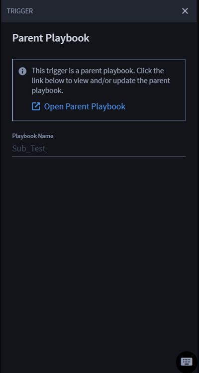

Nested Playbook Triggers
========================

You can create parent playbooks as triggers in nested playbooks. When an
action is configured to call a nested playbook, the nested playbook will
show that parent playbook as a trigger.

**Warning!** Review `Nested Playbooks <../nested-playbooks.rst>`__ to
understand the relationship of a parent and nested playbook before
continuing.

**Note:** You do not need to select a trigger before adding and
configuring actions and conditions.

Playbook Button Triggers
------------------------

**Tip:** If you have more than one playbook as a trigger, click the
desired playbook trigger, which will be visible with a blue highlight
box around the trigger.

| 
| |image1|

The TRIGGER panel displays. To view the list of parent playbooks and
triggers:

#. From TRIGGER, click **Open Parent Playbook**.
   |image2|

The parent playbooks and triggers open in a new tab. From here, view
and/or make updates to the parent playbooks.

**Important!** When calling nested playbooks, Turbine's default
configuration is for a maximum depth of 10 playbook levels.

.. |image1| image:: ../../Resources/Images/nested-playbook-as-trigger.png

