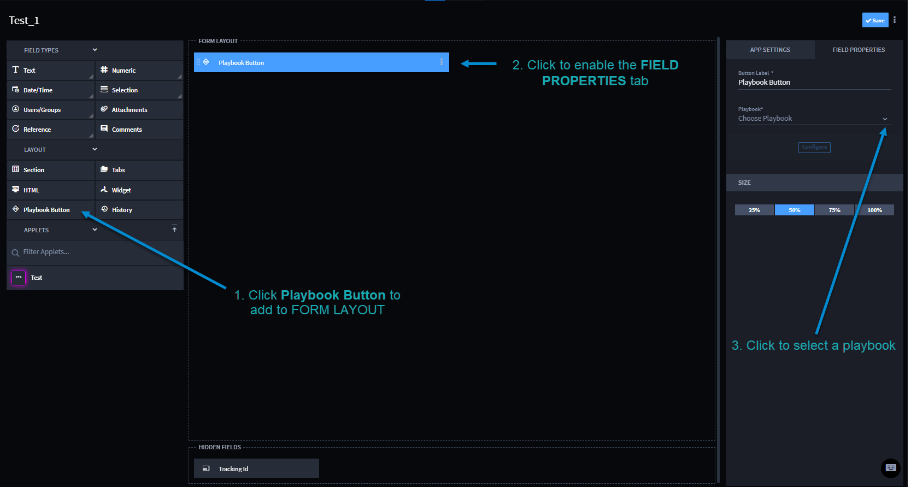

Playbook Button Triggers
========================

A playbook button trigger is in an application. It is added as a
Playbook Button in calling the Application.

**Note:** You can also include triggers from widgets. For more
information, see `Record Widgets <../../widgets/record-widgets.htm>`__.

.. _playbook-button-triggers-1:

Playbook Button Triggers
------------------------

To trigger a playbook with a playbook button, navigate to APPLICATIONS &
APPLETS. Either select an existing application or click the plus icon.
Then import an application or create a new application.

From the application:

#. Click and drag **Playbook Button** to the FORM LAYOUT section.

On the APP SETTINGS tab, the name field defaults to the same name as the
application. You can add a description and/or click the toggle to enable
tracking time for the playbook button.

2. Click the **Playbook Button** field in the FORM LAYOUT to enable the
   **FIELD PROPERTIES** tab.

3. | On FIELD PROPERTIES, click the **Playbook** drop-down menu, and
     select the playbook that this button triggers when clicked on an
     application's record.
   | |image1|\ You have now created a playbook button trigger that
     initiates the associated playbook that you selected.

