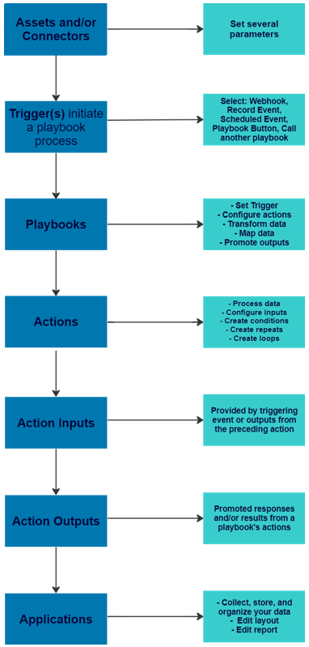
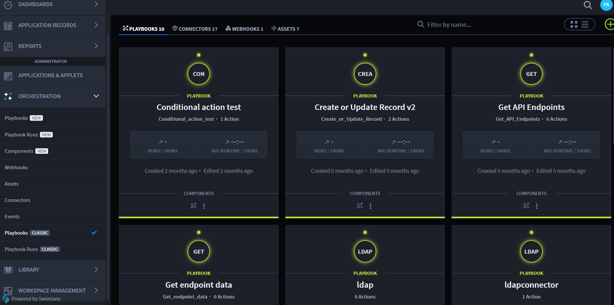

Playbooks
=========

Playbooks are where automation is built quickly and easily and enriches
data processing. With Swimlane Turbine's playbooks, anyone can create
modular, repeatable automations that process real-time data.

What are Playbooks?
-------------------

Playbooks are self-contained modular entities that help you quickly and
easily build and/or enrich automation processes.

Playbooks contain:

-  Triggers
-  Actions
-  Conditions
-  Inputs and Outputs
-  Repeats
-  forEach Loops

Playbooks are initiated by triggers and used to achieve desired
outcomes.

Playbook Inputs
---------------

Playbook inputs pass and normalize data into a playbook from a trigger,
application, or event.

Triggers
--------

One or more triggers automate actions based on the criteria set within a
playbook. Swimlane Turbine currently uses four types of triggers to
retrieve and/or ingest data.

#. Webhooks
#. Record events
#. Schedules
#. Record action button

Once a playbook has been triggered, a series of actions within that
playbook are executed.

Actions
-------

Actions are tasks within a playbook and a series of operations that
happen when the playbook is executed.

Actions:

-  Include details to execute a task, i.e., connectors and assets (used
   for third-party authentication)
-  Have inputs and outputs.
-  Can be configured with advanced steps, i.e. repeats.
-  Are drag-and-drop for intuitive logic flow

Conditions
----------

Conditions:

-  Allow playbook builders to execute actions in a playbook when
   specific criteria are met.
-  Can operate based off of properties from other actions or triggers.
-  Have configured conditional statements, if desired.
-  Contain on success, on failure, and on complete condition
   expressions.

Playbook Outputs
----------------

Action outputs are the response and/or result(s) from a connector
technology, which can be applied as an input for other actions within
your playbook, or promoted for use outside of the current playbook.

Playbook Architecture
---------------------

The following playbook architecture is for a single playbook, but
provides a high-level understanding of the playbook set up and logic
flow.

|image1|

Playbook Page Components\ |image2|
----------------------------------

+--------------------------+------------------------------------------+
| Component                | Description                              |
+--------------------------+------------------------------------------+
| PLAYBOOKS                | Displays the number of current           |
|                          | playbooks. Click to navigate to the      |
|                          | Playbooks home page.                     |
+--------------------------+------------------------------------------+
| CONNECTORS               | Displays the number of connectors        |
|                          | installed. Click to navigate to the      |
|                          | Connectors home page.                    |
+--------------------------+------------------------------------------+
| WEBHOOKS                 | Displays the number of webhooks          |
|                          | installed. Click to navigate to the      |
|                          | Webhooks home page.                      |
+--------------------------+------------------------------------------+
| ASSETS                   | Displays the number of assets            |
|                          | configured. Click to navigate to the     |
|                          | Assets home page.                        |
+--------------------------+------------------------------------------+
| Filter by name           | A search field that searches for         |
|                          | existing playbook names.                 |
+--------------------------+------------------------------------------+
| View Mode Toggles        | Click the toggle(s) to view the          |
|                          | playbooks in card or list mode.          |
+--------------------------+------------------------------------------+
| Upload/Create a playbook | Plus icon. Click to display the option   |
|                          | to upload a playbook or create a new     |
|                          | playbook.                                |
+--------------------------+------------------------------------------+

 

.. toctree::
   :titlesonly:
   :caption: Children:

   /Content/playbooks/create-playbooks
   /Content/playbooks/enable-and-disable-playbooks
   /Content/playbooks/playbook-inputs/playbook-inputs
   /Content/playbooks/playbook-outputs/playbook-outputs
   /Content/playbooks/nested-playbooks
   /Content/playbooks/playbook-file-handling
   /Content/playbooks/context-variables
   /Content/playbooks/swimlane-help-chatbot
   /Content/playbooks/actions/actions
   /Content/playbooks/playbook-triggers/playbook-triggers
   /Content/native-actions/native-actions
