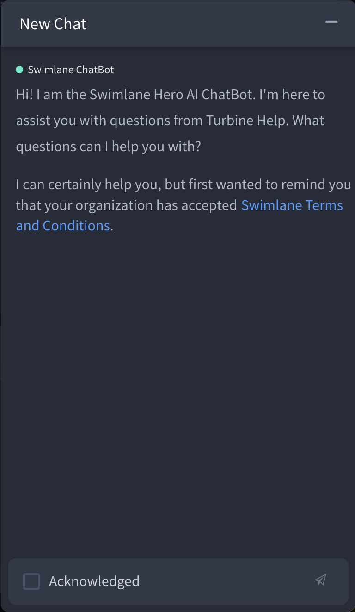
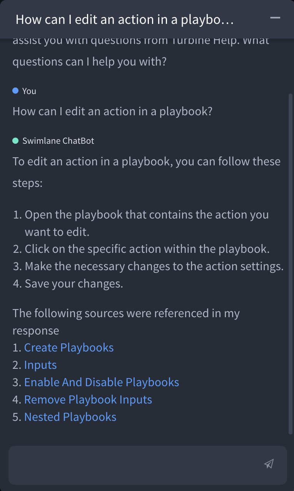
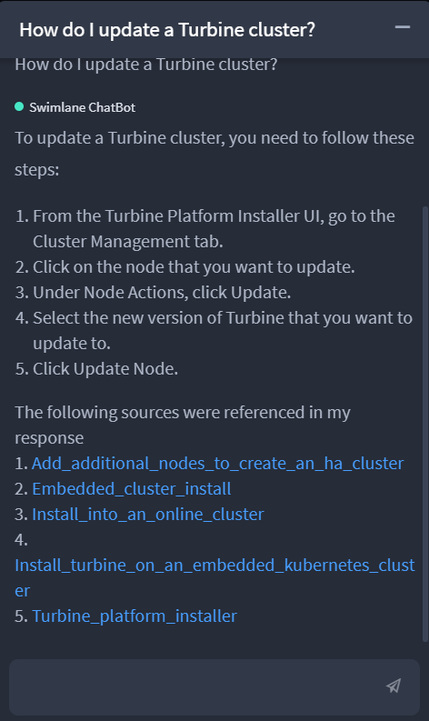

.. _swimlane-help-chatbot:

Swimlane Hero AI Help Chatbot
=============================

When you open a playbook, notice the icon in the lower right of your
browser window. That is the Swimlane Hero AI Help ChatBot icon.

|image1|

Click the icon to open a new chat. The first time you ask a question,
the chatbot will ensure that you acknowledge that your organization has
accepted the Swimlane Terms and Conditions. Click **Swimlane Terms and
Conditions** to review them. Next, select **Acknowledge**, and then
click the Send icon.

|image2|

Now you can begin asking questions!

The Swimlane Hero AI Help Chatbot is loaded with Turbine technical
content - both the `Turbine User
Guide <../welcome-to-the-turbine-user-guide.rst>`__ and the `Turbine
Platform Installer
Guide <https://docs.swimlane.com/turbine_installer/>`__. The chatbot
answers each of your questions individually. Also, be sure not to enter
any Personal Identifiable Information (PII) or confidential information
in your questions.

The chatbot will answer your questions, when possible, with links to
relevant topics in the Turbine content. You can see up to 5 links so
that you can select the topic most suited to answer your question.
Clicking a link opens a new tab in your browser that loads the content.
If the chatbot cannot find an answer to your question, it will respond,
"I don't know."

Help Chatbot Query Examples
---------------------------

Here are some examples of what you can ask the Swimlane Help Chatbot.

When you ask, "How can I edit an action in a playbook?" the chatbot
responds:

|image3|

Click **View Source** to see where the Chatbot has pulled the answer, as
well as topics that are potentially related to your question.

|image4|

Keep in mind that you can also ask questions related to the Turbine
Platform Installer. So, when you ask, "How do I update a Turbine
cluster?" the chat bot responds:

|image5|

.. |image1| image:: ../Resources/Images/help-chatbot-icon.png

.. |image3| image:: ../Resources/Images/swimlane-help-chatbot-edit-action.png

