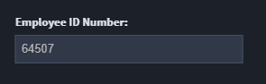
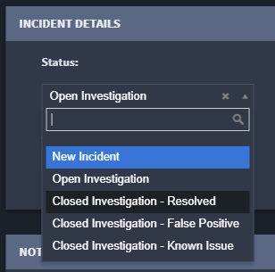
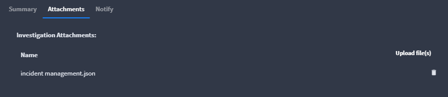
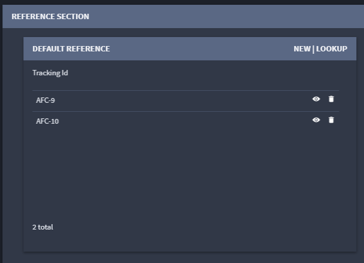

Modify a Record
===============

Click a record to open the record's detail. The detail page of a record
contains fields configured in Application Builder.

Records can have a few fields, or multiple fields, tabs, sections, and
layout areas. It all depends upon how the records are configured.

You can save your record as you modify it. When you're ready to move on
to another record, click the **Save** button pull-down menu and select
**Save & Close**.

To modify a record, you interact with the fields within the record. Your
interaction is dependent upon the type of field you are working with.

**Note:** If time tracking is enabled on the application, a dialog that
reports the time spent on a record will display once you save the
record. The time tracking begins 30 seconds after the record is opened,
so as to allow for review of the record prior to tracking work within
the record.

Field Types
-----------

Fields can be grouped into sections, which may be expanded or collapsed
by clicking on the header. Some fields may refer to other applications
or other records within an application. These reference fields may be
displayed as drop-down select boxes or search grids within the record.

Text Field Type
~~~~~~~~~~~~~~~

| Enter text, numbers, or symbols.
| |image1|

**Note:** When manually creating Text List field values, you will need
to enter the value and press **Enter** for each value you create in the
list.

Numeric Field Type
~~~~~~~~~~~~~~~~~~

| Type numbers or select them with the up and down arrows.
| |image2|

**Note:** When manually creating Numeric List field values, you will
need to enter the value and press **Enter** for each value you create in
the list.

Date Field Type
~~~~~~~~~~~~~~~

| Click the calendar icon to view a selection window.
| |image3|

Multi-Select Field Type
~~~~~~~~~~~~~~~~~~~~~~~

| Select from a list of values.
| |image4|

Attachment Field Type
~~~~~~~~~~~~~~~~~~~~~

| Select files to upload as attachments.
| |image5|

The allowable file types are: .csv, .doc, .docx, .gif, .jpeg, .jpg,
.pdf, .png, .ppt, .pptx, .tsv, .txt, .xls, and .xlsx.

Comments Field Type
~~~~~~~~~~~~~~~~~~~

| Track changes or post additional information.
| |image6|

Reference Field Type
~~~~~~~~~~~~~~~~~~~~

| Link target records to a source record.
| |image7|

Widget Field Type
~~~~~~~~~~~~~~~~~

| Enhance the record with a customizable UI component.
| |image8|

.. |image1| image:: ../../Resources/Images/text.png

.. |image3| image:: ../../Resources/Images/date.png

.. |image6| image:: ../../Resources/Images/comments.png

.. |image8| image:: ../../Resources/Images/threat-level-widget.png

.. toctree::
   :titlesonly:
   :caption: Children:

   /Content/records/modify-a-record/record-lock
