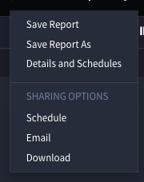
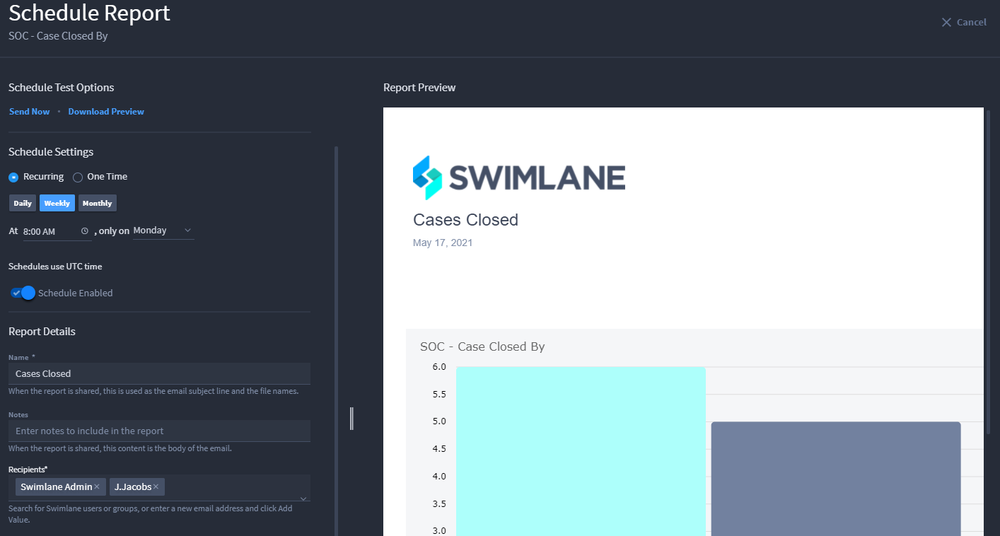
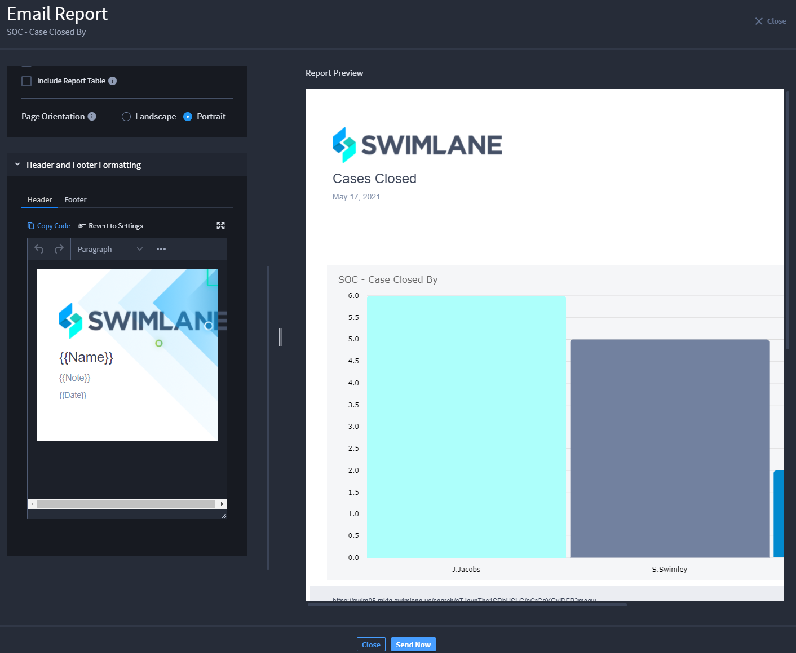
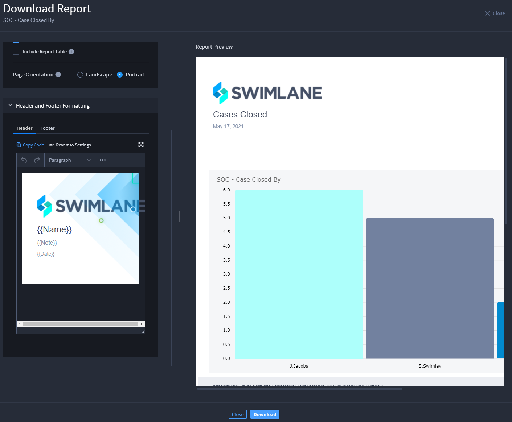

Share Reports
=============

You can share reports by scheduling an email to be sent, sending an
email now, or downloading a PDF of the report. To find these sharing
options, from within the open report, click the ellipsis on the report
header and select **Schedule**, **Email**, or **Download** under Sharing
Options.

|image1|

**Note:** Once you save your first scheduled report, the **New** icon
next to Schedule disappears.

Schedule a Report
-----------------

Schedule Report allows you to schedule when an email of the report is
sent to recipients. In addition to scheduling the email, you can also
choose to send the email now and choose to download a preview of the
report.

To schedule a report:

#. On **Schedule Report**, go to **Schedule Settings**. Select either
   **Recurring** or **One Time** for the frequency of reports being
   sent. For **Recurring**, select how often you would like the report
   to send. This can be scheduled daily, weekly, or monthly at a
   specified time. For **One Time**, select the day and time you would
   like the schedule to send.

#. Toggle **Schedule Disabled** to enable the schedule. If the schedule
   is not enabled, it will not send.

#. Under **Report Details**, under **Name**, type a name for the report.
   This name is visible in the Report Preview once you click out of the
   **Name** text box.

#. Under **Notes**, type notes to include in the report. These notes are
   visible in the Report Preview once you click out of the **Notes**
   text box.

#. | Under **Recipients**, search for and select the name of the Turbine
     users or groups you would like to add or enter an email address and
     then select **Add Value**.
   | |image2|

6. Under **Report Controls**, you can chose to include a link to the
   report in Turbine, to include the report table as a CSV file
   attachment, to include a report table, and select the page
   orientation of the report.

7. Click the drop-down arrow next to **Header and Footer Formatting**.
   This is where you format the header and footer for your report.
   |image3|

8. Once you have finished editing your report, click **Save Schedule**.
   A dialog appears confirming the email has been scheduled. Once the
   schedule is saved, click **Close** to exit.

   #. Once in **Email Report**, under **Name**, type a name for your
      report. This name is visible in the Report Preview once you click
      out of the **Name** text box.

   #. Under **Notes**, type any notes you would like to include on the
      report. These notes are visible in the Report Preview once you
      click out of the **Notes** text box.

   #. Under **Recipients**, search for and select the name of the
      Swimlane Turbine users or groups you would like to add or enter an
      email address and then select **Add Value**.

4. Under **Report Controls**, you can chose to include a link to the
   report in Turbine, to include the report table as a CSV file
   attachment, to include a report table, and select the page
   orientation of the report.

5. Click the drop-down arrow next to **Header and Footer Formatting**.
   This is where you format the header and footer for your report.
   |image4|

6. Once you have finished editing your report, click **Send Now**. A
   dialog appears confirming the email will be sent momentarily. Once
   the report is sent, click **Close** to exit.

Your email shows the name of the account the email is sent from, the
name of the report, the notes included in the report, a link to the
report in Turbine if selected, a PDF of the report, and a CSV file of
the report table if selected.

Download Report
---------------

Download Report allows you to download the report PDF and a CSV file if
selected.

#. Once in **Download Report**, under **Name**, type a name for your
   report. This name is visible in the Report Preview once you click out
   of the **Name** text box.

2. Under **Notes**, type any notes you would like to include on the
   report. These notes are visible in the Report Preview once you click
   out of the **Notes** text box.

3. Under **Report Controls**, you can chose to include the report table
   as a CSV file attachment, to include a report table, and select the
   page orientation of the report.

   **Note:** When including a report table, the table displays a maximum
   of 25 records. If the report contains more than 25 records, you
   receive a message at the bottom of the report table that indicates
   how many total records are included.

4. Click the drop-down arrow next to **Header and Footer Formatting**.
   This is where you format the header and footer for your report.
   |image5|

5. Once you have finished editing your report, click **Download**. A
   green check appears on the **Download** button once your report is
   downloaded. Click **Close** to exit.

.. |image3| image:: ../Resources/Images/schedule-report-header-footer.png

